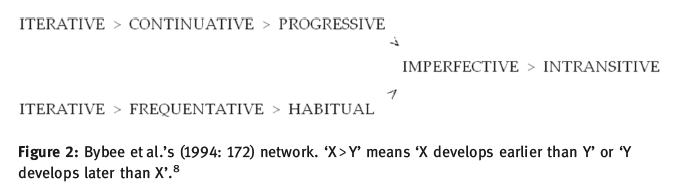
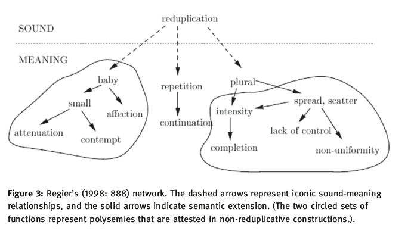
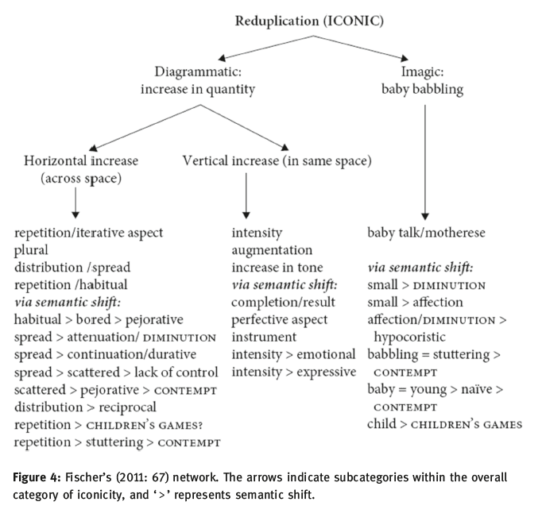
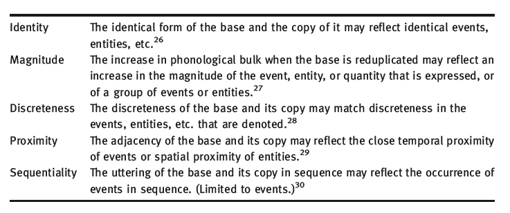
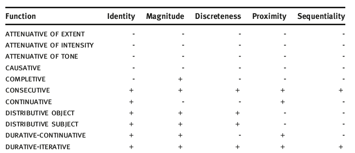
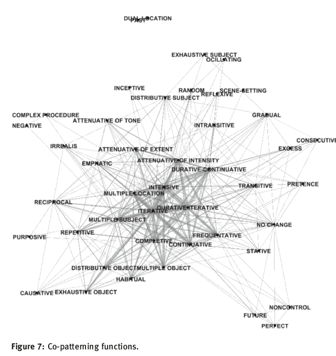
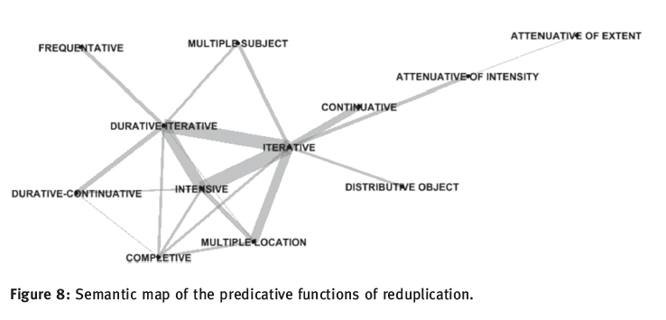
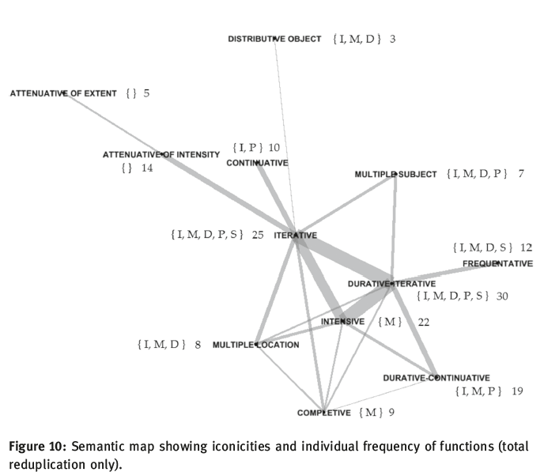
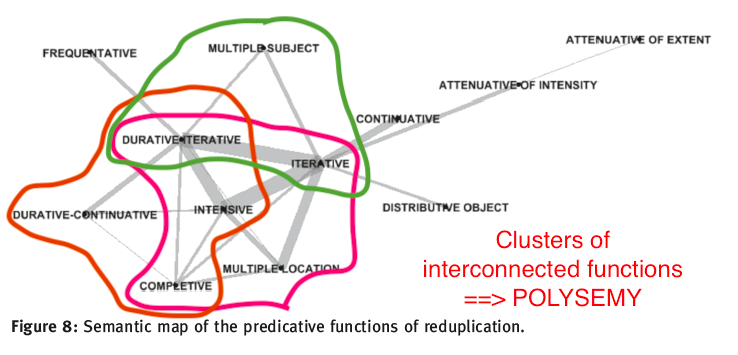

```{r setup, include=FALSE}
options(htmltools.dir.version = FALSE)
```

# Road map

1. Author introduction
2. Introduction
3. Literature review
4. Methodology
  1. sample
  2. database
5. Findings
  1. 45 functions
  2. 5 iconicities
  3. network visualizations
6. Discussion and conclusion
7. Further research

---

# Authors

.pull-left[
## Li Yueyuan

Ph.D Lancaster University
>Verb reduplication: A cross-linguistic survey with special focus on Mandarin Chinese. 2015.

now lecturer at Zhejiang International Studies University

affinity with Cognitive Linguistics
]

.pull-right[
## Dan Ponsford

Ph.D Lancaster University
>Bet proposal constructions: Structure, sources and discourse basis. 2015.


now ?

affinity with Cognitive Linguistics
]

---

# Introduction

Reduplication has been studied in relation to:
* form (Moravcsik 1978; Inkelas & Zoll 2005; Štekauer et al. 2012)
* semantics (Key 1965; Moravcsik 1978; Regier 1994; Regier 1998; Fischer 2011)
* iconicity (e.g. Haiman 1980; Lakoff & Johnson 1980; Kouwenberg & LaCharité 2001; Fischer 2011)

--

Previous studies:
* no quantification (Regier 1998; Fischer 2011)
* small sample (Bybee et al. 1994)
* small range of functions (e.g. Kajitani 2005)
* too broad to be detailed functions Michaelis et al. (2013)

---

# Introduction

##Aims of the study
* focus on one construction: .sc[predication] (Croft 1990; Croft 2001)
* large sample: 108 languages
* many functions: 45
* relations between functions

> functions that are expressed by a common form in many languages are more likely to be closely related than are functions that are expressed by a common form in a small number of languages or no languages at all. (Croft 2003; Haspelmath 2003)

* iconicity: a matter of degree, rather than binary (iconic vs. non-iconic): 5 formal features that are in iconic relation to the meaning

---
# Introduction

## Total or partial reduplication?
* total .sc[base~base] `imb-a~imb-a 'sing frequently' (Swahili)`
* .sc[base + red] `gàdέγέ~dέγέ 'be quite fragile' (Zialo)`
* .sc[red + base] `'o~'o'out 'burn very much' (Rapanui)`
* .sc[base] + infix .sc[red] `hu<gá~>gando 'playing' (Chamorro)`

## Which part of the base is copied?
* initial part of .sc[base] `mɨ′ɨ~mɨ-ki 'always dying out' (Cora)`
* medial part of .sc[base] `óoku<suun~>sunika 'push (intensive)' (Shi)`
* final part of .sc[base] `aha~maha 'panting very strongly' (Meyah)`

So, in order to focus on function, Li & Ponsford first describe the form.
This is similar to what we saw in my previous presentation on by Tuggy.

---

#Introduction

## Research questions
1. What is the range of functions of reduplication where it is used in predication? 
2. What tendencies are there with respect to how reduplication is used in predication?
3. What iconicities are present in the predicative uses of reduplication? 4. How do the predicative functions of reduplication relate to one another?

---

# Previous studies

## Sample size

"Convenience sampling": what information is available from grammars.

.font80[
```{r regex, echo=FALSE, warning=FALSE, message=FALSE}
library(tidyverse)
writers <- c("Bybee et al. (1994)", "Kajitani (2005)", "Haiman (1980)", "Fisher (2011)", "Key (1965)", "Moravcsik (1978)", "Michaelis et al. (2013)", "Hurch (2005)", "Regier (1998)", "Rubino (2005")

samplesize <- c(16, 16, 24, 29, 47, 59, 76, 82, 87, 365)

samples <- tibble(writers, samplesize)
knitr::kable(samples, format = "html")
```
]

---

# Previous studies

Even without quantification, claims have been made about the tendencies regarding function, e.g. 

> "[Reduplication is] generally employed, with self-evident symbolism, to indicate such concepts as distribution, plurality, repetition, customary activity, increase in size, added intensity, continuance" (Sapir 1921:79)

> “It seems evident that reduplication functions in many languages to indicate emphasis, or some shade of plurality or augmentative" (Key 1965:100) 

Many more claims are listed, but not all meanings can/could be united, because they are rough opposites, e.g.
* augmentation / diminution
* endearment / contempt
* intensity / attenuation
* etc. 

However, this study wants to quantify it and see if unification is somewhat possible.

---

# Previous studies

## Iconicity

Imagic vs. diagrammatic:
* imagic `cuckoo, 汪汪`
* diagrammatic `搭車去公園 vs 去公園搭車, 霧濛濛`

--

This is usually treated as a binary phenomenon: an expression is iconic or not. 
But Li & Ponsford want to state [again] that it is probably gradual: 

>"Speakers may exploit more or fewer aspects of form iconically in expressing various aspects of meaning." (2018:61)

They discuss a.o. British Sign Language (and sign languages have a lot of (imagic) iconicity, e.g. `TREE`)

---

# Networks of functions: Bybee et al. (1994)




---
# Networks of functions: Regier (1998)




---
# Networks of functions: Fischer (2011)



---
# Short discussion of literature

## Drawing a map

How can we draw a map?
* based on semantic affinity (Regier 1998)
* based on common form (Bybee 1994; Fischer 2011)

But none of them use frequency of expression by a common form in establishing the relationships between functions.

## Network topology

Interconnection between nodes is important, cf. Fischer's map

## Differences between the three approaches

see pp. 67-68.

---

# Survey

## Method

Data collection: grammars of individual languages
* based on Graz database on reduplication
* literature on reduplication
* only languages that have .sc[reduplication] in .sc[predicative] use (cf. Bybee et al. 1994:173-174)
* slight bias in the sample

---
# Map of the sample

```{r sample, echo=FALSE, warning=FALSE, message=FALSE}
library(lingtypology)
df <- read_csv("LiPonsford_data.csv")
df <- df %>%
  mutate(affiliation = aff.lang(language))
df$popup <- aff.lang(df$language)
map.feature(languages = df$language,
            features = df$affiliation,
            popup = df$affiliation,
            #color= c("yellowgreen", "navy"),
            #shape = TRUE
            label = df$language,
            legend = FALSE
            )
```

---

# Database

**Languages selected:**

* base must have meaning by itself
* semantic contribution must be noticable 
* predicative use


**Form:**

* number of copies of base
* total vs. partial reduplication
* place reduplication is added to base
* part of base that is copied

---

# Functions

.font80[
```{r appendixB, echo=FALSE, warning=FALSE, message=FALSE, tidy=FALSE}
appendixb <- read_csv("appendixb.csv")
#knitr::kable(appendixb, format = "html")
DT::datatable(
  head(appendixb, 45),
  fillContainer = FALSE, options = list(pageLength = 8)
)
```
]


---

# Nature of functions

Increase in quantity:
* .sc[pluarlity] (discrete entities)
* .sc[repetition] (of events)
* .sc[intensity] (non-discrete properties)
* .sc[continuity] (non-discrete events)

.sc[more of form stands for more of content] (Lakoff & Johnson 1980)

--

Other meanings:
* .sc[attenuation] (of inensity or tone)
* .sc[pretence]
* .sc[randomness]
* .sc[perfectivity]
* .sc[negation]


However, Li & Ponsford wonder how these can be united. That is why they introduce five iconic parameters, which combined form the functions.

---
# Iconicities

class: middle, center



---
#Iconicities

They focused on the languages with .sc[total reduplication], and both coded and resolved the differeces between the two of them (table 3).




---

# Iconicities

.pull-left[

The iconicties are not made equal

```{r iconicities, echo=FALSE, warning=FALSE, message=FALSE}
icon <- c("Identity", "Magnitude", "Discreteness", "Proximity", "Sequentiatlity")
num <- c(22, 20, 15, 9, 9)

iconicities <- tibble(icon, num) %>%
  rename(Iconicities = icon, Freq = num)
knitr::kable(iconicities, format = "html")
```
]


.pull-right[
.sc[Discreteness]  --> .sc[Identity] or .sc[Magnitude]

.sc[Proximity] --> .sc[Identity] or .sc[Magnitute] (often both)

.sc[Sequentiality] --> .sc[Identity] and .sc[Magnitude] and .sc[Discreteness]


.sc[Identity] and .sc[Magnitude] have a special status. Although they often occur together (as in the conceptual metaphor), they need to be discerned:

* .sc[+Identity, -Magnitude]: .sc[continuative, gradual, reflexcive, scene-setting, stative]
* .sc[-Identity, +Magnitude]: .sc[completive, emphatic, intensive]


]
---

# Relations between functions

## Constructional polysemy

Constructions (Goldber 1995) may be polysemous, e.g. Gayo:
* .sc[epmphatic] `kunul~kunul 'sit (emphasis)`
* .sc[attentuative of extent] `maté~maté 'die' (almost)`

However, these functions may derive from the same function, but that original function may now be lost: <br>
`{f1} > {f1, f2 < f1} > {f1, f2, f3 > f1} > {f2, f3}`

Or, co-patterning may be the result of loss of a diachronically intermediate function: <br>
`{f1} > {f1, f2 < f1} > {f1, f2, f3 < f2} > {f1, f3}`

So co-patterning is a good start, but does not count as enough evidence. 
However, maybe frequency of co-patterns can help us with this diachronic question.

---

# Relations between functions

## Constructional polysemy

Operationalizing .sc[polysemy]:
>A construction is polysemous between two functions iff <br>
(i) the two functions are expressed by the same form in at least five languages <br>
(ii) in at least one recorded example there is ambiguity between the two functions. <br>
Copatterning is thus a necessary condition for polysemy but not a sufficient one. Cases where two functions are expressed by the same form but these two conditions are not met amount to cases of homonymy.

## Semantic maps

Semantic maps are a good way to represent semantic affinity (Haspelmath 2003; Croft 2001; Cysouw 2007). Because of the large number of co-patterning pairs in this study (286) they will use the 'Cysouw' method (2007).

---

# Connectivity

.pull-left[

]

.pull-right[
The stronger a line, the higher the frequency, the stronger (the assumption is that) there is diachronic affinity.

This approach differs from Regier (1998) and Fischer (2011), who construct their network based on reasoning. 

`I think it is also more convincing because of the requirements they make in their sample.`
]
---

# Final test


The perform an extra test `co-patterning pairs with frequency ≥ 5` and `can be identified as ambiguous in at least one language` can be included in the semantic map.
* .sc[intensive / completive] ambiguity:<br>`ɲiya~ɲiya(g) 'destroy completely' (Zialo)`
* .sc[iterative / multiple location] ambiguity: <br>`su~su 'touch all over, paw' (Arapesh)`


---
# The map



* .sc[iterative] and .sc[durative-iterative] are most interconnected, and (together with .sc[frequentative]) have to do with repetition of events.
* This is probably the first usage, cf. Bybee et al. (1994).
* Other usage extensions include .sc[intensive], .sc[multiple locatoin], .sc[continuative, durative-continuative], .sc[multiple subject, distributive object], .sc[attenuative of intensity, attenuative of extent], and .sc[completive]

---

# Iconicity, co-patterning, frequency
.pull-left[

]

.pull-right[
* .sc[Identity], .sc[Magnitude], .sc[Discreteness], .sc[Proximity], .sc[Sequentiality]
* superset-subset relation of iconicities between core members and peripheral members, e.g. .sc[iterative] `{I, M, D, P, S}`, but .sc[continuative] `{I, P}`.
* The more central function is generally the most frequent one.
* exception: .sc[intensive]
]

.footnote[
This is only total reduplication, because "complete doubling of the base is assumed to be more noticeable, and therefore manipulable, by language-users than partial doubling" (p. 89).
]

---

# Discussion



* Compared to previous proposals, e.g. Fischer (2011), there are more interconnections between functions than previously schematized.
* Many different links have been identified *typologically*.

---

# Conclusion (1)

* Previous proposals on iconicity were not entirely wrong, but can be supplemented and revised with this larger sample.
* 108 languages, 45 functions, 5 iconicities
* .sc[Identity] and .sc[Magnitude] are the most important of these 5
* more interconnectivity between functions than previously assumed
* diachronic change is `loss of iconicity` rather than `gain of iconicity`: there is a `change towards greater arbitrariness`

---

# Conclusion (2): Mandarin Chinese

Li & Ponsford identify five functions (based on Hsu 2002 and McEnery & Xiao 2004):
1. .sc[iterative]
1. .sc[continuative]
1. .sc[attenuative of intensity]
1. .sc[attenuative of extent]
1. .sc[attenuative of tone]

Of these, the following polysemies are found:
* .sc[continuative] and .sc[iterative]
* .sc[attenuative of intensity] and .sc[iterative]
* .sc[attentuative of extent] and .sc[attenuative of intensity]

I had hoped that they would provide their database also, so it would be easy to get examples of what they mean. Also, they should maybe have taken type/token frequency effects in consideration in their treatment, although that might be very difficult doing this kind of typological study.


---

# Further research

This paper (Li & Ponsford 2018) and Tuggy (2003) both discuss reduplication. 

I think my main questions will be 
1. How do ideophones relate to the functions identified for reduplication in both papers?
2. How are they acquired? 

By looking at the CHILDES corpus, it should be possible to trace which ideophones / reduplications get learned and when.

Also the nature of the ones (are they more colloquial or more literary?)


