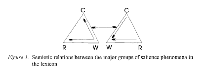
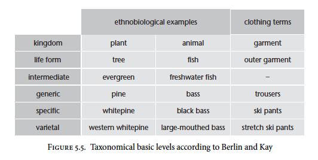
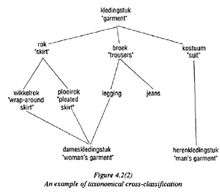

```{r setup, include=FALSE}
options(htmltools.dir.version = FALSE)
```

class: center

# Let's look back at Taylor (2008:48-49)




.pull-left[
**semasiological**

what does a word MEAN?

Rosch

prototype

horizontal
]

.pull-right[
**onomasiological**

what is a meaning CALLED?

Berlin & Kay

color, taxonomy: basic level

vertical
]

---
class: center, middle

# Geeraerts's research on onomasiology


---
class: center

# Basic level of clothing 


--
.left[Based on Geeraerts (2010:199-203):

>If we apply the basic-level model to the lexical field of **clothing terminology**, items like ***trousers, skirt, sweater, dress*** are to be considered basic level categories: 
* their overall frequency in actual language use is high, 
* they are learnt early in acquisition,
* they typically have the monomorphemic form of basic level categories.

]
---

# "Obsession with women's clothing"

`Geeraerts, Grondelaers & Bakema (1994)`:  
*The structure of lexical variation: Meaning, naming, and context* 

.pull-left[
**material**

* clothing magazines
* 'window shopping'
* both in Belgium and Netherlands
]

.pull-right[
**methodology**

collecting the *referents* and the *names* in order to get at entrenchment statistics
]

---
class: center, middle

# Cross-classification



How to classify `wikkelrok` vs. `legging`?  
It depends on the superordinate category that is chosen.

---

# Miniconclusion

As `Atran (1990)` argues, the basic-level model does not apply to artefacts, because artefacts, in contrast with natural kinds, can be linked to various superordinate categories.

Just like prototype theory, there might be some `fuzziness` and `differences of structural weight` involved in taxonomies.

---

# Taylor (2008): 6.3 Constructions

>Constructions: "patterns for the combination of smaller linguistic units, such as words, morphemes, and phrases."

They can be described from
* semantic perspective: what is the meaning conveyed by the construction?
* formal perspective: (what kinds of items are likely to occur in the construction, and in what kind of configuration?

---

# Verhagen's (2005) Wh-extractions

Based on the small, 720,000 word Eindhoven corpus, Verhagen found that `denken` 'think' was the most frequent verb in a long-distance Wh-extraction (one of the big issues of Generative Grammarians).

<table border="0">
<tr> 
 <td  align="left">En</td>
 <td  align="left">wat</td>
 <td  align="left">denk</td>
 <td  align="left">je</td>
 <td  align="left">dat</td>
 <td  align="left">ie</td>
 <td  align="left">zei,</td>
 <td  align="left">die</td>
 <td  align="left">prins?</td>
</tr>

<tr> 
 <td  align="left">and</td>
 <td  align="left">what</td>
 <td  align="left">think</td>
 <td  align="left">you</td>
 <td  align="left">that</td>
 <td  align="left">he</td>
 <td  align="left">said</td>
 <td  align="left">that</td>
 <td  align="left">prince</td>
</tr>

<tr>
 <td colspan="9">‘And what do you think this prince said?’</td>
</tr>

</table>

`denken + 2SG` 'think + 2SG' is very common, prototypical even.

This construction functions as a pragmatic appeal to the hearer, and can best be understood through the notion of prototypicality:
* descriptive adequacy
* explanatory power

---
class: center

# Cue validity vs category validity

.pull-left[
**cue validity**

> Given that entity e exhibits property p, what is the probability that e is a member of category C?

If a creature (`e`) has wings (`p`), there is a high chance that it is a bird (`C`).

]

.pull-right[
**category validity**

>Given that entity e is a member of category C, what is the probability that e will exhibit property p?

If a creature (`e`) is a bird (`C`), there is a high chance it has wings (`p`).

]

---
class: center

# Cue validity vs category validity

In regard to constructions this becomes:

.pull-left[
**Cue validity of words vis-à-vis constructions**

> Given an occurrence of word w, what is the probability that w is part of construction C?

*cranberry* words like *dint*, which occurs in a fixed phrase *by dint of* in 92% of the cases.

But *by* is not a good indicator of this construction!

]

.pull-right[
**Category validity of constructions vis-à-vis the words that occur
in them**

>Given the occurrence of construction C, what is the probability that word w features as part of C?

.left[
The Dutch Wh-extraction construction has high category validity: this construction very strongly predicts the occurrence of the main verb denken.

But, because *denken* is very frequent, the occurrence of the verb has virtually no predictive power vis-à-vis the construction!
]

]

---

# Other studies

* Stefanowitch and Gries (2003; Gries & Stefanowitch 2004) with their `collostructions`
* Goldberg (2006) etc.

>The picture that emerges from these studies is that **the syntax and lexicon of a language are closely intertwined and interdependent**. 
This links up with an important theme in Rosch’s work. One of Rosch’s “principles of categorization” is that an organism perceives a **“correlational structure”** in the world.

So, in general, Taylor concludes that:

> Linguistic encoding of a situation involves the categorization of the situation in accordance with the available linguistic resources. 
Our discussion has suggested that categorization may play an even more fundamental role in language. 
The very structure of language itself is a matter of categorization. 
Rosch’s discoveries regarding the internal structure of categories are no less relevant to the **category of language** than they are to the **categories *symbolized* by language**.
