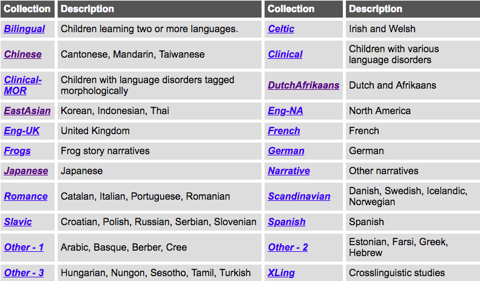
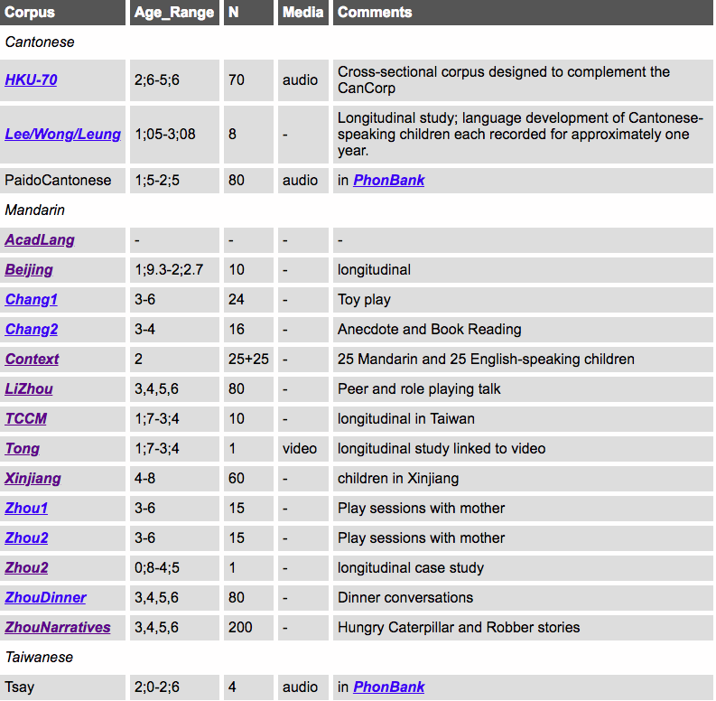
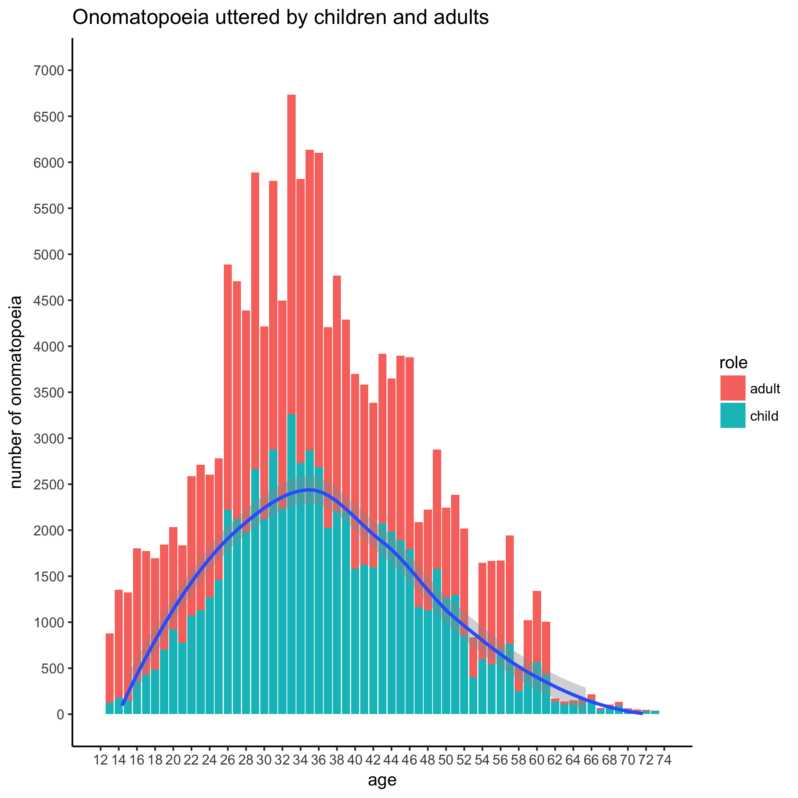

```{r setup, include=FALSE}
options(htmltools.dir.version = FALSE)
```

# Roadmap

* Introduction
* Literature review
* Research questions
* Methodology
* Results
    * Mandarin vs. Cantonese onomatopoeia
    * Mandarin ideophones
    * Reduplication and XXde
    * Case studies: 圓圓的 and 甜甜的
* Discussion & conclusion
* Selected references
    


---

# Introduction: background

As you know, my main research interest (Van Hoey 2015-2018) comprises ideophones in Chinese:
* inventory of ideophones in a database with lexical description (needs updates though)
* how ideophones developed through time 
* typology of ideophones
* etc.

Recently, however, I have become also interested in their L1 acquisition, due to:
* advice from my (and some of your) adviser (e.g. Lu 2006)
* class on SLA from a Cognitive Linguistics perspective, taught by Su I-Wen this semester (see Robinson & Ellis 2008):
    * frequency -- prototypicality
    * usage-based -- corpus-based
    * bottom-up -- chunking
    * learning as a process vs. acquisition as a product

---

# Literature review

## Ideophones

```{r map, message=FALSE, warning=FALSE, echo=FALSE, out.width='100%'}
library(tidyverse)
library(plotly)
library(DT)
library(lingtypology)
df <- read_tsv("https://raw.githubusercontent.com/simazhi/ideophones/master/terminology_map.csv")

map.feature(languages = df$language,
            features = df$terminology,
            popup = df$popup,
            #color= c("yellowgreen", "navy"),
            #shape = TRUE
            label = df$language,
            legend.position = "bottomright"
            )

```

---

# Literature review

## Ideophones cross-linguistically

Dingemanse's (2011: 2012) definition for cross-linguistic concepts:
.larger[
.underline[marked] .underline[words] that .underline[depict] .underline[sensory imagery]
]

## Ideophones in Chinese: working definition
.font80[
* partial / full reduplication <br> `玲瓏、稀裡嘩啦，汪汪、濛濛` though not always`壁咚、嗶一下`
* different pronunciation than conventionalized word, "stretching the boundaries of the phonological system" (Nuckolls 2014)  `咻地跑過去 [ʃɯʷ] instead of [ʂjou]`
* 'radical support' for literary ideophones (Van Hoey 2017; 2018), <br> `雨 in 霏霏`
* multiple <graphemes> that encode the same word, `<凌亂> and <零亂>`
* *canonically* non-.sc[referential] usage (although conceptual reification and metonymy can occur (cf. Croft 1991; 2001)  `一個帥帥`
* a definition in traditional dictionaries that ends with `的樣子` or `然`
]

.footnotesize[My aim is to eventually develop a framework similar to Hopper & Thompson's (1980) seminal paper on transitivity, or Kwon's (2015;2017) application of canonical typology to sound symbolism and total reduplication in Japanese and Korean.]
---

# Literature review

## Acquisition

L1 Acquisition is a hot topic, but currently the frameworks I agree with most are:
* Tomasello's Usage-Based theory of language acquisition (e.g. 1992; 2003)
* MacWhinney's Emergentist approach (e.g. MacWhinney & O'Grady 2015)

A big reason why these models -- which specifically deal with the acquisition conundrum -- attract me, is because it seems straightforward to integrate them with other Cognitive Linguistic approaches such as Langacker's Cognitive Grammar (1987; 1991; 2008).

---

# Literature review

## Acquistion in specific languages

Unfortunately, I did not find any good papers on specifically the acquisition of ideophones / mimetics in Chinese.

But I did find an interesting discussion on the acquisition of nouns vs. verbs: <br>Nouns are learned earlier than verbs (Gentner 1982; Gentner & Boroditsky 2001; Tomasello 2003; Imai et al. 2008a)

But: 
.font90[
* By 24 months (`2;0`) infants acquiring a range of languages can successfully map novel nouns to object categories and novel verbs to event categories, but the success-rate depends on what language is learned (typologically) (Waxman et al. 2013) <br> + cultural effects, like the 'verb-friendliness' of a language (Tardif 1996; 2006).
* Chinese does have a 'verb' advantage compared to English, presumably due to the "imageability hypothesis" -- Chinese has for some concepts, e.g. 26 verbs that denote .sc[carry]; and sometimes it encodes actions more specifically [than English] --> .sc[manner] is often encoded in the lexemes (Ma et al. 2009).
* Other elements, like syntax, also facilitate verb learning (Lee & Naigles 2005).
]

---

# Literature review

## Japanese
.font90[
Japanese acquisition have a tradition that is longer standing.
* 0;11 infants already are sensitive to sound symbolism (lexical bootstrapping hypothesis, Imai & Kita 2014)
* similar to Tomasello's (1992) .sc[chunking/verb island hypothesis --> analyzed smaller blocks] process, Lu (2006) proposes that Japanese infants/children from unanalyzed chunks of language (未分化) (including ideophones) to the creation of ICM’s, which are then extended in meaning through such mechanisms like metaphor and metonymy
]

## Assumptions for Chinese
.font90[
So: let's accept that Chinese verbs are more imageable, in a verb-friendlier environment.

Ideophones usually are relational as well, and perhaps more salient in these East-Asian languages (Choi 2000 for Korean; Imai et al. 2008b for Japanese) compared to Standard Average European.

This salience is presumably a combination of the innate postulate of 'joint attention', combined with cultural preferences.
]

---

# Research questions

.pull-left[
*In my weather related research*

1. .sc[colloquial ideophones] <br> `稀裡嘩啦、轟隆`
2. .sc[literary ideophones] <br> `霏霏、淋淋、淋漓`

On the form pole, .sc[colloquial] and .sc[literary] ideophones both tend to have some sort of reduplication, however .sc[literary] ideophones are more prone to .sc[radical support] / .sc[componential support]. 

As to their function, it seems that .sc[colloquial] ideophones express more .sc[imagic iconicity], while .sc[literary] ideophones maybe more often depict .sc[diagrammatic iconicity].

]

--

.pull-right[
Since it increasingly seems like Chinese has two strata of ideophones (Van Hoey 2017;2018), we can start asking the following .underline[research questions].

.content-box-yellow[
Which kind of ideophones do Mandarin children learn? <br> (colloquial / literary)

How about other Sinitic languages?

When do infants learn these?

What does this mean about ideophones in Chinese, typologically?
]]

---

# Methodology — Material

## CHILDES database

.pull-left[
* `CHI`ld `L`anguage `D`ata `E`xchange `S`ystem
* [https://childes.talkbank.org/](https://childes.talkbank.org/)
* MacWhinney (2000)


]

.pull-right[

]

---

# Methodology — Material

## R package: `childesr`

* really new package, from May 2018 (5月！) (Sanchez et al. 2018)
* developed at Stanford ([childesr](http://childes-db.stanford.edu/))
* easy interface to the CHILDES database, using more data science-friendly search functions than the CHAT tagging system and CLAN search function native to the CHILDES database
* works through an API (Application Programming Interface)
* CHILDES database `2018.1`; every six month update
* `childesr` version `0.1.0`: very new, but good for a test drive

I decided to `get_utterances()` from all the Chinese corpora in the Chinese collection <br> message: `getting data from 1031 children`

Chinese corpus: `716,823` utterances between adults and children
<br> taking out non-Mandarin ones (Cantonese, Taiwanese) <br> --> `435,452` utterances remain 
<br> taking out NAs for age (a crucial value) --> `237,887` utterances between adult and child

---

# Methodology

I am mainly investigating three concrete things:
* onomatopoeia (have been tagged as `on` in the POS column)
* ideophones from my database
* reduplication patterns


---

# Results: Mandarin onomatopoeia

.pull-left[
```{r mandarin-onomatopoeia, echo=FALSE, warning=FALSE, message=FALSE, cache=TRUE}
corpus <- read_csv("Chinesecorpus.csv") %>%
  mutate(age = str_extract(target_child_age, "..(?=\\.)")) %>%
  mutate(role = case_when(speaker_role == "Target_Child" ~ "child",
                          speaker_role != "Target_Child" ~ "adult")) %>%
  filter(corpus_name != "LeeWongLeung") %>%
  filter(corpus_name != "HKU") %>%  
  filter(corpus_name != "PaidoCantonese") %>%
  filter(corpus_name != "Tsay")

corpus$age <- as.numeric(as.character(corpus$age))


mand_onom <- read_csv("mand_onom.csv")
mand_onom_child <- mand_onom %>%
  filter(role == "child") %>%
  group_by(age) %>%
  tally()

mandoplot <- ggplot() + 
  stat_count(data = mand_onom, mapping = aes(x = age, fill = role)) +
  geom_smooth(data = mand_onom_child, mapping = aes(x = age, y = n)) +
  ggtitle("Mandarin onomatopoeia uttered by children and adults") +
  theme_bw() +
  theme(panel.border = element_blank(),
        panel.grid.major = element_blank(),
        panel.grid.minor = element_blank(),
        axis.line = element_line((colour = "black"))
        ) +
  scale_x_continuous(name = "age",
                     limits = c(12, 74),
                     breaks = seq(12, 74, 2)) +
  scale_y_continuous(name = "number of onomatopoeia",
                     limits = c(0, 60),
                     breaks = seq(0, 60, 10)) +
  scale_fill_manual(values=c("#999999", "#56B4E9"))
mandoplot
```
]

.pull-right[
This is not a very beautiful plot :( 

There are only 297 data points

But maybe in the future, when there are fewer NAs for age (childes API update?) it will look better?
]

---

# Results: Cantonese onomatopoeia

.pull-left[
```{r cantonese-onomatopoeia, echo=FALSE, warning=FALSE, message=FALSE, tidy=FALSE}

canto_onom <- read_csv("canto_onom.csv")
canto_onom_child <- canto_onom %>%
  filter(role == "child") %>%
  group_by(age) %>%
  tally()


cantoplot <- ggplot() + 
  stat_count(data = canto_onom, mapping = aes(x = age, fill = role)) +
  geom_smooth(data = canto_onom_child, mapping = aes(x = age, y = n)) +
  ggtitle("Cantonese onomatopoeia uttered by children and adults") +
  theme_bw() +
  theme(panel.border = element_blank(),
        panel.grid.major = element_blank(),
        panel.grid.minor = element_blank(),
        axis.line = element_line((colour = "black"))
        ) +
  scale_x_continuous(name = "age",
                     limits = c(12, 74),
                     breaks = seq(12, 74, 2)) +
  scale_y_continuous(name = "number of onomatopoeia",
                     limits = c(0, 60),
                     breaks = seq(0, 60, 10)) +
  scale_fill_manual(values=c("#999999", "#E69F00"))

cantoplot
```
]

.pull-right[
I looked at Cantonese as well: a much more beautiful plot, because there are more data points.

Two possible conclusions:
1. Mandarin just uses fewer onomatopoeia than Cantonese <br> Maybe?
2. The database is lacking <br> more probable I think
]


---

# Comparing Mandarin to Cantonese

.pull-left[
```{r mandarin-cantonese-onomatopoeia, echo=FALSE, warning=FALSE, message=FALSE, tidy=FALSE}

cantonese <- canto_onom %>% mutate(lang = "cantonese")
mandarin <- mand_onom %>% mutate(lang = "mandarin")

df <- rbind(cantonese, mandarin)

canto_mando <- df %>%
  filter(role == "child") %>%
  ggplot() + 
  stat_count(data = df, mapping = aes(x = age, fill = lang)) +
  ggtitle("Mandarin vs. Cantonese onomatopoeia by children") +
  theme_bw() +
  theme(panel.border = element_blank(),
        panel.grid.major = element_blank(),
        panel.grid.minor = element_blank(),
        axis.line = element_line((colour = "black"))
        ) +
  scale_x_continuous(name = "age",
                     limits = c(12, 74),
                     breaks = seq(12, 74, 2)) +
  scale_y_continuous(name = "number of onomatopoeia",
                     limits = c(0, 60),
                     breaks = seq(0, 60, 10)) +
  scale_fill_manual(values=c("#E69F00", "#56B4E9"))

canto_mando

```
]

.pull-right[
For Cantonese:
`2;10` to `3;0` increase, afterward decrease

For Mandarin:
some very early `1;2`, `1;8`, then decrease, then increase again...??
]
---

# Comparing Mandarin to Cantonese

What are the ideophones that are being uttered?

.font80[

.pull-left[
```{r mandarin-utterance, echo=FALSE, warning=FALSE, message=FALSE, tidy=FALSE}
mandarin_real_utt <- mand_onom %>%
  filter(role == "child") %>%
  select(gloss, age) %>%
  arrange(age)

DT::datatable(
  head(mandarin_real_utt, 45),
  fillContainer = FALSE, options = list(pageLength = 8))
```
]

.pull-right[
```{r cantonese-utterance, echo=FALSE, warning=FALSE, message=FALSE, tidy=FALSE}
cantonese_real_utt <- canto_onom %>%
  filter(role == "child") %>%
  select(gloss, age) %>%
  arrange(age)

DT::datatable(
  head(cantonese_real_utt, 200),
  fillContainer = FALSE, options = list(pageLength = 8))
```
]
]

---

# Mandarin ideophones

Which ideophones from my database I've been collecting for the past few years occur in these utterances? (distinct)

.font80[

```{r mandarin-ideophones, echo=FALSE, warning=FALSE, message=FALSE, cache=TRUE}
ideos <- read_lines("masterlist.txt")


mand_ideos <- map_df(ideos, function(i){
  
  #cat(".")
  
  df <- mand_onom %>% 
    filter(str_detect(gloss, i)) %>%
    mutate(ideophone = str_extract(gloss, i))
  
  })

mand_ideos %>%
  select(gloss, age, role) %>%
#  filter(role == "child") %>%
  arrange(age) %>%
  dplyr::distinct() %>%
  knitr::kable(format = "html") 
```
]

So these are also pretty much .sc[colloquial ideophones]

---

# Reduplication

.pull-left[
Maybe reduplication can yield better results (cf. Lee & Naigles 2005 for discussion on reduplicated verbs in Mandarin acquisition):

I counted the most used reduplications produced by the children over all ages, just to get an idea of the kind of reduplications that are at stake.

It seems there are both nominal, verbal and adjectival reduplications.

Upon closer inspection, there was one structure of more interest: `AA的`.

]

.pull-right[
.font80[
```{r reduplication, echo=FALSE, warning=FALSE, message=FALSE, cache=TRUE}
red_first <- read_csv("reduplication_mandarin.csv")

twentyfour <- red_first %>%
  filter(role == "child") %>%
  select(reduplication, gloss, age) %>%
  arrange(age) %>%
  group_by(reduplication) %>%
  tally() %>%
  arrange(desc(n)) %>%
  filter(!str_detect(reduplication, "[a-z0-9]")) %>%
  top_n(20)

twentyfour %>%
  knitr::kable(format = "html")   

```
]
]

---

# Reduplication: XX的

.pull-left[
```{r mandarin-reduplication, echo=FALSE, warning=FALSE, message=FALSE, cache=TRUE}
XXde <- read_csv("XXde.csv")

XXde_child_smooth <- XXde %>%
  filter(role == "child") %>%
  group_by(age) %>%
  tally()
#XXde_child_smooth

ggplot() +
  stat_count(data = XXde, mapping = aes(x = age, fill = role)) +
  geom_smooth(data = XXde_child_smooth, mapping = aes(x = age, y = n)) +
  ggtitle("XXde uttered by children and adults") +
  theme_bw() +
  theme(panel.border = element_blank(),
        panel.grid.major = element_blank(),
        panel.grid.minor = element_blank(),
        axis.line = element_line((colour = "black"))
        ) +
  scale_x_continuous(name = "age",
                     limits = c(12, 100),
                     breaks = seq(12, 100, 6)) +
  scale_y_continuous(name = "number of onomatopoeia",
                     limits = c(0, 400),
                     breaks = seq(0, 400, 50))  
```
]

.font80[
.pull-right[
```{r mandarin-xxde-numbers, echo=FALSE, warning=FALSE, message=FALSE, cache=TRUE}
XXde %>%
  select(xxde, age, role) %>%
  filter(role == "child") %>%
  count(xxde) %>%
  arrange(desc(n)) %>%
  top_n(30) %>%
  knitr::kable(format = "html")   
```

]
]
---

# Item-based case-study 1: 圆 

.pull-left[
```{r yuanyuande, echo=FALSE, warning=FALSE, message=FALSE, cache=TRUE}
yuan <- corpus %>%
  select(gloss, role, age) %>%
  filter(!is.na(age)) %>%
  filter(str_detect(gloss, "圆")) %>%
  filter(role == "child") %>%
  mutate(yuan = case_when(
    str_detect(gloss, "圆圆\\s?的?") ~ "yuanyuande",
    str_detect(gloss, "圆\\s?的") ~ "yuande",
    str_detect(gloss, "圆形") ~ "yuanxing",
    str_detect(gloss, "圆") ~ "yuan"
  )) %>%
  group_by(age, yuan) %>%
  tally()

yuan$n <- as.numeric(as.character(yuan$n))

ggplot() +
  geom_smooth(data = yuan, aes(age, n, color = yuan), se = FALSE) +
  geom_point(data = yuan, aes(age, n, color = yuan)) +
  ggtitle("Acquiring 圓圓 的 'round' ") +
  theme_bw() +
  theme(text= element_text(family="STKaiti")) +
  theme(panel.border = element_blank(),
        panel.grid.major = element_blank(),
        panel.grid.minor = element_blank(),
        axis.line = element_line((colour = "black"))
        ) +
  scale_x_continuous(name = "age",
                     limits = c(30, 100),
                     breaks = seq(12, 100, 6)) +
  scale_y_continuous(name = "number of onomatopoeia",
                     limits = c(0, 70),
                     breaks = seq(0, 100, 10)) 
```
]

.pull-right[
So from an item-based perspective there are some (subtle) differences;
however, there are two periods (`2;6` to `4;6`, and later `5;5` till `7;0`) where `圆圆的` does better than `圆的`. This might be an indication that the reduplication is some kind of intensification that helps with the construal of 'round'.
]

---

# Item-based case-study 1: 甜 

.pull-left[
```{r tiantiande, echo=FALSE, warning=FALSE, message=FALSE, cache=TRUE}
tian <- corpus %>%
  select(gloss, role, age) %>%
  filter(!is.na(age)) %>%
  filter(str_detect(gloss, "甜")) %>%
  filter(role == "child") %>%
  mutate(tian = case_when(
    str_detect(gloss, "甜\\s?甜\\s?的?") ~ "tiantiande",
    str_detect(gloss, "甜\\s?的") ~ "tiande",
    str_detect(gloss, "很\\s?甜") ~ "hen tian",
    str_detect(gloss, "甜") ~ "tian"
  )) %>%
  group_by(age, tian) %>%
  tally()

#tian
tian$n <- as.numeric(as.character(tian$n))

ggplot() +
  geom_smooth(data = tian, aes(age, n, color = tian), se = FALSE) +
  geom_point(data = tian, aes(age, n, color = tian)) +
  ggtitle("Acquiring 甜甜 的 'sweet'") +
  theme_bw() +
  theme(text= element_text(family="STKaiti")) +
  theme(panel.border = element_blank(),
        panel.grid.major = element_blank(),
        panel.grid.minor = element_blank(),
        axis.line = element_line((colour = "black"))
        ) +
  scale_x_continuous(name = "age",
                     limits = c(30, 100),
                     breaks = seq(12, 100, 6)) +
  scale_y_continuous(name = "number of onomatopoeia",
                     limits = c(0, 60),
                     breaks = seq(0, 100, 10)) 
```
]

.pull-right[
Here it seems that the reduplication really does help with the acquisition.
]


---

# Discussion and conclusion

## Using the CHILDES database

Using the `childesr` package (and its related API) can yield interesting methods when trying to study the acquisition of onomatopoeia, ideophones and reduplication.

However, many observations had to be dropped because the age wasn't made clear, and in acquisition research that is crucial.

## Onomatopoeia

* Mandarin: presumably a lack of data
* Cantonese: increase around `2;10` to `3;0`, followed by a decrease

I repeated similar steps for Japanse, that other language which is known for its frequent usage of ideophones:

---
# Discussion and conclusion

## Japanese mimetics

.pull-left[

]

.pull-right[
For Japanse, there seems to be more input from the adults, but also more repeated mimetics.

This looks more like the findings from Cantonese than Mandarin, so the conclusion that it is a data problem seems more likely.

However
* Japanese has a better defined form of mimetics, namely mostly `ABAB`
* I used a web dictionary to get the list
* I was not super rigorous because my focus was on Chinese
]
---

# Discussion and conclusion

## Colloquial vs. literary

What I did find of onomatopoeia / ideophones suggests that indeed, colloquial ideophones are learnt very early. This probably can be linked to processes like `holophrases` and `chunking`.

The follow-up question would then be: when do speakers of Chinese learn these more literary ideophones? (future research)

## Reduplication

There is a lot of reduplication going on
* some are terms and phrases that almost always reduplicated like 爸爸 or 谢谢
* but the `XXde` pattern was also prevalent (caught my eye)
* two case studies (圆圆的, 甜甜的) show that item-based learning is  also important or should be when studying the acquisition of ideophones
* that is of course, if you accept `XXde` as a kind of ideophonic structure, but since its function seems to be mainly .sc[performative], it does make sense to include it in the bigger inventory
* however, it does need more future research.

---

# Concluding thoughts

There is definitely more ways that this kind of data can be linked to ideophones. I might explore more in the future, but I do hope the `childesr` database for Chinese will be updated so fewer data points have to be discarded.

Before this, I was not really familiar with Acquisition, so reading some of the literature has taught me a lot. 

My main focus will still be historical development, but a small part of my research may include some of the issues I am presenting here today.

.font140[
Thank you for listening!
<br> 謝謝聆聽!
]

---

# Selected references

.font50[
Dingemanse, Mark. 2012. Advances in the cross-linguistic study of ideophones. *Language and Linguistics Compass* 6(10). 654–672.

Gentner, Dedre. 1982. Why nouns are learned before verbs: Linguistic relativity versus natural partitioning. Center for the Study of Reading Technical Report 257.

Gentner, Dedre & Lera Boroditsky. 2001. Individuation, relativity, and early word learning. In Melissa Bowerman & Stephen C. Levinson (eds.), *Language acquisition and conceptual development*, 215–256. (Language, Culture and Cognition 3). Cambridge, UK : Cambridge University Press.

Imai, Mutsumi & Sotaro Kita. 2014. The sound symbolism bootstrapping hypothesis for language acquisition and language evolution. *Philosophical Transactions of the Royal Society B: Biological Sciences* 369(1651). 1–13. doi:10.1098/rstb.2013.0298.

Imai, Mutsumi, Sotaro Kita, Miho Nagumo & Hiroyuki Okada. 2008. Sound symbolism facilitates early verb learning. *Cognition* 109(1). 54–65. doi:10.1016/j.cognition.2008.07.015.

Imai, Mutsumi, Lianjing Li, Etsuko Haryu, Hiroyuki Okada, Kathy Hirsh-Pasek, Roberta Michnick Golinkoff & Jun Shigematsu. 2008. Novel Noun and Verb Learning in Chinese-, English-, and Japanese-Speaking Children. *Child Development* 79(4). 979–1000. doi:10.1111/j.1467-8624.2008.01171.x.

Lee, Joanne N. & Letitia R. Naigles. 2005. The Input to verb learning in Mandarin Chinese: A role for syntactic bootstrapping. *Developmental Psychology* 41(3). 529–540. doi:10.1037/0012-1649.41.3.529.

Lu Chiarung. 2006. *Giongo, gitaigo no hiyuteki kakuchō no shosō: ninchi gengogaku to reikeiron no kanten kara.* Kyōto: Kyōto University PhD dissertation.

MacWhinney, Brian. 2000. *The CHILDES project: Tools for analyzing talk*. 3rd ed. Mahwah, NJ: Lawrence Erlbaum.

MacWhinney, Brian & William O’Grady (eds.). 2015. *The handbook of language emergence*. (Blackwell Handbooks in Linguistics). Chichester, West Sussex, UK ; : Wiley Blackwell.

Robinson, Peter Jake & Nick C. Ellis (eds.). 2008. *Handbook of cognitive linguistics and second language acquisition*. New York: Routledge.

Sanchez, Alessandro, Stephan Meylan, Mika Braginsky, Kyle MacDonald, Daniel Yurovsky & Michael Frank. 2018. childes-db: A flexible and reproducible interface to the Child Language Data Exchange System. doi:10.17605/osf.io/93mwx (19 June, 2018).

Tardif, Twila. 1996. Nouns are not always learned before verbs: Evidence from Mandarin speakers’ early vocabularies.* Developmental Psychology* 32(3). 492–504. doi:10.1037/0012-1649.32.3.492.

Tardif, Twila. 2006. But are they really verbs? Chinese words for action. In Kathy Hirsh-Pasek & Roberta M. Golinkoff (eds.), *Action meets word: how children learn verbs*, 477–495. Oxford: Oxford University Press.

Tomasello, Michael. 2003. *Constructing a language: a usage-based theory of language acquisition*. Cambridge, Mass: Harvard University Press.

Van Hoey, Thomas. 2018. Does the thunder roll? Mandarin Chinese meteorological expressions and their iconicity. *Cognitive Semantics* 4(2).
]