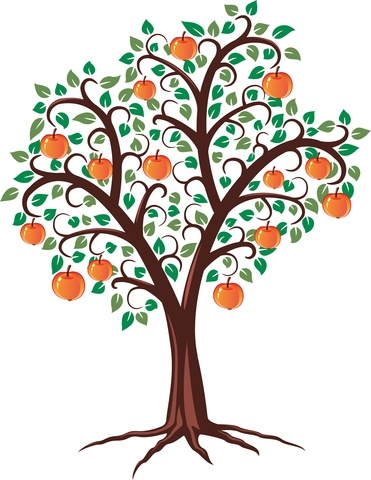
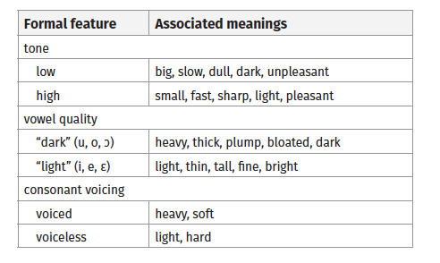
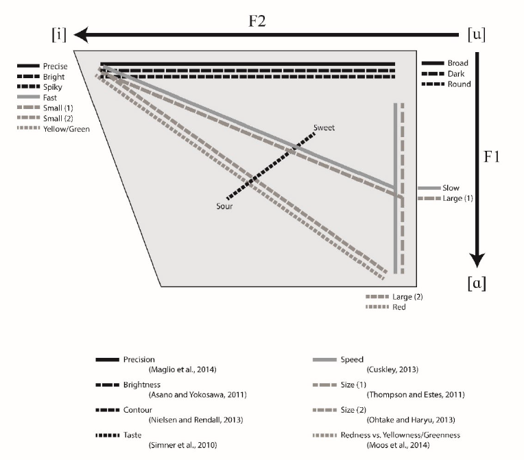
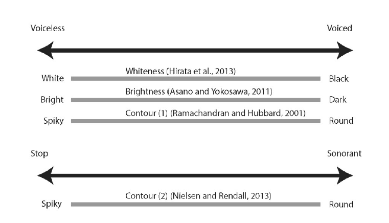
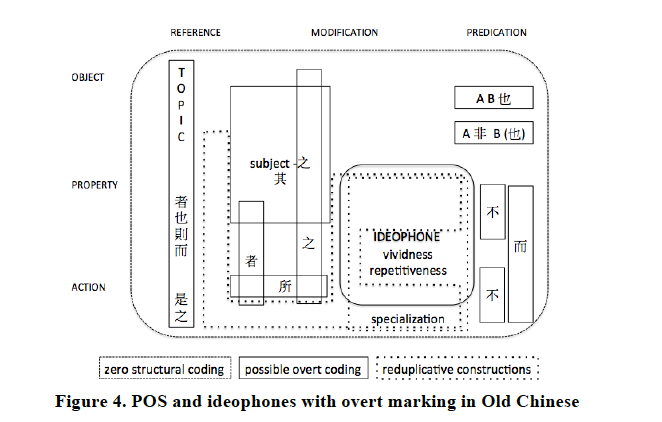

```{r setup, include=FALSE}
options(htmltools.dir.version = FALSE)
```

# Abstract

.left-column[


]

.right-column[

.font80[ 
>Ideophones (also known as expressives or mimetics, and including onomatopoeia) have been systematically studied in linguistics since the 1850s, when they were first described as a lexical class of vivid sensory words in West-African languages.

>This paper **surveys the research history of ideophones**, from its **roots** in African linguistics to its **fruits** in general linguistics and typology around the globe.

>It shows that despite a recurrent narrative of marginalisation, work on **ideophones has made an impact in many areas of linguistics**, from theories of phonological features to typologies of manner and motion, and from sound symbolism to sensory language. 

>Due to their hybrid nature as gradient vocal gestures that grow roots in discrete linguistic systems, ideophones provide opportunities to reframe **typological questions**, reconsider the role of **language ideology** in linguistic scholarship, and **rethink the margins of language**. With ideophones increasingly being brought into the fold of the language sciences, this review synthesises past theoretical insights and empirical findings in order to enable future work to build on them.

] 

]

---

# Topic addressed

##  Alternative (affectionate) title:

.font120[**Ideophones and why you should care.**]

## Focuses of the paper

- ideophones in the margins .lit[§1]
- historical overview (a story about scholars) .lit[§2-5]
- recent developments .lit[§6]
- lessons learned from ideophoens .lit[§7]

---

# Terminology (once more)

## Difference in semantics:
- semantics / pragmatic functions <br> *expressive, descriptive, intensifier*
- morphosyntactic properties <br> *radical, particle, adverb*
- mode of representation <br> *imitative, Lautbild, picture word*
- familiar phenomena <br> *onomatopoeia, interjection, Schallwort*

## Three competitors
- expressives
- mimetics
- **ideophones**

---

# Terminology 


```{r message=FALSE, warning=FALSE, echo=FALSE, out.width='100%'}
library(tidyverse)
library(lingtypology)

df <- read_csv("https://raw.githubusercontent.com/simazhi/ideophones/master/terminology_map.csv")

map.feature(languages = df$language,
            features = df$terminology,
            popup = df$popup,
            #color= c("yellowgreen", "navy"),
            #shape = TRUE,
            label = df$language
            )
```


---

# Marginality and rara

Ideophones were understudied, relocated to the margins of linguistics.
But, what does it mean to be marginal?

>.sc[Rara] are typologically exceptional phenomenona that illuminate the fringes of linguistic diversity. […] 

>.sc[Marginalia] are typologically unexceptional phenomena that many linguists think can be ignored without harm to linguistic inquiry. They are not rare, but linguistic practice assigns them to the margins by consensus. 

>Whereas rara can be objectively described as exceptional, marginalia are viewpoint-dependent” 
(Dingemanse 2017: 195–6).

However, they (should) have a rightful place in grammars.

---

# Origins of marginality

## Assimilation

Ideophones can be equated with grammatical categories more familiar to the investigator

- response cries .lit[(Pinker & Jackendoff 2009)]
- onomatopoeia, which only depict .sc[sound] in their strict definition

## Exceptionalism

Ideophones are *completely different* from anything in else in language

- ideophones are a "singularly unique feature" of Yoruba .lit[(Vidal 1852)]
- studying ideophones = "explorations in the lunatic fringe of language" .lit[(Frankis 1991)]

Combatting marginality through highlighting the **unique significance** of ideophones, while showing how they are **shaped and constrained by the linguistic system**.

---

# The discovery of ideophones

Much of this survey can be found in Dingemanse's PhD dissertation .lit[(2011)]

## First findings

- Sanskrit *anukāraṇa* (4th cent. BCE)
    - quotatitve *-iti*
    - reduplication
- Japanese (17th cent.)
    - "adverbs that dconclude and draw attention"
    - "The Japanese have a great number of adverbs which serve not only to express the manner of an event, but which also indicate the sound, the noise, the posture of the thing. (…) Many of these adverbs are formed by repetition of the same word, to express the manner in which a thing is done, or the sound of the thing: like farafara, ‘sound of rain or tears falling’."
    
---

# The discovery of ideophones

## 1850s: First modern findings

1850s: independent descriptions of large numbers of ideophones in West-African languages

- [Owen Vidal](https://en.wikipedia.org/wiki/Owen_Vidal) (1819-1854) on Yoruba .lit[(1852)]
- [Sigismund Koelle](https://en.wikipedia.org/wiki/Sigismund_Koelle) (1820-1902) on Kanuri .lit[(1854)]
- [Bernhard Schlegel](https://www.deutsche-biographie.de/sfz78426.html) (1827-1859) on Ewe .lit[(1857)]

They find similar sets of ideophones for these three languages, and have some impact.

However, authorities like [Max Müller](https://en.wikipedia.org/wiki/Max_M%C3%BCller) from Oxford say they "constitute a very small proportion of our dictionary" and "are playthings , not the tools of language" .lit[(1861:346)]

---

# The discovery of ideophones

## Around 1900: Africa and beyond

More studies start mentioning ideophones:

* McLaren (1886) on Nguni
* Junod (1896) on Ronga
* Whitehead (1899) on Bobangi
* Meinhof (1906) on the Bantu languages
* Aston (1894) on Japanese
* Grammont (1901) on Indo-European languages
* Leskien (1902) on Lithuanian
* Wrinkler-Breslau (1907) on Caucasian languages
* Urtel (1919) on Basque

---

# Ideophones are significant

## [Henri Junod](https://en.wikipedia.org/wiki/Henri-Alexandre_Junod) (1863-1934)

.pull-left[
- Ronga language .lit[(Junod 1896)]
- *adverbes descriptifis*
- occurs in normal conversation
- "One might say: “This is an childish way of speaking; it is not worth the trouble. **Quite the contrary!** The versatile and spontaneous mind of the people is reflected in this picturesque talk. It enables these words to render nuances which a more restrained language could not express." (Junod 1896: 196f.)
]

.pull-right[

]

---

# Ideophones are significant

## [Diedrich Westermann](https://en.wikipedia.org/wiki/Diedrich_Hermann_Westermann) (1875-1956)


.pull-left[
- Ewe language .lit[(Westermann 1905; 1907)]
- *Lautbilder* 'picture words'
- "the more the meaning of a verb is removed from the sensory domain, the more these special adverbs disappear and make place for more general ones like *ŋutɔ* ‘very’, *geɖe* ‘many’, *kakáka* ‘to a great extent’, etc." (Westermann 1907: 83).
]

.pull-right[


]

---

# Ideophones are significant

## Diedrich Westermann 

>Ewe has two dialectally separated words for duck (…), *kpakpa* after its quacking and *ɖaboɖabo.* When I asked a local whose dialect does not have the latter why it is that other people would say *ɖaboɖabo*, his answer was, “Well, because…”, and he used his upper body to imitate the waddle of a duck. **Ideophones describe a process or object as a whole, not focusing on a single aspect but highlighting primarily its living, moving features.** Asking for the meaning of an ideophone often leads to the objection: “You cannot just describe it, you have to see it.” **It is the total impression, the whole Gestalt, or the movement of the whole Gestalt, which is important.** (Westermann 1937: 159)

.ru-blockquote[
As a side note, to me this quote convinces me even more that we can use Mental Space theory to the idea of ideophones, as I explored for seminar and [presented in Nagoya (Van Hoey 2017)](https://www.dropbox.com/s/trv8rzytiqf0j9y/Mimetics2_Thomas.pdf?dl=0). 

Recently, Verhagen and Dingemanse want to apply the notion of intersubjectivity to ideophones, and I think that could be a continuation of applying Mental Spaces to that phenomenon.
]

---
 
# Ideophones are significant

## Ewe collocations with zɔ ‘to go/walk’

- *zɔ hlóyihloyi* ‘walk with many objects dangling about’
- *zɔ kpúɖukpuɖu* ‘rapid walking of a small person’
- *zɔ ʋɛ̃ʋɛ̃* ‘gait of a fat and stiff peson'

These vivid depictions made an impact on the philosopher Lévy-Bruhl and made its way into Dan Slobin's .lit[(2004)] starting point on .sc[thinking-for-speaking]! and .sc[satellite]-framed versus .sc[verb]-framed.

.ru-blockquote[
Notice how these patterns are similar to what we call ABB in Chinese
- 霧濛濛
- 軟綿綿
- 硬邦邦
]

---

# Ideophones are significant

## Iconicities discovered by Westermann .lit[(1927; 1937)]


---

# Ideophones are significant
## Iconicities in the lab 
.lit[(Lockwood & Dingemanse 2015; Lockwood 2017)]




---

# Ideophones are significant
## Iconicities in the lab 
.lit[(Lockwood & Dingemanse 2015; Lockwood 2017)]

.right-column[

]

.left-column[
Dingemanse thinks it's unfortunate that not more experimental studies use real ideophones as stimuli, instead of making up *maluma* and *takete*, or *kiki* and *bouba*.
]

---
# Ideophones are significant

## [Lévy-Bruhl](https://en.wikipedia.org/wiki/Lucien_L%C3%A9vy-Bruhl) (1857-1939)

Junod's and Westermann's research showed that ideophones can be a study field by themselves, and they were quoted by the influential book *Les fonctions mentales dans les sociétés inférieures* (*How Natives Think*) (1910).
However, this book argued that the people using ideophones were **primitive and used by primitives**.

This (with a.o. Max Müller's comments) made sure ideophones only got marginal attention in linguistics.

---

# Grammar and performance

## [Clement Martyn Doke](https://en.wikipedia.org/wiki/Clement_Martyn_Doke) (1893-1980)

.left-column[

]

.right-column[
- *Bantu Linguistic Terminology* (1935)
- coined term 'ideophone' (in this usage)
- definition: "A vivid representation of an idea in sound. A word, often onomatopoetic, which describes a predicate, qualificative or adverb in respect to manner, colour, sound, smell, action, state or intensity" (Doke 1935:118).
- argues that ideophones are their own word class / part-of-speech
- only rhetorical device, used in narrative
]

---

# The 1960s: More research

The Africanist [Paul Newman](https://en.wikipedia.org/wiki/Paul_Newman_(linguist)) accepted ideophones as a class for Hausa, but maybe not so much for other languages .lit[(1968)].

So, "it was possible to speak of ideophones as a lexical class while recognising that their morphosyntactic functions might be more multifaceted and language-specific."


## More research

- Hoffkann (1952) on ancient Indian languages
- Emeneau (1969) on languages in India
- Uhlenbeck (1952) on Indonesian (Javanese)
- Carr (1966) on Malay
- Durand (1961) on Vietnamese
- Baner (1964) on Bahnar
- Henderson (1965) on Khasi
- Watson (1966) on Pacoh
- explosion in Japanese studies as well (Akita 2009)


---

# Grammar and performance

## [Clement Martyn Doke](https://en.wikipedia.org/wiki/Clement_Martyn_Doke) (1923-2016)

.left-column[

]

.right-column[
- After Fortune .lit[(1962)] noted the dramatic (as in theater) usage of ideophones, Kunene highlighted their similarity to performances
- While for Vidal (1852) ideophones had the meaning of 'very' (intensifier), for Kunene **this intensification simply arose as a side effect of the depictive quality of ideophones.** (1965:22)

>"The ideophone attempts to bring before the listener, for first-hand perception, actions or states (…) It is an attempt to make the audience *see for themselves* what happened — or will happen" (1965:35)

]


---

# The 1970s: Cross-linguistic encounters

## William Samarin

.pull-left[
.font80[
> Elsewhere in the world […] we find similar classes of words. What is striking about them, as with African ideophonic words, is that (1) they display a **great deal of play with sounds**, that (2) they are **predominantly reduplicative**, that (3) their **phonology** is in some respects **different** from that of all other words, and finally, that (4) they have **very specific meanings** sometimes **difficult to define**. (Samarin 1970b: 160)

]

Based on ideophones in African languages, Azerbaijani, Malagasy, Mon-Khmer, Korean, Tamil, Thai, Yokuts and Waiwai.

]

.pull-right[

]

---

# The 1970s: Cross-linguistic encounters

## Gérard Diffloth

.pull-left[
.font80[
> Such a wide geographic and historical distribution indicates that ideophones are a characteristic of natural language in general, even though they are conspicuously undeveloped and poorly structured in the languages of Europe. (Diffloth 1972: 440)

]

Based on ideophones in Bantu, Chadic, Indo-Aryan, Dravidian, Munda and Mon-Khmer, Austronesian, Japanese and Korean

]

.pull-right[


]

---

# The 1970s and 1980s

## New methods and findings

- Renewed focus on how iconicity and ideophones might correlate, while shifting away from the discussion of their word class status
- Expressive phonology
- ...

.ru-blockquote[
I also wonder, how important is their word class status, especially if one were to adopt frameworks like Croft's Radical Construction Grammar (2001) or Langacker's Cognitive Grammar (1987; 1991; 2008)

]

---

# The 1980s: Impact in linguistics
 
| Topic of study | Key examples
| ------|----
| nature of phonological features | Kim-Renaud (1978), Mester & Itô (1989)
| nonconcatenative morphology | McCarthy (1983), McNally (1991)
| aesthetic and expressive functions of language | Samarin (1970a), Jakobson and Waugh (1979)
| lexical discreteness and the nature of words | Diffloth (1976), Mithun (1982)
| gradience and iconicity in prosody | Liberman (1975), Bolinger (1985)
| psychological reality of lexical iconicity | Fischer-Jørgensen (1978), Fordyce (1988)
| expressive vs. prosaic levels of structure | Diffloth (1980), Zwicky & Pullum (1987)

So, ideophones started influencing theoretical linguistics, providing  ruual data and motivating theoretical innovations.

---

# The 1990s: Contravoices

In 1992 [Frederick Newmeyer](https://en.wikipedia.org/wiki/Frederick_Newmeyer) wrote that "the number of pictorial, imitative, or onomatopoetic nonderived words in any language is vanishingly small" .lit[(1992:758)] -- not based on data, but on his gut feeling (or so).

BUT

Other works stressing the important role of iconicity:
- Linda Waugh took "the 'con' out of iconicity" .lit[(Waugh 1992)]
- seminal volume on *Sound Symbolism* .lit[(Hinton, Nichols & Ohala 1994)]
- Janis Nuckolls began working on Quecha ideophones .lit[(Nuckolls 1997)]

---

# The 2000s and 2010s: Inter-discipline

Kulemeka .lit[(1995)] argued that there are two 'traditions' of ideophones:
- African: focus on word class status of ideophones
- Asian: focus on iconic patterns in ideophones

Then the first conference on ideophones led to a seminal volume *Ideophones* .lit[(Voeltz & Kilian-Hatz 2001)] on ideophones all around the world, but with a strong focus on Africa.

Interdiscplinary studies: gesture, sociolinguistics, translation, neuroimaging, word learning.
These have already been reviewed in other overview articles .lit[(Vigliocco & Kita 2006; Akita 2009; 2015; Armoskaite & Koskinen 2017; Ibarretxe-Antuñano 2017)]

Because of these discussions elsewhere, Dingemanse will focus on typology, and linguistic anthropology and language ideologies

---

# The 2000s and 2010s: Typology 

One common argument that stresses the importance of including ideophones in linguistics is the size of the inventory.

| Language | Reported magnitude of ideophone inventory
|  ---|---
| Basque | “more than 4,500” (Ibarretxe-Antuñano 2006: 150)
| Gbeya | “over 3,000” (Samarin 1971: 161)
| Japanese | “4,500” (Ono 2007)
| Korean | “several thousands” (Sohn 2001: 96)
| Semai | “same order of magnitude” as nouns and verbs (Diffloth 1976: 249)
| Turkish | “one to two thousand” (Jendraschek 2001: 39)
| Zulu | “3,000” (von Staden 1977: 200)

--

.font80[
> "Precise numbers are less important than what they imply about grammatical significance and functional load. While minor word classes may be dismissed by some as marginal or of limited importance to linguistic analysis, it is much harder to make such arguments for languages with thousands of ideophones." 

]

---

# The 2000s and 2010s: Typology 

## Chinese inventory

.ru-blockquote[
* my database project was stuck at 784 types for a very long time.
* since this summer I (and Arthur Thompson from HKU) are working on getting all the ideophones from Kroll .lit[(2015)], *A Student's Dictionary of Classical and Medieval Chinese*
* combining that database and this dictionary project seems to yield about 2000 ideophones in total -- although we still need to discuss the validity.
* this database can be analyzed and also used for corpus-based explorations
]

---

# The 2000s and 2010s: Typology 

Dingemanse deplores that some linguistic typologies, like Dixon's .lit[(1982)] continuum between strongly adjectival languages and strongly verbal languages does not take ideophones into account. Neglecting to do so would place e.g. in the verbal category; while with ideophones in mind, Ewe is adjectival.

In the typology of the motion event, we know about .sc[satellite-framed] and .sc[verbal-framed] languages (and .sc[equipollently framed] ones). As work on Basque .lit[(Ibarretxe-Antuñano 2004; 2015)] and Quecha .lit[(Nuckolls 2014)] shows, ideophones can and should be part of the complex event description.

---

# The 2000s and 2010s

##Linguistic anthropology 

Ethnographically informed approaches to ideophone studies
- Philip Noss on ideophones and verbal art in Gbaya .lit[(1989; 1999; 2001)]
- Janis Nuckolls linguistic and cultural ecology of ideophones in Quechua .lit[(1996; 2010)]
- Anthony Webster and the aesthetics and semiotics of iconicity in Navajo poems .lit[(2008)]

Many studies done by native speaker-linguists.

Based on Ameka .lit[(2006)], Dingemanse argues that the "most productive situation in linguage description and theory is when native and non-native speakers join forces."

---

# The 2000s and 2010s

##Redrawing the margins

> “So **linguists do not deal with onomatopoeic expressions. Or perhaps I should say, they are unable to deal with them.** And this is not surprising; onomatopoeic expressions are not the kind of subject matter that expert linguists can take up as a separate topic and study academically. After all, onomatopoeic expressions are not really language; they are, in a sense, raw language. […] Linguists, who are always described by such orthodox adjectives as *kashikoi* (wise), *tadashii* (right), *erai* (great), or *rippana* (respected), cannot handle them. If they handle them carelessly, they will run into problems.” (Gomi 1989: iii)

However, a redrawing of the margins has long been underway
- ideophones are increasingly considered as a possible word class
- innovations in phonology and morphology because of their similarity to gesture
- arbitrariness vs. iconicity

---

# The 2000s and 2010s: Redrawing the margins

Some current questions for which ideophones provide critical evidence.

- How can we incorporate arbitrariness and iconicity in formal theories of language? .lit[(Schlenker, Lamberton & Santoro 2013; Wilcox & Xavier 2013; Davidson 2015)]
- What are the roles of iconicity in language learning and communication? .lit[(Imai & Kita 2014; Laing 2014; Perniss & Vigliocco 2014)]
- Which cognitive and perceptual processes underlie iconic associations? .lit[(Bankieris & Simner 2015; Sidhu & Pexman 2017)]
- What is the role of iconicity in the cultural evolution of language? .lit[(Verhoef, Kirby & de Boer 2015; Tamariz et al. 2017; Pleyer et al. 2017)]
- How are new vocal depictions created and interpreted? .lit[(Assaneo, Nichols & Trevisan 2011; Dingemanse 2014;Perlman, Dale & Lupyan 2015)]
- Which words are most iconic, and why? .lit[(Winter et al. 2017)]
- How universal or language-specific are iconic form-meaning mappings? .lit[(Dingemanse 2012; Occhino et al. 2017)]

---

# Challenges and opportunities

## 1. Three .sc[misconceptions] about ideophones
1. **Ideophones are “playthings, not tools”.** Some have considered any imitative useo f language childish, based on unreflective adoption of Standard Average European language ideologies. <br> *Questionable assumption: one’s own language ideologies offer a good guide to those of others.*
2. **Ideophones are just onomatopoeia.** Some have taken all ideophones to be imitative of sound, based on the fact that onomatopoeia are the most obvious example of imitative words. <br> *Questionable assumption: speech can depict only sound.*
3. **Ideophones are just intensifiers.** Some have thought ideophones are essentially intensifiers, because pragmatically equivalent translations in European languages tend to include “very”. <br> *Questionable assumption: pragmatic equivalence implies semantic and semiotic identity.*

.ru-blockquote[
Some authors, like Haiman (2018) still seem to think this.
]

---

# Challenges and opportunities

## 2. Three .sc[lessons] learned from ideophones
1. **Depiction is one of the major modes of communication.** Ideophones show how vocal depictions may become lexicalised as vivid sensory words, and how speech and iconic gesture can be tightly linked and mutually reinforcing in multimodal acts of depiction.
2. **Lexical iconicity is not deterministic but probabilistic.** Language provides a multidimensional possibility space for iconic associations between aspects of form and meaning. Ideophones offer existence proofs of many iconic associations beyond those known from pseudowords.
3. **Ideophones reshape the typology of language.** Our power to formulate meaningful typological generalisations in domains like phonology, motion events, adjectival concepts, and sensory language is strongly affected by the inclusion or exclusion of ideophones.

---

# Challenges and opportunities

## 2. Three .sc[challenges] provided from ideophones
1. **How can we account for depiction in grammar?** As multimodal depictions, ideophones defy dichotomies like language versus paralanguage or word versus image. Linguistic theory needs to be enriched to account for the phonology and morphosyntax of lexicalised depictions.
2. **How can we make linguistic diversity accessible to the cognitive sciences?** Ideophones provide fertile ground for empirical work on the roles of iconicity in cognition and communication. Linguistic studies must be combined with experimental work for broader impact.
3. **How can we avoid perpetuating language ideologies in linguistic practice?** Biases can only be overcome through awareness and diversity in scholarship. As ideophones show, native speaker linguists can offer a powerful antidote against unquestioned ideologies.

.ru-blockquote[
Dingemanse is an avid advocate for experimental work. However, corpus studies can maybe provide even more data, because they are non-elicited?
]

---

# My takeaway

## What do I want to do with ideophones?

.ru-blockquote[
Things I think this overview misses:
1. **Chinese**
2. **diachronic** studies
3. attention for cross-modal studies (gesture is there, but what about **writing**?)
4. **variation** and the **onomasiological** perspective
]

## Frameworks and methodology

.ru-blockquote[
- **corpus-based** approaches
- **Radical Construction Grammar** and/or **Cognitive Grammar** (?) .lit[Croft; Langacker etc.]
- **Diachronic prototype semantics** .lit[Geeraerts (1997)]
]

---

# Selected references

Dingemanse, Mark. 2018. Redrawing the margins of language: Lessons from research on ideophones. Glossa: a journal of general linguistics 3(1). doi:10.5334/gjgl.444.

---

# Questions: Alex

.font90[
>Doke argued the ideophone was a **part of speech** on a par with better known categories like nouns, verbs and adverbs. Writing for an audience of traditionally schooled grammarians, he noted that only a limited proportion of ideophones were imitative of sound and therefore “it is not wise to use the term [onomatopoeia] for that part of speech” (Doke 1935: 183). **Doke’s insistence on the ideophone as a word class was arguably one of the most influential moves in ideophone studies. **

>QUESTION: Do you concur with Doke’s idea that ideophone can be regarded as a part of speech/class of word? 

>However Kunene argued that that ideophones could sometimes even be substituted by a gesture, carrying dramatisation to its logical extreme. 
Ideophones emerged as multimodal performances, inviting the listener to imagine what it is like to perceive the scene depicted. 

>QUESTION: Are these two ideas incompatible or complementary to each other? 

> QUESTION: Are there any supporting evidence or vivid examples that you can kindly share with us? 

>A deeply rooted dismissive attitude towards iconic modes of communication is one of the prime reasons for the traditional marginalisation of the ideophone in Western linguistics. Interesting!

]

---

# Questions: Alex

.ru-blockquote[
I think that word class status in Chinese is a particularly difficult topic. Given a framework like CG and RCG, where parts of speech are also semantically motivated (and not just distributionally), I would say that **ideophones or ideophonic constructions, as a family of constructions, can definitely have their place.** Although I would definitely consider ideophones to be closer to adjectives and verbs than nouns!
]




---
# Questions: Alex

.ru-blockquote[
So I think, with more **functional approaches to language** (focusing on language use, in all modalities), it should be possible to integrate both Doke's concerns and Kunene's observations. But of course it is a continuum, and the whole spectrum should be investigated.
In fact, that is what Dingemanse has been trying to do since he came into contact with Siwu.  

An example we have used before in class: 咻 *xiū* as a .sc[manner] depiction that integrates in a **complex verbal event**.

他咻一下地跑過去了。
[gesture]

My hairdresser: 頭髮要吹蓬蓬 (/澎澎) *chuī péng~péng* 'blow the hair PENG'

Maybe you have other examples?
]


