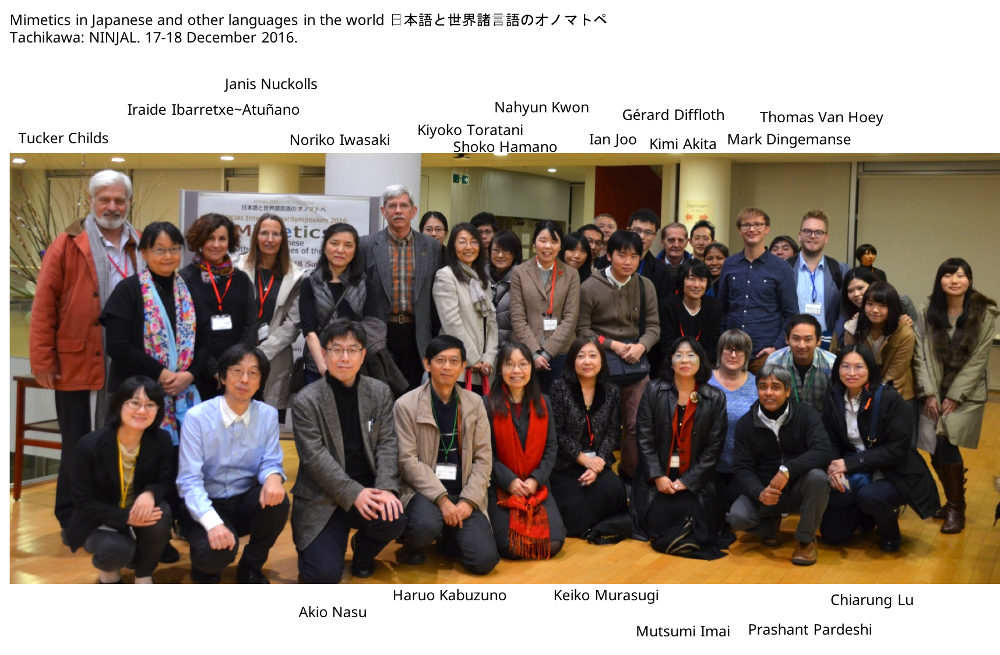
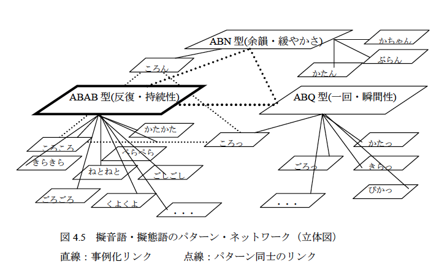
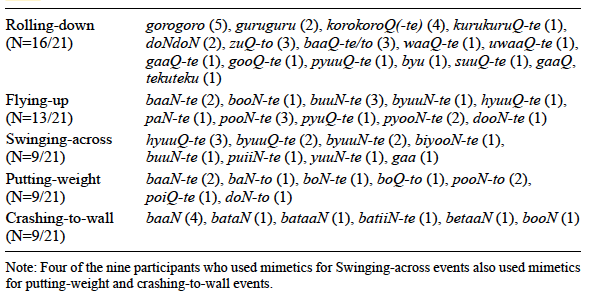
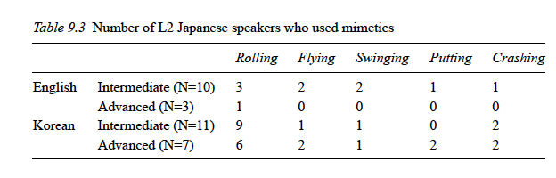
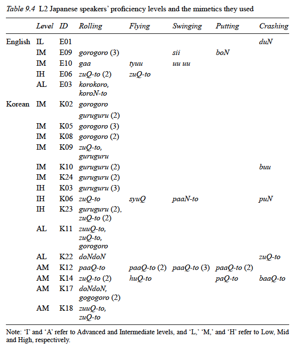

```{r setup, include=FALSE}
options(htmltools.dir.version = FALSE)
```


# Iwasaki Noriko 岩﨑典子



---

# Iwasaki Noriko 岩﨑典子

.pull-left[
Iwasaki obtained her PhD in Second Language Acquisition and Teaching (SLAT) at the University of Arizona.

Now she is in the Department of Linguistics at SOAS (London)


**Research interests:**
* L2 learning of Japanese, Korean
* Mimetics
* style, grammar, etc.

Citet(myBib, "Dingemanse2011")

]

.pull-right[


Co-editor of 
* *The grammar of Japanese mimetics: Perspectives from structure, acquisition and translation* (2016)
* *The Routledge Intermediate to Advanced Japanese Reader: A Genre-Based Approach to Reading as a Social Practice* (2015)

]

---
class: center, middle

# Introduction: terminology

```{r map, message=FALSE, warning=FALSE, echo=FALSE, out.width='100%'}
library(tidyverse)
library(lingtypology)
df <- read_tsv("https://raw.githubusercontent.com/simazhi/ideophones/master/terminology_map.csv")

map.feature(languages = df$language,
            features = df$terminology,
            popup = df$popup,
            #color= c("yellowgreen", "navy"),
            #shape = TRUE
            label = df$language,
            legend.position = "bottomright"
            )

```


---

# Introduction

>Mimetics in Japanese are generally considered to be an important part of the lexicon for second language (L2) learners of Japanese to acquire (e.g. Makino & Tsutsui 1986; Akimoto 2007), and many reference books have been published on this topic (e.g. Hyuga & Hibiya 1989; Akutsu 1994; Tomikawa 1997).  
However, **few studies have investigated L2 acquisition of mimetic words**; in particular, **research examining how L2 learners *spontaneously* use mimetics in speech is scarce**. (p. 193)

Iwasaki (2017:148-171) showed that even though "English speakers, whose L1 contains no mimetics" [I don't agree with this], they used more mimetics than expected. 


But the language level of the subjects was very varied.

So Iwasaki decided to perform a new study, to see how Motion event related mimetics occur spontaneously.

---

# The typology of Motion events

## Components

Based on Talmy (1975; 1985; 2000; 2007), there are four components in a Motion event.

1. **Figure**: the entity that is moving or is located at a specific place
2. **Ground**: the entity which acts as a spatial reference point for the motion/ location of the figure
3. **Path**: the path of motion of the figure
4. **Manner**: the manner of motion by which the figure moves along the path


---

## Co-Events

**Manner**, later retermed as **Co-Event**, is specified as (Talmy 2007: 85-86):

1. **Precursion**: *Glass splintered over the food*<br> [glass <sc>moved</sc> over the food] <sc>with-the-precursion-of</sc> [the glass splintered]
2. **Enablement**: *I scooped jellybeans up into her sack*<br> [I Amoved jellybeans into her sack] <sc>with-the-enablement-of</sc> [I scooped up the jellybeans]
3. **Cause**: *I squeezed the toothpaste out of the tube*<br> [I Amoved the toothpaste out of the tube] <sc>with-the-cause-of</sc> [I squeezed on the toothpaste/tube]
4. **Manner**: *The top spun into the box*<br> [the top moved into the box] <sc>with-the-manner-of<sc> [the top
spun]
3. **Concomitance**: *She wore a green dress to the party*<br> [she went to the party] <sc>with-the-concomitance-of</sc> [shewore a green dress]
4. **Subsequence**: *They locked the prisoner into his cell*<br> [they Amoved the prisoner into his cell] <sc>with-the-subsequence-of</sc> [they locked the cell]

---

## Twofold and Threefold typology

Based on Talmy (1975; 1985; 2000; 2007) and later Slobin (2004; 2006), Motion events can be divided into three categories:

**Verb-Framed** Motion Event: Verb incoporates *Path*

<table border="0">
<tr> 
 <td  align="left">ボール-が</td>
 <td  align="left">転がって</td>
 <td  align="left">落ちた。</td>
</tr>

<tr> 
 <td  align="left">booru-ga</td>
 <td  align="left">korogatte</td>
 <td  align="left">otita</td>
</tr>

<tr> 
 <td  align="left">ball-<sc>nom</sc></td>
 <td  align="left">roll.<sc>ger</sc></td>
 <td  align="left">fall.<sc>pst</sc></td>
</tr>

<tr>
 <td colspan="9">'The ball fell, rolling.'</td>
</tr>

</table>

**Satellite-Framed** Motion Event: Verb incoporates *Manner*

<table border="0">
<tr> 
 <td  align="left">The=ball</td>
 <td  align="left">roll-ed</td>
 <td  align="left">down.</td>
</tr>

<tr> 
 <td  align="left"><sc>art</sc>=ball</td>
 <td  align="left">roll-<sc>pst</sc></td>
 <td  align="left">down</td>
</tr>

<tr>
 <td colspan="9">'The ball rolled down.'</td>
</tr>

</table>

---
class: middle


**Equipollently-framed**: Both Path and Manner are saliently encoded

<table border="0">
<tr> 
 <td  align="left">他</td>
 <td  align="left">跑</td>
 <td  align="left">出</td>
 <td  align="left">來</td>
 <td  align="left">了。</td>
</tr>

<tr> 
 <td  align="left">tā</td>
 <td  align="left">pǎo</td>
 <td  align="left">chū</td>
 <td  align="left">lái</td>
 <td  align="left">le</td>
</tr>

<tr> 
 <td  align="left">3.<sc>sg</sc></td>
 <td  align="left">run</td>
 <td  align="left">exit</td>
 <td  align="left">come</td>
 <td  align="left"><sc>pfv</sc></td>
</tr>

<tr>
 <td colspan="9">'They came running out.' Croft (2010:207, from Li & Thompson 1981:58)</td>
</tr>

</table>


Path
Boundary-crossing
Equipollent: Path and Manner receive equal weight


---

## New typology

Croft et al (2010:208) propose a new typology:

1. **Verb framing** (VF)
2. **Symmetrical**
    1. *Coordinate* (CD)
    1. *Serial*
    1. *Compounding* (CP)
3. **Satellite framing** (SF)
4. **Double framing** (DF)

---

## Compounding

<table border="0">
<tr> 
 <td  align="left">私-は</td>
 <td  align="left">家-に</td>
 <td  align="left">駆け-込んだ。</td>
</tr>

<tr> 
 <td  align="left">watasi-wa</td>
 <td  align="left">ie-ni</td>
 <td  align="left">kake-konda</td>
</tr>

<tr> 
 <td  align="left">1.<sc>sg</sc>-<sc>top</sc></td>
 <td  align="left">house-to</td>
 <td  align="left">run-go.into.<sc>pst</sc></td>
</tr>

<tr>
 <td colspan="9">'I ran into the house.'</td>
</tr>

</table>

--
<br>
<br>


<table border="0">
<tr> 
 <td  align="left">私-は</td>
 <td  align="left">家-に</td>
 <td  align="left">走って-入った。</td>
</tr>

<tr> 
 <td  align="left">watasi-wa</td>
 <td  align="left">ie-ni</td>
 <td  align="left">hasitte-haitta</td>
</tr>

<tr> 
 <td  align="left">1.<sc>sg</sc>-<sc>top</sc></td>
 <td  align="left">house-to</td>
 <td  align="left">run-go.into.<sc>pst</sc></td>
</tr>

<tr>
 <td colspan="9">'I ran into the house.'</td>
</tr>

</table>


---

## Coordination

<table border="0">
<tr> 
 <td  align="left">私-は</td>
 <td  align="left">タル-を</td>
 <td  align="left">転がし-て</td>
 <td  align="left">地下室-に</td>
 <td  align="left">入れた。</td>
</tr>

<tr> 
 <td  align="left">watasi-wa</td>
 <td  align="left">taru-o</td>
 <td  align="left">korogasi-te</td>
 <td  align="left">tikasitu-ni</td>
 <td  align="left">ireta</td>
</tr>

<tr> 
 <td  align="left">1.<sc>sg</sc>-<sc>top</sc></td>
 <td  align="left">barrel-<sc>acc</sc></td>
 <td  align="left">roll-<sc>conj</sc></td>
 <td  align="left">basement-to</td>
 <td  align="left">put.into.<sc>pst</sc></td>
</tr>

<tr>
 <td colspan="9">'I rolled the barrel into the basement.'</td>
</tr>

</table>

--
<br>
<br>

<table border="0">
<tr> 
 <td  align="left">彼女-は</td>
 <td  align="left">喋り-ながら</td>
 <td  align="left">道路-を</td>
 <td  align="left">渡った。</td>
</tr>

<tr> 
 <td  align="left">kanozyo-wa</td>
 <td  align="left">syaberi-nagara</td>
 <td  align="left">dooro-o</td>
 <td  align="left">watatta</td>
</tr>

<tr> 
 <td  align="left">3.<sc>sg.f</sc>-<sc>top</sc></td>
 <td  align="left">talk-while</td>
 <td  align="left">street-<sc>acc</sc></td>
 <td  align="left">cross.<sc>pst</sc></td>
</tr>

<tr>
 <td colspan="9">'She talked her way across the street [lit. She crossed the street, talking].'</td>
</tr>

</table>

---

## Mimetics and Motion typology

Manner is often expressed in V- languages by utilizing adverbs and mimetics (Wienold 1995; Slobin 2006; Nuckolls 2017 etc.)

However, Manner is not the only Co-event that can be expressed using mimetics (Toratani 2012), e.g.

<table border="0">
<tr> 
 <td  align="left">父-は</td>
 <td  align="left">コソコソ-と</td>
 <td  align="left">家-の-中-に</td>
 <td  align="left">入って</td>
 <td  align="left">行った。</td>
</tr>

<tr> 
 <td  align="left">titi-wa</td>
 <td  align="left">kosokoso-to</td>
 <td  align="left">ie-no-naka-ni</td>
 <td  align="left">haitte</td>
 <td  align="left">itta</td>
</tr>

<tr> 
 <td  align="left">father-<sc>top</sc></td>
 <td  align="left"><sc>mim</sc>-<sc>quot</sc></td>
 <td  align="left">house-<sc>gen</sc>-inside-<sc>dat</sc></td>
 <td  align="left">enter.<sc>ger</sc></td>
 <td  align="left">go.<sc>pst</sc></td>
</tr>

<tr>
 <td colspan="9">'My father went into the house stealthily.' (Mure 2003:95)</td>
</tr>
<tr>
 <td colspan="9">[father <sc>moved</sc> into the house]
<sc>with-the-concomitance-of</sc> [father acted stealthily]</td>
</tr>

</table>


---

## L1 influence in L2 motion description

To bring back the topic to the focus of our class: **what is the influence of L1 for L2 motion description?**

Methodology: **three-language research design** is better than two-language design, because the latter does not necessarily show the property we are interested in, viz. motion description.

e.g. Cadierno & Ruiz (2006) with
* Participants: L1 Danish (Satellite-framed) and Italian (Verb-framed) who learn L2 Spanish (Verb-Framed)
* Material: Frog Story -- *Frog, where are you?* by Mayer (1969)
* No significant result

---

## L1 influence in L2 motion description

Conversely, two-language designs: 
* Larrañaga et al. (2011) found that **English-speaking learners of L2 Spanish** had enormous **difficulty in encoding Manner in boundary- crossing contexts**, e.g. *correr en* (which is wrong, because Spanish is V-framed)
* Choi & Lantolf (2008) examined speech and gesture used by English- Korean bilinguals (two Korean- speaking learners of L2 English; two English- speaking learners of L2 Korean). They found that, while the bilinguals **shifted their L1 patterns to L2 for encoding Path**, they largely **retained their L1 patterns of encoding Manner in their L2**.

Iwasaki argues that we need more research because these studies have conflicting results.

---

## **Learning** to describe Motion events using mimetics in Japanese as L1 and as L2

Tsjumura (2002:25) reports Japanese children of 2;5, 2;7 and 2;8 years old who already use mimetics to code motions.

Using the *Frog Story*, Toratani (2012; 2016) finds L2 Japanese learners who use mimetics similarly to L1 Japanese speakers. 

<table border="0">
<tr> 
 <td  align="left">いっぱい</td>
 <td  align="left">ハチ-が</td>
 <td  align="left">ハチ-の-巣</td>
 <td  align="left">から</td>
 <td  align="left">出ました。</td>
 <td  align="left">ブーン、</td>
 <td  align="left">ブーン。</td>
</tr>

<tr> 
 <td  align="left">ippai</td>
 <td  align="left">hati-ga</td>
 <td  align="left">hati-no-su</td>
 <td  align="left">kara</td>
 <td  align="left">demasita</td>
 <td  align="left">buuN</td>
 <td  align="left">buuN</td>
</tr>

<tr> 
 <td  align="left">many</td>
 <td  align="left">bee-<sc>nom</sc></td>
 <td  align="left">bee-<sc>gen</sc>-nest</td>
 <td  align="left">from</td>
 <td  align="left">exit<sc>pst</sc></td>
 <td  align="left"><sc>mim</sc></td>
 <td  align="left"><sc>mim</sc></td>
</tr>

<tr>
 <td colspan="9">'Many bees came out of the beehive. “Buun, buun! (Toratani 2012:128)</td>
</tr>

</table>


---

# Current study

## Objectives and research question

**Goal**: investigate the infl uence of L2 learners’ L1 when using Japanese mimetics in Motion event descriptions 

**Design**: three-language design
* English (Satellite-framed)
* Korean (Verb-framed)
* Japanese (Verb-framed)

**Questions**
* How many mimetics (per group)?
* How are they used (syntactically)?

---

## Identification of mimetics

Iwasaki makes an important point:

> [D]ue to the creative nature of mimetics (see Tsujimura, this volume), it is important to understand the variety of mimetics and constructions that L1 speakers use; relying on the author’s intuition, dictionary entries or published literature can lead to inaccuracies when identifying target mimetics or constructions used to describe a Motion event.

---
## Identification of mimetics



However, Japanese has a pretty good formal description of what mimetics are: ABAB or ABQ or ABN (Lu 2006)

* *korokoro* コロコロ
* *koroQ* コロッと
* *koroN* コロン

---

## Participants

```{r participants, echo=FALSE}

language <- c("Japanese", "Korean", "English")
number_used <- c(21, 18, 13)
gender <- c("10f; 11m", "11f; 7m", "7f; 6m")
mean_age <- c(21, 24.3, 21.5)
place <- c("Tokyo", "Seoul", "London")

df <- tibble(language = language,
          number = number_used,
          gender = gender,
          "mean age" = mean_age,
          place = place)

knitr::kable(df, format = "html")
```

--

Iwasaki goes into great detail describing the proficiency levels of the participants, according to fixed standards, (2017:203) and is a good example of how it should be done.

Although I wish she would have used a more tabular format instead of writing it in the text, for the sake of clarity.

---
class: center, middle

## Stimuli

<iframe width="560" height="315" src="https://www.youtube.com/embed/DiGWfxK5ZIc" frameborder="0" allow="autoplay; encrypted-media" allowfullscreen></iframe>

* Rolling down: 1'58"-2'38"
* Flying up: 5'05"-5'35"
* Swinging across: 5'35"-5'59"

---


# Findings

## Which mimetics are used?



---

## Number of mimetics per group



---

## Number of mimetics per group



---

## Case study: how do L2 Japanese speakers use mimetics for rolling-down event descriptions?


<table border="0">
<tr> 
 <td  align="left">コロコロ</td>
 <td  align="left">コロコロ-して</td>
 <td  align="left">で</td>
 <td  align="left">その</td>
 <td  align="left">下-に</td>
 <td  align="left">坂-が、</td>
 <td  align="left">ありました。</td>
</tr>

<tr> 
 <td  align="left">korokoro</td>
 <td  align="left">korokoro-site</td>
 <td  align="left">de</td>
 <td  align="left">sono</td>
 <td  align="left">sita-ni</td>
 <td  align="left">saka-ga</td>
 <td  align="left">arimasita</td>
</tr>

<tr> 
 <td  align="left"><sc>mim</sc></td>
 <td  align="left"><sc>mim</sc>-do.<sc>ger</sc></td>
 <td  align="left"><sc>conj</sc></td>
 <td  align="left">that</td>
 <td  align="left">below-<sc>loc</sc></td>
 <td  align="left">slope-<sc>nom</sc></td>
 <td  align="left">exist.<sc>hon</sc>.<sc>pst</sc></td>
</tr>

<tr>
 <td colspan="9">'[He] rolled and there was a slope below.' (English speaker; E03 Advanced- Low)</td>
</tr>

</table>

<br>
<br>

<table border="0">
<tr> 
 <td  align="left">猫-が</td>
 <td  align="left">ボーリング場-に</td>
 <td  align="left">コロン-と</td>
 <td  align="left">して</td>
 <td  align="left">ドーン。</td>
</tr>

<tr> 
 <td  align="left">neko-ga</td>
 <td  align="left">booringuzyoo-ni</td>
 <td  align="left">koroN-to</td>
 <td  align="left">site</td>
 <td  align="left">dooN</td>
</tr>

<tr> 
 <td  align="left">cat<sc>nom</sc></td>
 <td  align="left">bowling.alley<sc>to</sc></td>
 <td  align="left"><sc>mim</sc>-<sc>quot</sc></td>
 <td  align="left">do-<sc>ger</sc></td>
 <td  align="left"><sc>mim</sc></td>
</tr>

<tr>
 <td colspan="9">'The cat rolled into the bowling alley and boom!' (English speaker; E03 Advanced- Low)</td>
</tr>

</table>

---

Features
* Holophrase 'doon'
* *koro* as a verb
* marker *to* used incorrectly

The construction resembles the English *rolls down into* despite the fact that the Japanese construction ‘NP - ni ‘to/towards’ manner verb’ generally does not describe a boundary- crossing event

Korean:
Unlike English speakers, however, the Korean speakers used them in what
appear to be V- framing patterns. They all produced path verbs ( iku ‘go’ or hairu
‘enter’) as the main verbs, and used mimetics in subordinate (or coordinated)
clauses ending

---

# Discussion

The use of mimetics among L2 Japanese speakers was rather limited, corroborating findings in previous studies. 

However, the current study yields a number of new findings. 
1. It is evident that the preference for the use of mimetics depends on the events being described.
2. Both groups of L2 Japanese speakers used Mimetic- suru verbs (e.g. gorogoro- suru) to describe the rolling event, but they did so in differing constructions. English: as a manner verb, Korean as a *te*/*nagara* subclause.
3. Both English and Korean speakers tended to use high-iconic phenomimes (e.g. guruguru, korokoro ) and phonomimes (in case of Korean speakers) in mimetic verbs, despite Akita’s (2009) generalization that highly iconic mimetics are less subject to integration with main verbs.
4. English speakers had a tendency to use only partially integrated mimetics, while Korean speakers used mimetics in a more grammatically integrated fashion.

---
# Conclusion

**Korean speakers used more mimetics in the rolling event descriptions, and overall they used mimetics in a more grammatically integrated fashion.** 

This suggests that *Korean speakers have an advantage* when using
Japanese mimetics to describe Motion events.

Iwasaki (this volume: Ch. 7) found that the presence of grammatically similar mimetics in the L1 was not enough to encourage Korean speakers to use more mimetics in interviews in L2 Japanese.

However, being a V- language, **Korean is similar to Japanese in patterns of mapping semantic components of Motion to forms**. 

These shared L1 factors – **presence of a rich lexical inventory of mimetics** which is **grammatically similar to Japanese**, and the **typological similarity in Motion event descriptions** – appear to have caused additive effect.


---
# Implications for my own research

In general, ideophones are considered an important but more advanced topic of L2 learning (of Japanese).

However, Chinese research does not always recognize ideophones when they stare them in the face (Wu Mengqi 2014).

Therefore, I have not exactly thought out what I want to do for this class's term paper, but recently I've become interested in a certain phenomenon:


<table border="0">
<tr> 
 <td  align="left">這</td>
 <td  align="left">偏</td>
 <td  align="left">文章</td>
 <td  align="left">讀-起來の</td>
 <td  align="left">零亂/凌亂。</td>
</tr>

<tr> 
 <td  align="left">zhè</td>
 <td  align="left">piān</td>
 <td  align="left">wénzhāng</td>
 <td  align="left">dú-qǐlái</td>
 <td  align="left">líng~luàn</td>
</tr>

<tr> 
 <td  align="left"><sc>dem</sc></td>
 <td  align="left"><sc>cl</sc></td>
 <td  align="left">paper</td>
 <td  align="left">read-<sc>qilai</sc></td>
 <td  align="left"><sc>ideo</sc></td>
</tr>

<tr>
 <td colspan="9">'This paper reads very messily.' (Lily I-wen Su)</td>
</tr>

</table>


---
# Implications for my own research

I think this can be analyzed with the idea of Mental Spaces (Fauconnier 1994; Fauconnier & Turner 2003 among others). 

A good idea might be first to perform a corpus exploration to see how prevalent an ideophone is after such a sensory construction, e.g. 摸起來、聞起來 etc.

Second, devise a similar three-language design to investigate L2s with L1s, similar to this paper.

I think this would prove very interesting, and reveal more how integrated Mandarin mimetics still are.
But there is a drawback: it is impossible to see whether or not this research will lead anywhere, because unlike with Motion event typology, there is no framework comparable for these kinds of constructions (as far as I'm aware of).

---
# References

**Iwasaki, Noriko. 2017. Use of mimetics in Motion event descriptions by English and Korean learners of L2 Japanese: Does language typology make a difference?** In Noriko Iwasaki, Peter Sells & Kimi Akita (eds.), The grammar of Japanese mimetics: perspectives from structure, acquisition and translation, 193–218. (Routledge Studies in East Asian Linguistics). Milton Park, Abingdon, Oxon ; New York, NY: Routledge.

Fauconnier, Gilles. 1994. Mental spaces: aspects of meaning construction in natural language. Cambridge ; New York, NY, USA: Cambridge University Press.

Fauconnier, Gilles & Mark Turner. 2003. The way we think: conceptual blending and the mind’s hidden complexities. New York, NY: Basic Books.

Wu, Mengqi. 2014. The structure of ideophones in Southern Sinitic. Hong Kong: University of Hong Kong Master thesis.


