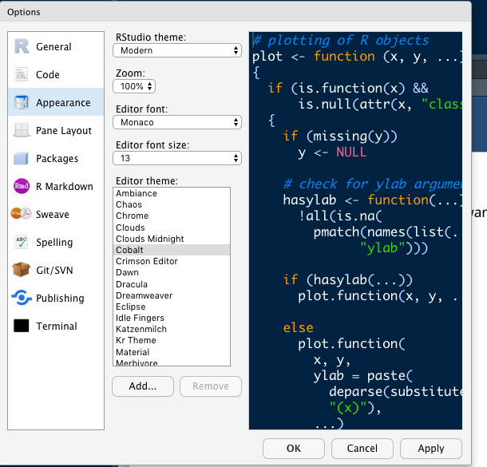

```{r setup, include=FALSE}
options(htmltools.dir.version = FALSE)
```

class: inverse, center, middle, clear

# Why R?

---

# Advantages of R


1. Data Manipulation.  
2. Automation.  
3. Faster Computation.  
4. It Reads Any Type of Data (.txt, .csv, .dat, etc.).  
5. Easier Project Organization.  .font70[Excel files can be slow, clunky, and difficult to navigate. R scripts often store different tasks in different scripts.]
6. It Supports Larger Data Sets.  .font70[Excel has restrictions for how large your data can be. ]
7. Reproducibility.  .font70[Commenting code + separation of data and analysis (+ version control)]
8. Accuracy. .font70[Gene crisis in excel]
9. Easier to Find and Fix Errors.  .font70[Errors will be there but they will more obvious]
10. It’s Free.  
11. It’s Open Source.  
12. Advanced Statistics.  
13. State-of-the-Art Graphics. 
14. It Runs on Many Platforms.  .font70[ You can use R on Windows, Mac, Linux, and Unix.]
15. Packages! .font70[Collections of functions and code that can help you achieve a goal faster.]

.font70[[Source for inspiration](https://fantasyfootballanalytics.net/2014/01/why-r-is-better-than-excel.html
)]


---

# Why R?

* Don't throw out Excel! .font70[[(podcast about using spreadsheets in data science)](https://www.datacamp.com/community/podcast/spreadsheets-data-science)]
  * But you can use opensource spreadsheet software like [LibreOffice](https://www.libreoffice.org) which behaves nicer with Chinese characters than Excel
  * Or Google Slides 
  * (or Numbers)
  
* Compared to other programming languages R is pretty slow but it is focused on analysis (and so are we!)
  * python
  * matlab
  * C++
  * ...
  
* You are already a data scientist because we are used to dealing with real language data, but can probably learn to speed it up a bit.

---

# Steep learning curve

.pull-left[

]

--

.pull-right[

]

R is *traditionally* considered not an easy programming language in the beginning.

But my own experience is that it has become easier in the past few years, mainly because of the **tidyverse**.

In this series of lectures you will learn the basics of using are in a **tidyverse**-friendly way.

---

# Installing R

## R 3.6.1 (2019-07-05) 'Action of the Toes'

You can download it by clicking this link: 
http://cran.csie.ntu.edu.tw

Download the version that is the right one for your operating system (Windows / Mac)

(problems? https://www.r-project.org)

<!--  -->

---

# Installing RStudio

## RStudio

[RStudio](https://rstudio.com) is a Graphical User Interface for R and the one that is used by most people.

You can already use R by just opening it, but RStudio makes it easier.

## Downloading

Go to https://rstudio.com/products/rstudio/download/#download

And also select the version for your operating system.

---

# RStudio

.pull-left[


[Source](http://www.sthda.com/english/wiki/running-rstudio-and-setting-up-your-working-directory-easy-r-programming)

]

.pull-right[
.font80[
1. Top-left panel: **Code editor** allowing you to create and open a file containing R scripts and Rmarkdown documents. 

2. Bottom-left panel: **R console** for typing R commands

3. Top-right panel: 
  * **Workspace tab**: shows the list of R objects you created during your R session
  * **History tab**: shows the history of all previous commands

4. Bottom-right panel:
  * **Files tab**: show files in your working directory
  * **Plots tab**: show the history of plots you created. From this tab, you can export a plot to a PDF or an image files
  * **Packages tab**: show external R packages available on your system. If checked, the package is loaded in R.
]
]


---

# RStudio Settings

.pull-left[

Open settings: shortcut

* Windows: `CTRL + ,`
* Mac: `CTRL + ,`

✓ - Uncheck "Restore .RData into work space at start up"

✓ - Set "Save work space to .Rdata on exit" to "Never"


[Source of tip: Emil Hvitfeldt](https://rawcdn.githack.com/EmilHvitfeldt/oRganized-talk/209977121efa5d3a97d4fb86090b9c6dfcd9f6b0/2018-10-29_getting-organized-with-r.html#1)

]


.pull-right[

]


---

# RStudio

We can change what our RStudio looks like


.pull-left[
1. .blue[*Appearance*]: change the color to what you want <br> (I like `Cobalt`)

2. .blue[*Pane lay-out*]
<br> I suggest
  * top-left .blue[**code editor**]
  * top-right .blue[**R console**]
  * bottom-left .blue[**environment, history**]
  * bottom-right .blue[**files, plots, packages...**]
]

.pull-right[

]


---

# R the calculator

The .blue[console] can be used as a simple calculator

Type / copy the following commands in the console

```{r, eval=FALSE}
1 + 1
3 - 2
4 * 5
10 / 2
```

The output will look like this

```
[1] 2
[1] 1
[1] 20
[1] 5
```

---

# R script

Now we're going to make an R script.

Click: .blue[`file > new file > R Script`]

Copy the previous calculations

```{r, eval=FALSE}
1 + 1
3 - 2
4 * 5
10 / 2
```

You can: 
* (save it somewhere, doesn't matter now)
* run the whole script
* run line by line
  * Windows: `CTRL + ENTER`
  * Mac: `CMD + ENTER`

Below you can just keep copying the examples to this script.

---

# <-  and  c()

You can also .blue[assign]  a value to a .blue[variable] and then call that variable

You assign with the `<-` operator <br>
Think of it like the .sc[container] metaphor: you put something in something else

```{r}
var1 <- 2 # type arrow hyphen <-

var1
```

--

But you can also put more than one value in a variable, with the `c()` function
<br> (`c` stands for 'concatenate')

```{r}
var2 <- c(0.1, 0.2)

var2
```


---

# Other types of data

Of course you can also put words into variables (.blue[character strings])

```{r}
var3 <- c("hello", "world", "你好")
```

Or you can put in .blue[logical values]

```{r}
var4 <- c(TRUE, FALSE)
```

--

After you run these two commands, you can check your .blue[Environment tab] and see that, indeed, all these variables exists in your current R session.

By looking at .blue[History] you can see all the things R has done.

---
class: inverse, center, middle, clear

# Any questions so far? 


---

# Functions

Both `<-` and `c()` are functions: they act like the verbs in formal syntax

$$KISS(X, Y)$$

where $X = Zhangsan$ and $Y = Lisi$ 

So *Zhangsan kisses Lisi* can be expressed like

$$KISS(X = Zhangsan, Y = Lisi)$$

--

So `KISS()` is the "verb"

and `X` and `Y` are the arguments

and `Zhangsan` and `Lisi` are the values of the arguments

Notice that we use `=` in the function!

---

# Functions

Let's say we want to know what the .blue[mean] is of the numbers 1 to 10.

We will need `c()`, then the numbers (by typing `1, 2, 3, ..., 10` or with the shortcut `1:10` '1 to 10').

Then we need to calculate the mean, either the long way ($\Sigma_{i}^{n} / n$) or the short way with `mean()`.

--

```{r}
var5 <- c(1:10) 
mean(var5)

# or
mean(c(1:10))
# or
mean(1:10)
```

---

# Dataframes

Of course, data becomes most interesting if we can relate different things together.

That is where the .blue[dataframe] comes in.

A dataframe is basically a kind of spreadsheet, composed of different .blue[vectors] of **equal length**.

And we are going to make one!

```{r}
name <- c("Tsai Ing-Wen", "Han Kuo-yu")
gender <- c("female", "male")
job <- c("president", "mayor/president-wanna-be")

data.frame(name, gender, job)

# you can assign it to a variable if you want, e.g.
#myfirstdataframe <- data.frame(name, gender, job)
```

---

# Dataframes

I find that most things in R work best, or are most intuitive, if they are in a dataframe (rectangle format).

So far, we have been using .blue[Base R] (the basic functions that R always provides).

But now we want to make use of ~~all~~ some of  the packages R offers!

Why?

Well you may not know it now, but that dataframe for instance treats the .blue[character values] as .blue[factors], which are harder to change. 

So in practice, I rarely use `data.frame()` -- instead I use the `tibble()` function from the `tidyr` package.

---

# Installing packages

It is very easy to install packages in R.

Most packages will be available on CRAN, the network where accepted (and valid) packages are distributed.

If you want to install, e.g. the `tidyverse` package, you should do it like this:

```{r, eval=FALSE}
install.packages("tidyverse")
```

Do that now.

If it asks you if it should install other packages, you can say yes.

---

# Installing packages

Here are a number of other packages that are good to have (we will use them one of these weeks):

```{r, eval=FALSE}
#install.packages("rvest") # included in tidyverse
# install.packages("glue") # included in tidyverse
install.packages("rmarkdown")
install.packages("knitr")
install.packages("tidytext")
install.packages("quanteda")
install.packages("here")
install.packages("fs")
```

Maybe we'll / you'll need other packages, but we'll find out when we're there.

---
class: inverse, center, middle, clear

# Break for 🙋 and 🚻
 
---


# Basic tidy R process

.center [

]

.font70[
[source](https://tidyverse.tidyverse.org/articles/paper.html)
]

With this basic process, we can tackle a lot of problems.

But is it really that simple? 
<br> Let's look at a slightly more enriched model.


<!-- # Fear not: it will become intuitive -->

<!-- inspiration http://www.storybench.org/getting-started-with-tidyverse-in-r/ -->

<!-- .red[make that plot] -->

---

# Rstudio Projects

Instead of an Rscript, it is better to use .blue[RStudio Projects]

So click .blue[`File > New Project > New Directory`]
and find a folder for it on your system.

Call your project whatever you want, e.g. .blue[Rbootcamp]

This will initialize a new folder with an .blue[Rbootcamp.Rproject] object.

--

The advantages of using R Projects:
* self contained folder
* keep all relevant code together
* you can send the folder to somebody
* functions in the `here` package

--

instead of the long path "USERS/THOMAS/.../.../.../.../.../...(forever)"

you start from where that .blue[.Rproject] object is located

Files are easier to find.

---
class: inverse, center, middle, clear

# Does everybody have the folder with the Rproject?

---

# R Markdown

I prefer using .blue[R Markdown] documents over .blue[R scripts].

.pull-left[
So: .blue[`File > New file > R Markdown`]

* (untitled is okay, you can also give it a title)
* html is also okay
]

.pull-right[
Let's run it!

By clicking .blue[`Knit`]
]

This will generate an example html file

---

# R Markdown

Now delete everthing starting from .blue[line 12].

--

We are left with the .blue[YAML] header
* title
* author
* date
* output
* many options

and the setup


````Rmd
```{ r include=FALSE}
knitr::opts_chunk$set(echo = TRUE)
```
````

---

# R chunks

Instead of one big R script, an .blue[Rmarkdown] document works with .blue[R chunks]

````
```{ r} #(without the space)
SOME R CODE
```
````

This way you can incrementally make your code longer, have a conversation with your data.

Because code is also a complex adaptive system (cf. Huang *laoshi* and Huang *laoshi*): you start from small chunks and make a longer analysis.

--

Shortcuts:
* Windows: .blue[`CTRL + ALT + i`] (?)
* Mac: .blue[`CMD + OPTION + i`]


---

# Loading packages

```{r, eval=FALSE}
# the tidyverse, we will always load this
library(tidyverse)

# `here` for easy file paths
library(here)
here()

# readxl for reading excel files
library(readxl)
```

```{r echo=FALSE}
# the tidyverse, we will always load this
library(tidyverse)

# `here` for easy file paths
library(here)

# readxl for reading excel files
library(readxl)
```


---

# Let's read in some data

Download this file

https://www.dropbox.com/s/kusjh3nxxvnuksg/linguistsdataset.xlsx?dl=0

and place it into your .blue[Rbootcamp folder].

--

```{r, eval=FALSE}
dataset <- read_excel(here("linguistsdataset.xlsx"))
```

```{r, echo=FALSE}
dataset <- read_excel(here("static", "Rbootcamp", "linguistsdataset.xlsx"))
```


What did we do?
* put our function in a variable with `<-`
* read an excel file with `read_excel()`
* the location of the file should be inside the .blue[Rbootcamp] folder, so we can use `here("linguistsdataset.xlsx")`


---

# Let's read in a file (spreadsheet style)

Let's call the dataset and see what the .blue[tibble] looks like

```{r}
dataset
```

* see the names of the variables (columns)
* all the rows
* what kind of data it is (numeric, logical, character...)


---
class: inverse, center, middle, clear

# Any questions?


---

# dplyr "verbs"

With the  `dplyr` package (loaded through the .blue[tidyverse] package) we can manipulate the data.

This is where I tell you about the [CHEAT SHEETS](https://rstudio.com/resources/cheatsheets/) (link).

You should download the .blue["Data Transformation Cheat Sheet"] by clicking [this link](https://github.com/rstudio/cheatsheets/raw/master/data-transformation.pdf) 

---

# dplyr "verbs"

As you can see there are MANY verbs in the `dplyr` package.

But fear not: the most important ones are

* `select` and `filter` and `distinct`
* `summarise` and `count` and `tally`
* `group_by` and `ungroup`
* `mutate` and `rename` and `case_when`
* `arrange`

(I use these like 80% of the time)

---

# dplyr "verbs"

Let's say we want to see how many rows (observations) per linguist we have in this mini dataset.

--

```{r, eval=FALSE}
dataset %>%
  count(linguist_lastname)
```

--

.pull-left[
```{r, echo=FALSE}
dataset %>%
  count(linguist_lastname)
```

So it seems we have 6 people (number of rows)
]

.pull-right[
alternative:

```{r, eval=FALSE}
dataset %>%
  count(linguist_lastname) %>%
  nrow()

# alternative
nrow(count(dataset, linguist_lastname))
```

]

---

# Male vs. female

How about male versus female

```{r, eval=FALSE}
dataset %>%
  distinct(linguist_lastname, gender) %>%
  count(gender)
```

--

```{r, echo=FALSE}
dataset %>%
  distinct(linguist_lastname, gender) %>%
  count(gender)
```

---

# Lifespan

Now we want to know how old every linguist is, or how long they lived

So we will need the columns `date_born` and `date_died`.

But if we look at `date_died` there are two problems:
* this is a character vector
* there are a lot of linguists still alive

So we need to .blue[mutate] `date_died` to the current year (2019).

--

We'll do this in a few steps: 

Select the variables `linguist_lastname`, `date_born`, `date_died`

```{r, eval=FALSE}
dataset %>%
  select(linguist_lastname, date_born, date_died)
```

---

# Lifespan

we need to change `"alive"` to `"2019"` (as character vectors)

```{r, eval=FALSE}
dataset %>%
  select(linguist_lastname, date_born, date_died) %>%
  mutate(date_died = case_when(
    date_died == "alive" ~ "2019",
    TRUE ~ date_died
  )) 
```

---

# Lifespan

now we need to turn `date_died` in a numeric vector (not character)

```{r, eval=FALSE}
dataset %>%
  select(linguist_lastname, date_born, date_died) %>%
  mutate(date_died = case_when(
    date_died == "alive" ~ "2019",
    TRUE ~ date_died
  )) %>%
  mutate(date_died = as.numeric(date_died)) 
```

---

# Lifespan

calculate `lifespan` and put in `lifespandf` object

```{r, eval=FALSE}
lifespandf <- dataset %>%
  select(linguist_lastname, date_born, date_died) %>%
  mutate(date_died = case_when(
    date_died == "alive" ~ "2019",
    TRUE ~ date_died
  )) %>%
  mutate(date_died = as.numeric(date_died)) %>%
  mutate(lifespan = date_died - date_born) 

lifespandf
```

```{r, echo=FALSE}
lifespandf <- dataset %>%
  select(linguist_lastname, date_born, date_died) %>%
  mutate(date_died = case_when(
    date_died == "alive" ~ "2019",
    TRUE ~ date_died
  )) %>%
  mutate(date_died = as.numeric(date_died)) %>%
  mutate(lifespan = date_died - date_born) 

lifespandf
```

---

# First visualization with ggplot2

How old did every linguist get?


```{r, eval=FALSE}
lifespandf %>%
  ggplot(aes(x = linguist_lastname, y = lifespan)) +
  geom_point()
```

--

After you run it, let's clean it up a bit:

```{r, eval=FALSE}
lifespandf %>%
  rename(linguist = linguist_lastname) %>% #rename
  ggplot(aes(x = linguist, y = lifespan)) +
  geom_point() +
  geom_label(aes(label = lifespan)) + # add label of lifespan
  theme_minimal() + # add theme
  theme(axis.text = element_text(size = 14)) + # change size
  ggtitle("The lifespan of some linguists") # add title
```

---

# First visualization with ggplot2

How old did every linguist get?


```{r, echo=FALSE}
lifespandf %>%
  rename(linguist = linguist_lastname) %>%
  ggplot(aes(x = linguist, y = lifespan)) +
  geom_point() +
  geom_label(aes(label = lifespan)) +
  theme_minimal() +
  theme(axis.text = element_text(size = 14)) + 
  ggtitle("The lifespan of some linguists")
```


---

# Recap 

## Basic tidy R process

.center[]


So we have
1. imported the linguists mini dataset
2. tidied it (by using `readxl`)
3. transformed it to our needs
4. visualized it
5. still to do: communicate:

```
Chomsky is the oldest with 91 years old and counting.
Goldberg is now as old as de Saussure was when he died.
Langacker is one year younger than Lakoff and they are approaching Wierzbicka who is 81 years old.
```

---
class: inverse, center, middle, clear

# Any questions?

---
class: inverse, center, middle, clear

# That's all folks


---

# Next time

Next time we use our basic counting and R techniques to deal with .blue[text]

## Import

different file types: .docx, .csv, .excel, .txt, but also online stuff such as Project Gutenberg, PPTR (need to check it), datapasta...
(maybe .xml and .json)

## Tidy and Transform

turn text types into: concordances, get the basic corpus information

## Visualise 

some more ggplot2 tricks

## Communicate

what can you do with Rmarkdown?

---

background-image: url(https://media.giphy.com/media/upg0i1m4DLe5q/source.gif)
background-position: 50% 50%
background-size: 100%
class: center, bottom, clear


