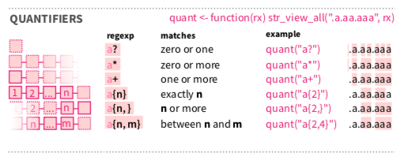
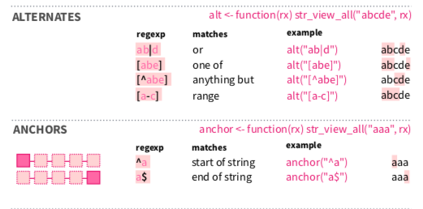
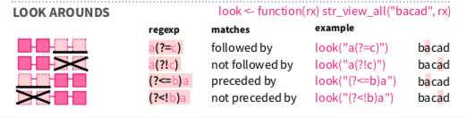

```{r setup, include=FALSE, eval=FALSE}
options(htmltools.dir.version = FALSE)
```

class: inverse, center, middle, clear

# Recap of last week

---

# Datatypes

Everything in R is an **object**.

But the objects come in different data types.
The most important ones are:

1. .red[numeric]
  * .blue[real] `2`
  * .blue[decimal] `2.5`
1. .red[character] `"hello"`
1. .red[logical] `TRUE` or `FALSE`

.font70[
The other ones are:

1. integer `1L`
1. complex `1+5i`
1. raw (I have never had to use this so I don't know)
]

--

Function for finding out the type of a data object: `typeof()`

```
typeof(DATAOBJECT)
```

---

# Writing R code

Baically two ways:

.pull-left[
R scripts

* can code run in one go
* good for standalone functions you write yourself
* automation
* .red[notes / comments possible after `#`]
]

.pull-right[
R Markdown

* .blue[human-friendly]: you are writing a report
* .blue[R chunks] with R code between the text
* incremental conversation with the data
]


---

# Basic R process

.center[]

But it's actually a bit more ~complicated~ nuanced: 

* what packages can we use?
* what are packages we should use in which stage?
* aren't there beautiful images instead of words in the model?

---


background-image: url(./figs/rpackages.png)
background-position: 50% 50%
background-size: 100%
class: center, bottom, clear

---

# Our plan for today

.pull-left[

1. working with strings of text
1. reading in different data types 
1. continue transforming our tidy data
1. case study: *Star Trek* movie corpus
]

.pull-right[
.orange[stringr] and .orange[gutenberg] <br>
.orange[readr] but also .orange[readxl] <br>
.orange[dplyr] etc. <br>
example workflow
]

---

class: inverse, center, middle, clear

# Strings, a.k.a. regular expressions

---

# The number 1 PhD skill

A while ago I saw a tweet along these lines:

<blockquote class="twitter-tweet"><p lang="en" dir="ltr">The single most useful skill that I brought to my PhD: Regular expressions! Here&#39;s regex turning semi-structured taxonomic data into structured and useful information. I&#39;ve also used it to mine data out of websites. Learn regular expressions. <a href="https://twitter.com/hashtag/PhDLife?src=hash&amp;ref_src=twsrc%5Etfw">#PhDLife</a> <a href="https://twitter.com/hashtag/PhDChat?src=hash&amp;ref_src=twsrc%5Etfw">#PhDChat</a> <a href="https://twitter.com/hashtag/RStats?src=hash&amp;ref_src=twsrc%5Etfw">#RStats</a> <a href="https://t.co/CDBm3lcKMb">pic.twitter.com/CDBm3lcKMb</a></p>&mdash; Desi Quintans (@eco_desi) <a href="https://twitter.com/eco_desi/status/988225095700238337?ref_src=twsrc%5Etfw">April 23, 2018</a></blockquote> <script async src="https://platform.twitter.com/widgets.js" charset="utf-8"></script>

And I agree with this person that .blue[regular expressions] will make your life better.

But what are they?

In a nutshell: .blue[regular expressions] allow you to find .red[patterns], and do stuff with them, like .orange[extracting, removing, replacing].
And I think it is what enables companies like Facebook, Google etc. to easily work with strings of text.

---

# Regex (regular expressions)

* First create a new .blue[Rmarkdown document]
* call it .blue[strings] 
* save it as .red[`"strings.Rmd"`] in your .blue[Rbootcamp folder]

--

* Delete the unnecessary rows (everything below the first code chunk, called `set-up` (so below line 12))

--

* Load the relevant packages for this part

```{r, eval=FALSE}
library(tidyverse) 
# this will load stringr, the package we need
# you can also directly load library(stringr) 
# but you're missing out on many tidyverse functions then
```

---

# Regex cheat sheet

Just like we did last week, there is *luckily* a cheat sheet for us!

Click on the [CHEAT SHEETS link](https://rstudio.com/resources/cheatsheets/) and download the .red["Work with Strings Cheat Sheet"]

Open it and enjoy the little pictures that help you pick the right function for your problem.

Okay time for an example!

---

# The R afterparty

An example: the names of the people in this class:

```{r, eval=FALSE}
people <- c("Abner", "Andrew", "Carol", 
            "Kimo", "Thomas", "Alex", "Rebecca")

# let's look at the vector:
people
```

--

Suppose I want to invite only people with the letter A to my R-afterparty.

Using the cheat sheet, we can find the right function:
* either under "detect matches"
* or under "subset strings"

---

# The R afterparty (2)

Looking at the cheat sheet, "subset strings" seems to do a better job at what I want, especially the `str_subset()` function 

--

```{r, eval=FALSE}
people %>% # go to string, and then
  str_subset("r") # look for pattern "a"
```

--

Oh, but this isn't right! I also wanted to invite the people .blue[capital A] and not just those with only .blue[a].
But that is what we asked R to do!

---

# The R afterparty (3)

2 possible solutions:

Option 1.

using .red[`[]`] within the .blue[pattern]. Everything within .red[`[]`] is interpreted as if it says .red[OR].

```{r, eval=FALSE}
people %>% # go to string, and then
  str_subset("[rR]") # look for pattern "a"
```

Option 2. 

Turn all letters .blue[to lowercase] with .red[`str_to_lower()`]

```{r, eval=FALSE}
invited <- people %>%           # go to string, and then
  str_to_lower() %>% # turn everything to lower, and then
  str_subset("r")    # look for pattern "a"

invited
```

**Notice that we save option 2 in a new vector .blue[invited]**

---

# best .orange[stringr] functions 

These functions are the *best* .orange[stringr] functions in the sense that I use these most of the time:

* `str_subset`
* `str_extract` and `str_extract_all`
* `str_trim` and `str_squish`
* `str_replace` and `str_replace_all` and `str_remove`
* `str_to_lower` (and `str_to_upper`)
* `str_c` 

---

# Special Regex patterns!


---

# Special Regex patterns! examples

```{r, eval=FALSE}
str_subset(people, ".") # function(STRING, PATTERN)

str_subset(people, "\\wa") # any word character followed by 'a'

# hmmmm, let's try to get "l " (lowercase L followed by a space)
str_subset(people, "l ") # or "l\\s"
```

--

The last says: `character(0)`, because it can't find it.

After all, we are just dealing with strings of single words, there are no spaces in our strings!

---

# Special Regex patterns! examples

So let's first glue the .blue[invited] people into one string with `str_c` and then then find a pattern with a space:

```{r, eval=FALSE}
invited_onestring <- str_c(invited, collapse = ", ") #  one string

str_subset(invited_onestring, " a") # subset
```

--

😠😠, now it just returns everything!!

Oh because we just put .blue[everything in one string]!!

Let's look at the `str_extract_all` function

```{r, eval=FALSE}
invited %>%
  str_c(collapse = ", ") %>% # one string
  str_extract(" a\\w+")      # the names with the pattern "SPACEa" until next comma
```

---

# Regex: quantifiers



--

```{r, eval=FALSE}
people_lower <- str_to_lower(people)
people_lower

str_subset(people_lower, "ab?n")

str_subset(people_lower, "c*") # 0 or more
str_subset(people_lower, "c+") # 1 or more

str_subset(people_lower, "c{2}") #exactly two times
```

---

# Regex: alternates and anchors



--

```{r, eval=FALSE}
people_lower

str_subset(people_lower, "ab|n") # or
str_subset(people_lower, "a[bnl]") # one of


invited_onestring

# replace all that isn't "a" with an "!"
str_replace_all(invited_onestring, "[^a]", "!") # not this thing [^]
```

---

# Regex: alternates and anchors


```{r, eval=FALSE}
invited_onestring

# replace beginning of string with "!@!"
str_replace_all(invited_onestring, "^.", "!@!") 

# replace end of string with "!@!"
str_replace_all(invited_onestring, ".$", "!@!") 
```

---

# Regex: groups


--


```{r, eval=FALSE}
invited_onestring

# replace group of string with itself + "!@!"
str_replace_all(invited_onestring, "(a[bn])", "\\1!@!") 

```

---

# Regex: groups



--


```{r, eval=FALSE}
invited_onestring

# replace "a" with "!@!" if preceded by a "c"
str_replace_all(invited_onestring, "(?<=c)a", "!@!") 

```

---

class: inverse, center, middle, clear

# The hardest part today is over! <br> Breaktime!

---

# You are now Regex graduates!

You are now able to handle most of the text related problems you can face!

For instance, Chinese surnames and names:

```{r, eval=FALSE}
chinesenames <- c("司馬 智", "呂 佳蓉")

chinesenames

chinesenames %>%
  str_replace_all(" ", "")
```

---

# Chinese surnames and names

Let's put it in a .blue[tibble] (tidy dataframe) with .red[`tibble()`]

```{r, eval=FALSE}
surnames <- c("司馬", "呂")
firstnames <- c("智", "佳蓉")

chinesenames <- tibble(surnames, firstnames) 

chinesenames
```

--

Alternative with .red[`tribble()`]

```{r, eval=FALSE}
chinesenames <- tribble(
  ~ surnames, ~ firstnames,
  "司馬", "智",
  "呂", "佳蓉"
)
chinesenames
```

--

Let's glue these together with .red[`mutate()`] and .red[`str_c`], which we now understand!

```{r, eval=FALSE}
chinesenames %>%
  mutate(together = str_c(surnames, firstnames))
```

---

# Protip: Datapasta

A super handy tip for copying tables in R is using the .orange[datapasta] addin. 
[(Here is the talk that introduced this to me.)](https://youtu.be/ywK4qs5dJsg)

--

Install .orange[datapasta]

```{r, eval=FALSE}
install.packages("datapasta")
```

(Maybe you need to restart Rstudio. If so, and if you are in a project, that project should still be open!)

---

# Datapasta and Finnish locatives

Now click on this link to go the [Finnish locative system](https://en.wikipedia.org/wiki/Finnish_noun_cases#The_Finnish_locative_system). 

Copy that table with `CTRL + C` or `CMD + C`.
(The header is System, Entering, Residing in, Exiting).

--

Go to your R chunk and click on: .blue[Addins > Paste as tribble] and run the R chunk.

--

This is what you should have seen:

```{r, eval=FALSE}
tibble::tribble(
  ~System, ~Entering, ~Residing.in,~Exiting,
  "Inner",     "-(h)Vn \"into\" (illative)", "-ssa \"in\" (inessive)",      "-sta \"from (in)\" (elative)",
  "Outer",       "-lle \"onto\" (allative)", "-lla \"on\" (adessive)",  "-lta \"from (at/on)\" (ablative)",
  "State", "-ksi \"into as\" (translative)",    "-na \"as\" (essive)", "-nta \"from being as\" (exessive)"
  )

```

---

# Where are we in the bootcamp?


.pull-left[
* **import**: .orange[readr, readxl]
* **tidy**: .orange[tidy, tibble]
* **transform**: .orange[dplyr, glue, stringr]
* **text**
* **program**
]

.pull-right[
* **model**
* **visualize**: .orange[ggplot2]
* **export**
* **communicate**: .orange[rmarkdown, knitr]
]

---

class: inverse, center, middle, clear

# Getting data in and out of R

---

# Reading in with .orange[readr]

First we'll download another cheat sheet.

Click on the [CHEAT SHEETS link](https://rstudio.com/resources/cheatsheets/) and download the .red["Data Import Cheat Sheet"].

--

Just like in all cheat sheets, there are are a few subsections on this cheat sheet:

1. Read Data
  * Read Tabular Data
  * Read Non-tabular Data
1. Write / Save data
1. Tidying your data (the second page -- not for now)

---

# Importing data (1)

The ones I've used:

data type | extension |  package | function | comment 
--------- | ----------|---------- | --------| ------
text | .txt | .orange[readr] | .red[`read_file()`] | single string
text | .txt | .orange[readr] | .red[`read_lines()`] | one string per line
csv | .csv | .orange[readr] | .red[`read_csv()`] | tibble
table in text | .txt | .orange[readr] | .red[`read_delim()`] | tibble
excel | .xls(x) | .orange[readxl] | .red[`read_excel()`] | tibble
RDS | .rds | .orange[readr] | .red[`read_rds()`] | dataframe
xml | .xml | .orange[xml2] | .red[`read_xml()`] | [vignette](https://xml2.r-lib.org), [tutorial](https://jennybc.github.io/purrr-tutorial/index.html)
json | .json | .orange[jsonlite] | .red[`fromJSON()`] | [vignette](https://cran.r-project.org/web/packages/jsonlite/vignettes/json-aaquickstart.html), [tutorial](https://jennybc.github.io/purrr-tutorial/index.html)
pdf | .pdf | .orange[textreadr] | .red[`read_pdf()`] | tibble, [vignette](https://github.com/trinker/textreadr)
doc | .doc(x) | .orange[textreadr] | .red[`read_doc(x)()`] | tibble, [vignette](https://github.com/trinker/textreadr)


---

# Importing data (2)

Other ones you may need:

data type | extension |  package | function | comment 
--------- | ----------|---------- | --------| ------
google sheet | .gs (?) | .orange[googlesheets] | ? |  [tutorial](https://cran.r-project.org/web/packages/googlesheets/vignettes/basic-usage.html)
SAS | .sas7bdat | .orange[haven] | .red[`read_sas()`] | [tutorial](https://www.rdocumentation.org/packages/haven/versions/2.1.1)
SPSS | .sav | .orange[haven] | .red[`read_sav()`] | [tutorial](https://www.rdocumentation.org/packages/haven/versions/2.1.1)
STATA | .dta | .orange[haven] | .red[`read_dta()`] | [tutorial](https://www.rdocumentation.org/packages/haven/versions/2.1.1)


**Tip**

As it turns out, a .blue[.numbers] file on Mac can be read into R by exporting the .numbers file as e.g. a .blue[.csv] file.

---

# Writing data

This becomes really simple with the tidyverse, because most of the time you just replace .red[`read_DATATYPE`] 
with .red[`write_DATATYPE`]:

data type | extension |  package | function | comment 
--------- | ----------|---------- | --------| ------
text | .txt | .orange[readr] | .red[`write_file()`] | single string
text | .txt | .orange[readr] | .red[`write_lines()`] | one string per line
csv | .csv | .orange[readr] | .red[`write_csv()`] | tibble
table in text | .txt | .orange[readr] | .red[`write_delim()`] | tibble
excel | .xls(x) | .orange[writexl] | .red[`write_xlsx()`] | tibble
RDS | .rds | .orange[readr] | .red[`write_rds()`] | dataframe


---

class: inverse, center, middle, clear

# Bringing it together for today

---

# Setting up a nice folder structure

So far, we have dumped all of the files in the .blue[root directory] of our project. <br>
This means, we have been putting files next to the .blue[.Rproj] object in our folder, right?

But what you want to do is separate the input files from the output files. <br>
Because that was one of the reasons why we argued that R is 'better' than excel: it separates the different steps in the data analysis.

--

So what we need to do now is create 
* an .blue[input] folder
* an .blue[output] folder
* a .blue[figures] folder

```{r, eval=FALSE}
library(fs) # if you don't have this, install with: install.packages("fs")
library(here) # if you don't have this, install with: install.packages("here")

fs::dir_create(here::here("input")) # fs helps us with files on our computer
fs::dir_create(here::here("output")) # here helps with specifying the path
fs::dir_create(here::here("figures")) 
```

**Notation**: a .orange[`pckage`]followed by .blue[`::`] calls that package for a .red[`function()`] without loading it completely, "just this one time".


---

# .red[library()] and the data

```{r, eval=FALSE}
library(tidyverse)
library(here)
```

The data comes from the [Cornell Movie Dialogs Corpus](https://www.cs.cornell.edu/~cristian/Cornell_Movie-Dialogs_Corpus.html)

You can download the zip file, unpack it and put the folder in our .blue[inputfiles] folder (within the project).


---

# Read in files

First of all, the "Readme.txt" file tells us that we should be looking at 
* movie_lines.txt
* movie_titles_metadata.txt

It also tells us the structure of that file.

The first two lines of the metadata.txt file look like this:

```
m0 +++$+++ 10 things i hate about you +++$+++ 1999 +++$+++ 6.90 +++$+++ 62847 +++$+++ ['comedy', 'romance']
m1 +++$+++ 1492: conquest of paradise +++$+++ 1992 +++$+++ 6.20 +++$+++ 10421 +++$+++ ['adventure', 'biography', 'drama', 'history']
```

So how should we read this in?

---

# Read in files

We are going to use .red[`readr::read_lines()`] (.red[read_lines()] in the .orange[readr] package).

```{r, eval=FALSE}
meta1 <- read_lines(here("inputfiles", "cornell movie-dialogs corpus", "movie_titles_metadata.txt"))

# inspect the first 6 entries
head(meta1)
```

--

Now we need to *wrangle* it into a nice tidy dataframe.
So our knowledge of strings will come in handy (because of that ` +++$+++ `). We are also using a new function to later *separate* each line into different columns (shown in the README.txt file).

```{r, eval=FALSE}
metadata <- meta1 %>%
  str_replace_all(" \\+\\+\\+\\$\\+\\+\\+ ", "@@") %>%
  as_tibble() %>%
  separate(value, 
           into = c("code", "title", "year", 
                    "imdb.rating", "imdb.votes", "genre"), 
           sep = "@@")

metadata

```


What's next?

---

background-image: url(https://media.giphy.com/media/VfwqcPTLgO3K0/giphy.gif)
background-position: 50% 50%
background-size: 100%
class: center, bottom, clear


---

# Star Trek movies

Let's look for Star Trek movies


```{r, eval=FALSE}
startreksubset <- metadata %>%
  filter(str_detect(title, "star trek")) 

startreksubset

```

And at this point it is also useful to get the codes themselves (you'll see why below).

```{r, eval=FALSE}
startreknumbers <- startreksubset %>%
  pull(code) 

startreknumbers
```

---

# Time to read in the movielines


```{r, eval=FALSE}
movielines1 <- read_lines(here("inputfiles", "cornell movie-dialogs corpus", "movie_lines.txt"))

head(movielines1)
```

--

Oh oh this is the same! <br>
But we can just copy the code, and change the names of the columns (see README.txt)!

```{r, eval=FALSE}
movielines <- movielines1 %>%
  str_replace_all(" \\+\\+\\+\\$\\+\\+\\+ ", "@@") %>%
  as_tibble() %>%
  separate(value, 
           into = c("line.id", "character.id", "code", "character", "line"), 
           sep = "@@")

head(movielines)
```

---

# Getting a nice tibble

One of the strongest functions of .orange[dplyr] we haven't seen is the family of .blue[joins]. <br>
Today we'll see my favorite join: left-join.

But which tables should we join together? <br>
Let's run these two.

```{r, eval=FALSE}
startreksubset
movielines
```

---

# Getting a nice tibble

If we start from the smaller dataset (.blue[startreksubset]) and then .red[`left_join()`] the bigger one (.blue[movielines] by the **common variable**) we get a nice tidy dataset.

Let's have a look!

```{r, eval=FALSE}
df <- startreksubset %>%
  left_join(movielines, by = "code")

df
```

---

# Exporting our hard work

After all this data wrangling, we can export our nice tidy dataframe to e.g. a .blue[.csv] file!

Store it in .blue[inputfiles] (not .red[outputfiles])

```{r, eval=FALSE}
write_csv(df, 
          here("inputfiles", "startrekmovies.csv"),
          col_names = TRUE)
```

---

class: inverse, center, middle, clear

# Let's inspect it briefly

---

# Read in our tidy dataframe

```{r, eval=FALSE}
df <- read_csv(here("inputfiles", "startrekmovies.csv"),
               col_names = TRUE)

df
```

Okay, that seemed to work!

---

# Species mentioned

This is our cliffhanger for today: the .orange[tidytext] package with its main function of .red[`unnest_tokens()`]!

Let's look at its basic usage (after loading it of course).

```{r, eval=FALSE}
library(tidytext)
```


```{r, eval=FALSE}
species <- df %>%
  select(title, character, line, year) %>%
  unnest_tokens(output = words, # name of output column
                input = line,   # name of input columm
                token = "words") %>% # split by what kind
  filter(str_detect(words, "human|vulcan|klingon|romulan|borg"))

# let's count
count(species, words, sort = TRUE)
```

---

# Species mentioned

Because we want to be a bit more precies and count all of the relevant species together, we may want to turn e.g. `humans` into `human`, with .red[`case_when()`].

```{r, eval=FALSE}
species2 <- species %>%
  mutate(species = case_when(
    str_detect(words, "human") ~ "human",
    str_detect(words, "vulcan") ~ "vulcan",
    str_detect(words, "klingon") ~ "klingon",
    str_detect(words, "romulan") ~ "romulan",
    str_detect(words, "borg") ~ "borg"
  ))

species2 %>%
  count(species, sort = TRUE)
```

---

# Species mentioned

```{r, eval=FALSE}
plot <- species2 %>%
  count(year, species) %>%
  ggplot(aes(x = year, y = n, color = species)) +
  geom_point() +
  geom_line() +
  theme_minimal()

plot

plot + 
  ggsave(here("inputfiles", "figures", "species.png"))
```

---

background-image: url("./figs/species.png")
background-position: 50% 50%
background-size: 70%
class: center, bottom, clear


---


# Where are we in the bootcamp?


.pull-left[
* **import**: **.orange[readr, readxl] and alternatives**
* **tidy**: .orange[tidy, tibble]
* **transform**: **.orange[dplyr, glue, stringr]**
* **text**
* **program**
]

.pull-right[
* **model**
* **visualize**: .orange[ggplot2]: .red[`facet_wrap()`]
* **export**: **.orange[readr, writexl]**
* **communicate**: .orange[rmarkdown, knitr]
]

---

# Next time

## Text options

* .orange[tidytext]
* .orange[quanteda]
* other alternatives

## Concordances

How to make a concordance from a corpus

## Scrape from internet

* .orange[rvest]  (hopefully we'll get here)
* .orange[PTTr]
* other althernatives


---


background-image: url(https://media.giphy.com/media/upg0i1m4DLe5q/source.gif)
background-position: 50% 50%
background-size: 100%
class: center, bottom, clear


