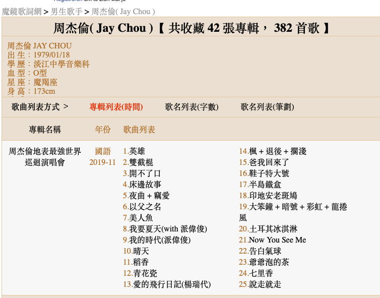
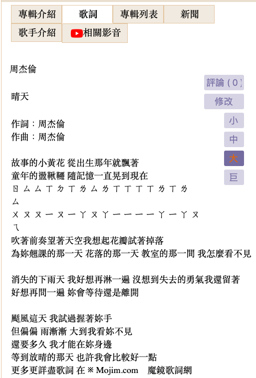
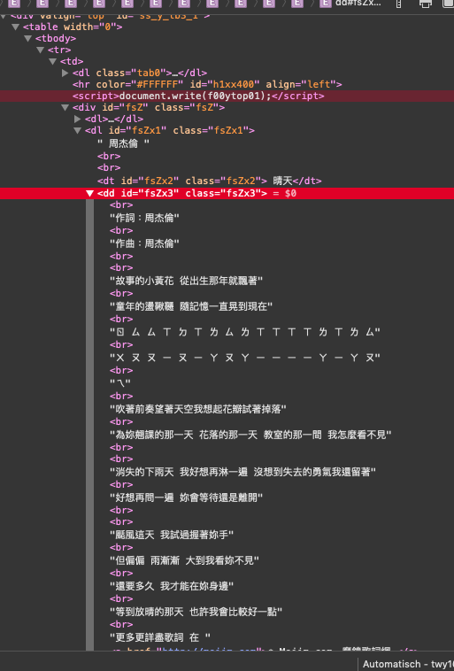
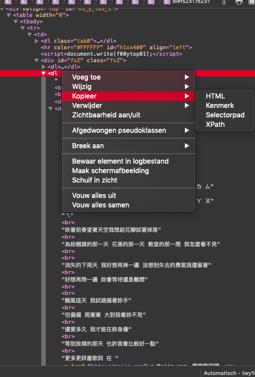

```{r setup, include=FALSE, eval=FALSE}
options(htmltools.dir.version = FALSE)
```

class: inverse, center, middle, clear

# Recap of last week

---

# Last week

## Skills

* ✔️ how to make a .blue[concordance] from a text tibble
* ✔️ how to read in and process .blue[multiple files]
* ✔️ how to make a .blue[wordcloud]

## Data
* ✔️ how to download data from .blue[Project Gutenberg]
* ✔️ how to work with .blue[multiple .Rds files] (as an example)

## Case studies
* ✔️ the .blue[.sc[way construction]] (Goldberg 1995)
* ✔️ the .blue[.sc[yidu 一度 construction]] (Chen 2019a; 2019b)  

---

# Things we will learn today

## Skills

* scraping stuff from static websites with .orange[rvest]
* .orange[quanteda] package .grey[(easier corpus but we needed .orange[tidytext] first)]
* looking at some .blue[.xml files]

## Datasets

* a .blue[website] 
* .blue[PTT] (this is your homework)
* (a part of the) .blue[BNC corpus (in xml)]

## Case studies

* .blue[Association measures from Gries]: your homework is to read the paper(s).

---

# Prepare our new document

## Make new Rmarkdown

* call it "scraping"
* remove from line 12 downwards

## Load in packages we'll need

```{r, eval=FALSE}
# "always" load these
library(tidyverse)
library(here)
```


```{r, eval=FALSE}
# packages you might need to install
library(glue)
library(rvest)
library(robotstxt) # install.packages("robotstxt)
```


```{r, echo=FALSE}
# "always" load these
library(tidyverse)
library(here)
# packages you might need to install
library(glue)
library(rvest)
library(robotstxt) # install.packages("robotstxt)
```


---

# Scraping

Today we are going to be interested in Jay Chou 周杰倫 songs.

.pull-left[
What we need to do is

1. download the texts
2. analyze them
]

.pull-right[
More specifically

1. first try to download 1 text
2. get links to all pages containing all the texts
3. automate it
4. have a break while it's downloading
5. analyze it
]


---

# From one to many


.pull-left[

Let's look up ".blue[周杰倫]" on a popular lyrics website.

https://mojim.com/twh100951.htm

]

.pull-right[

]


---

# From one to many

.pull-left[
Next we need to find a page we want to scrape first. 
I chose .blue[晴天]

Via this link: https://mojim.com/twy100951x42x10.htm

]

.pull-right[




]

---

# Getting the stuff of this page

## Ethics

You should always first test if it's "allowed" to scrape text of a page, because scraping is very heavy on the server, so you want to be nice and "ask permission"

```{r, eval=FALSE}
robotstxt::paths_allowed("https://mojim.com/twy100951x42x10.htm")
# if TRUE it is okay to scrape
```

Read more about the ethics [here](https://smac-group.github.io/ds/web-scraping-in-r.html).

---

# Getting the stuff of this page

## A first go

So let us first try to get the lyrics from one page.
We download with .orange[rvest::].red[read_html()]

```{r, eval=FALSE}
# link
onesong <- "https://mojim.com/twy100951x42x10.htm"

# get the data in R
onesong_html <- onesong %>%  read_html() 
onesong_html
```

Doesn't tell us that much...

So we need to identify on the page what are the exact elements we want from it.

In Chrome you can use .blue[selectorgadget] to find it.
( [watch video and download here](https://selectorgadget.com))

Or you can use the "inspect this page" (or something similar) to get the xml-structure of the page.
Which is what we will be doing. *#oldskool*

---

# Inspecting the XML

.pull-left[



]

.pull-right[



]

---

# Okay already downloaded!

We can go down the xml/html path with .red[html_node] and .red[html_text] to find the .blue[singer], .blue[title] and .blue[lyrics].

```{r, eval=FALSE}
onesong_html %>%
  html_node(xpath = '//*[@id="fsZx1"]/text()') %>%
  html_text() %>%
  str_remove_all("\n") -> onesong_singer

onesong_html %>%
  html_node(xpath = '//*[@id="fsZx2"]') %>%
  html_text() %>%
  str_squish() -> onesong_title

onesong_html %>%
  html_node(xpath = '//*[@id="fsZx3"]') %>%
  html_text() -> onesong_lyrics
```

---

# Singer, title, lyrics

Let's inspect what we have:

```{r, eval=FALSE}
onesong_singer
onesong_title
onesong_lyrics
```

--

Oh we need to .blue[clean `onesong_lyrics`]
* remove "更多更詳盡歌詞 在 ※ Mojim.com　魔鏡歌詞網"

--

But wait, we can't get the lyricist (作詞) and composer (作曲) with this format!

So maybe we need to rewrite our function!

After [some googling](https://stackoverflow.com/questions/38195120/how-can-i-retain-format-in-a-page-webscraped-with-rvest), the .orange[xml2::].red[xml_contents()] seemed like a good function.

So if we do that first, and then run .orange[rvest::].red[html_text] we get a nicer result.

---

# Cleaning the lyrics

But now there are all these .blue[EMPTY] rows. 
We will want to delete them -- the most efficient way seems to be with .orange[stringi::].red[stri_remove_empty()].

```{r, eval=FALSE}
onesong_html %>%
  html_node(xpath = '//*[@id="fsZx3"]') %>%
  xml_contents() %>% # different function!
  html_text() %>%
  stringi::stri_remove_empty()
```

Now it's easy to get the composer and the lyricist on this page, but we are not going to do this here because it might not be the same formatting in other files! But if you want, you can find a (more complicated) way of dealing with that issue.

So *today* we are treating "作詞：周杰倫" and "作曲：周杰倫"  as if it's part of the lyrics, ok?
(In a real analysis you will want to keep deleting this as well, with the .orange[stringr] tricks we learned before. Remember: **cheat sheet is your friend**)

---

# Cleaning the lyrics

We can, however, delete what we want:
* "更多更詳盡歌詞 在 "  
* "※ Mojim.com　魔鏡歌詞網 "
* some pages also provide time stamps: we don't want those either (e.g. [1:20:00] ....)

Because this will likely be the same on every page.


```{r, eval=FALSE}
onesong_html %>%
  html_node(xpath = '//*[@id="fsZx3"]') %>%
  xml_contents() %>% # different function!
  html_text() %>%
  str_remove_all("更多更詳盡歌詞 在 " ) %>%
  str_remove_all("※ Mojim.com　魔鏡歌詞網 ") %>%
  str_remove_all("^\\[.+") %>% # timestamps
  stringi::stri_remove_empty() -> onesong_lyrics

onesong_lyrics
```

---

# Functionize

We have a 
* link

and we want
* singer
* title
* lyrics

So now we need to wrap our code into a .blue[function] so we can .blue[visit all the links to every song page, and scrape everything per page].

---

# Functionize 

## Step 1

Rewrite  previous code with more general terms: .blue[link] and .blue[page] + test it 

Part 1:

```{r, eval=FALSE}
page <- read_html(link) #you can test this by replacing 'link' with 'onesong'

page %>%
  html_node(xpath = '//*[@id="fsZx1"]/text()') %>%
  html_text() %>%
  str_remove_all("\n") -> singer

page %>%
  html_node(xpath = '//*[@id="fsZx2"]') %>%
  html_text() %>%
  str_squish() -> title

page %>%
  html_node(xpath = '//*[@id="fsZx3"]') %>%
  xml_contents() %>% # different function!
  html_text() %>%
  str_remove_all("更多更詳盡歌詞 在 " ) %>%
  str_remove_all("※ Mojim.com　魔鏡歌詞網 ") %>%
  str_remove_all("^\\[.+") %>%
  stringi::stri_remove_empty() -> lyrics


```


---

# Functionize 

## Step 1

Rewrite  previous code with more general terms: .blue[link] and .blue[page] + test it 

Part 2 (testing): 

```{r, eval=FALSE}

singer
title
lyrics

tibble(
  singer = singer,
  title = title,
  lyrics = lyrics
)
```


---


# Functionize 

## Step 2

.red[don't change your code, just add the highlighted lines!!]

```{r, eval=FALSE}
* lyricsgetter <- function(link){
  page <- read_html(link)
  
  page %>% .......... -> singer
  
  page %>% .......... -> title
  
  page %>% .......... -> lyrics
  
*  df <- tibble( # we put the tibble in a dataframe
*    singer = singer,
*    title = title,
*    lyrics = lyrics
*    )
* }
```

---

# Functionize 

## Step 3

Test with the file we just did and with .orange[purrr]

```{r, eval=FALSE}
onesong

map_df(onesong, lyricsgetter)
```


---


# Functionize 

## Step 4

Save each file to a location

First make that location with .orange[fs::].red[dir_create()] and .orange[here::].red[here()]

```{r, echo=FALSE, eval=FALSE}
fs::dir_create(here("static", "Rbootcamp", "lyricscorpus_csv"))
fs::dir_create(here("static", "Rbootcamp", "lyricscorpus_txt"))
```

```{r, eval=FALSE}
fs::dir_create(here("lyricscorpus_txt"))
fs::dir_create(here("lyricscorpus_csv"))
```

---

# Functionize 

## Step 4

Then you can add the .orange[readr::].red[write_csv] into your function:

```{r, eval=FALSE}
 lyricsgetter <- function(link){
  page <- read_html(link)
  page %>% .......... -> singer
  page %>% .......... -> title
  page %>% .......... -> lyrics
  df 

*  write_csv(df, 
*            here::here("static", 
*                       "Rbootcamp", 
*                       "lyricscorpus_csv", 
*                       glue::glue("{singer}_{title}.csv")))
*  
*  write_lines(lyrics,
*              here::here("static", 
*                         "Rbootcamp", 
*                         "lyricscorpus_txt", 
*                         glue::glue("{singer}_{title}.txt")))
* } # pay attention you put it within the curly }
```

---

# Functionize 

## Step 5

Our function is finished!

Let's test it!!

```{r, eval=FALSE}
map_df(onesong, lyricsgetter)
```

---

# Getting all the lyrics files

Now we need to go back to the main page and grab all the urls (links) to the lyrics pages with the basic .red[read_html, html_nodes, html_attr] arguments.
.font70[(In the future just google "rvest links" or something similar and you can find examples.)]

https://mojim.com/twh100951.htm

## Link_suffix

```{r}
overview <- "https://mojim.com/twh100951.htm"

# put in link_suffix
overview %>%
  read_html() %>% # read in page
  html_nodes(xpath = '//*[@id="inS"]') %>%
  html_nodes('a') %>%
  html_attr('href') -> link_suffix
```

As you can see, these are not complete links! e.g. .blue[`r link_suffix[5]`]

---

# Getting all the lyrics files

## `glue` and link_prefix + link_suffix = link

So we need to .red[glue] or .red[str_c] them together to get full links.

```{r, eval=FALSE}
link_prefix <- "https://mojim.com"

links <- glue("{link_prefix}{link_suffix}")

head(links) # first six will show
tail(links, 10) # last ten will show
```

Looks okay to me!

---

# The Jay Chou corpus

Time to finally make the corpus of Jay Chou 周杰倫 songs!

.red[One more small thing!]

We will wrap our .red[`lyrics_getter`] function in the .red[`possibly`] *adverb* of .orange[purrr], the R iteration cat.
This way our function will keep on running, even if some of the links turn out to be leading to bad pages!

```{r, eval=FALSE}
lyrics_getter_possibly <- purrr::possibly(lyricsgetter, 
                                          otherwise = NULL)
```

And instead of wanting to get an output in Rstudio, we just want to run the code and write it to our drive.
So we should be using .orange[purrr::].red[walk]

```{r, eval=FALSE}
purrr::walk(links, lyrics_getter_possibly)
```

(might throw an error at some point, for me it was "周杰倫_可愛女人(可愛い女/ひと)")

---

class: inverse, center, middle, clear

# Recap

---

# Steps for scraping **static** websites

## 1. Go to one particular website
* Check with .orange[robotstxt]
* Read in the website with .orange[rvest::].red[read_html]
* Try to find the elements and .red[html_nodes] and .red[html_text]
* Try to be as specific as possible until you hit the format you want it in.

## 2. Schematize into a function
* Check if the function works!

## 3. Find all the links you want to scrape

## 4. Use iteration functions in .orange[purrr]

* Maybe you have to wrap the function in .red[possibly()] (or .red[safely()]).
* If you want immediate output in R, (like us here now), you can use .orange[purrr::].red[walk] instead of any of the .orange[purrr::].red[map] variants.

---
class: inverse, center, middle, clear

# Break!

---

class: inverse, center, middle, clear

# PTT

---

# A PTT script

If you want to grab materials from .blue[PTT]:

Your homework: look again at all the steps we took to get the lyrics from the website.

Then: download the .blue[ptt-scrape.Rmd] file from [this github link](static/Rbootcamp/ptt-scrape.Rmd).

Next: read through the .blue[ptt-scrape.Rmd] file and see if you understand most of the code.
Then try to adapt it to a PTT board of your own choice.

Remember to make sure that the .blue[PATHS] for the `write_csv()` parts are correct for your folder / project!!

If you can't make it work, feel free to ask me for help.

--

Alternatively: look at Yongfu's [PTTR](https://yongfu.name/pttR/) package.

---

class: inverse, center, middle, clear

# Quanteda

---

# Quanteda: what is it?

Quanteda is a package that is specifically designed for text analysis.

With our tidyverse knowledge so far, we can do lots of cool stuff with it, because they are compatible.

There is also a [Cheat Sheet](https://rstudio.com/resources/cheatsheets/) "quanteda" (in the bottom), and a really useful [website](https://quanteda.io/index.html) as well as a [tutorial](https://tutorials.quanteda.io/introduction/).

---

# Quanteda: a demonstration 

(for  you at home)

<iframe width="560" height="315" src="https://www.youtube.com/embed/st_PEBNgMfI" frameborder="0" allow="accelerometer; autoplay; encrypted-media; gyroscope; picture-in-picture" allowfullscreen></iframe>

---

# Quanteda: get started

Time to make a new Rmarkdown ".blue[quanteda]" and restart our R session!

Load in the packages

```{r, eval=FALSE}
library(tidyverse)
library(here)

library(quanteda) # install.packages("quanteda")
library(readtext) # install.packages("readtext")
```

---

# Read in text

Quanteda loves its own function .red[readtext] in the orange[readtext] package.
It's very good for textfiles (also .docx etc.) but I would recommend .oranage[readr::].red[read_csv] and the likes for tables.

```{r, eval=FALSE}
test <- readtext(here("static", "Rbootcamp", "lyricscorpus_txt", "*.txt"))

test <- readtext(here("static", "Rbootcamp", "lyricscorpus_txt", "*.txt"),
                 docvarsfrom = "filenames",
                 docvarnames = c("singer", "title"),
                 dvsep = "_")


```

---

# Turn it into a corpus

Turn our texts into a .blue[corpus] and get .red[summary]

```{r, eval=FALSE}
crp <- test %>% corpus() 

crp %>% summary 
```

As you can see, there are some empty documents in the beginning. 
I have not found a way to delete these yet, so we'll just use them, even though they contribute nothing.
I would not recommend manually deleting them if you want your .blue[scraping > analyzing] process to be reproducible.

---

# Tokens

Now we can .blue[tokenize] everything.

By default .orange[quanteda] will make some educated guesses for Japanese and Chinese and Korean texts ( [cf. this blogpost by Kohei Watanabe](http://koheiw.net/?p=339) )

So if we use the .red[tokens(CORPUS)] function and then inspect the 50 first tokens of the 4th element, you can see that it's *alright* 還好 (but not ideal).

```{r, eval=FALSE}
ch_stop <- stopwords("zh", source = "misc")

toks <- tokens(crp, 
               remove_punct = TRUE,
               remove_numbers = TRUE) %>%
  tokens_remove(pattern = ch_stop)
  
head(toks[[4]], 50)
```

.font70[While you can *glue* together some terms that have been split (explained in [this blogpost](https://koheiw.net/?p=481)), I would still recommend to first use a segmentation tool on your texts (.blue[next week!]), so it is a bit safer.
In that case you can use .red[tokens(CORPUS, what = "fastestword")] which just looks at the spaces `" "` between tokens.]

---

# Concordances

Basically a .blue[keyword in context (kwic)] search (which we already know how to make manually with .orange[tidytext]!)

```{r, eval=FALSE}
kwic_ni <- kwic(toks, pattern =  '*你*', window = 5)
head(kwic_ni, 50)

View(kwic_ni) #I would run this in console because otherwise the text is white in my color scheme of Rstudo...


# Let's export it
write_csv(kwic_ni, 
          here("output", "kwic_ni.csv"))
```

So now you know how *difficult* it is to manually get concordances, I am sure you appreciate this function in the .orange[quanteda] package.

Still, don't forget what we learned last week. 
And remember that you can use your knowledge of regular expressions to find the right pattern, and even build it!

---

# Document-Feature-Matrix DFM

In text mining, the .blue[DFM] plays an important role.

It is a really big matrix that shows how many times a term occurs in a document of a corpus.

Let's make one first.

```{r, eval=FALSE}
dfm <- dfm(toks)
```

How many documents are there?

```{r, eval=FALSE}
ndoc(dfm)
```

How many features?

```{r, eval=FALSE}
nfeat(dfm)
```


---

# Wordcloud and Chinese text

.red[IMPORTANT]

We want to be able to use Chinese fonts in our plots.
So if we try to do it like this below (the code for a [wordcloud](https://quanteda.io/articles/pkgdown/examples/chinese.html)), we might not get the desired result.

```{r, eval=FALSE}
# plot a word cloud
set.seed(100)

# to set the font correctly for macOS
textplot_wordcloud(dfm, min_count = 200,  
                   random_order = FALSE,
                   rotation = .25, max_words = 100,
                   min_size = 0.5, max_size = 10,
                   color = RColorBrewer::brewer.pal(8, "Dark2"))
```

---

# Wordcloud and Chinese text

So we need to load the .orange[showtext] package

```{r, eval=FALSE}
library(showtext) # install.packages("showtext")

showtext.auto()
```

And try again

```{r, eval=FALSE}
# plot a word cloud
set.seed(100)

# to set the font correctly for macOS
textplot_wordcloud(dfm, min_count = 200, random_order = FALSE,
                   rotation = .25, max_words = 100,
                   min_size = 0.5, max_size = 10,
                   color = RColorBrewer::brewer.pal(8, "Dark2"))
```

If it doesn't work, try to solve it by looking [here](https://cran.rstudio.com/web/packages/showtext/vignettes/introduction.html).
I don't know how nice Windows/Mac do this, but I can only export it (`ggsave`) and see it in my Rmarkdown document, but not in the separate window...

---

# The top 10 'words' 

The top ten words across all the texts
```{r, eval=FALSE}
topfeatures(dfm, 10)
```


---

# Networks

```{r, eval=FALSE}
dfm_high <- dfm_trim(dfm, min_termfreq = 50) # trimming the DFM
topfeatures(dfm_high)
```

```{r, eval=FALSE}
nfeat(dfm_high)
```

Feature Co-occurrence Matrix (just follow the code)

```{r, eval=FALSE}
fcm_high <- fcm(dfm_high)
dim(fcm_high)
```


```{r, eval=FALSE}
feat <- names(topfeatures(dfm_high, 50))
fcm_select <- fcm_select(fcm_high, pattern = feat)
size <- log(colSums(dfm_select(dfm_high, feat)))

set.seed(144)

textplot_network(fcm_select, min_freq = 0.8,
                 vertex_size = size / max(size) * 3)

```


---

# Dispersion

Sometimes you also want to know how often a something occurs, e.g. the word .blue[離開].

```{r, eval=FALSE}
showtext.auto()

p <- toks %>%
  kwic("離開") %>%
  textplot_xray() 
p

# Saving our plot
ggsave(p,
       filename = "test.png")
```

---

class: inverse, center, middle, clear

# A possible workflow


---

# You don't have to choose!


---

# You don't have to choose!

.blue[Depending on what kind of data you have, and what you want to do with it, there are many possible ways of getting there.]

For instance, you can read in your data with .orange[quanteda], quickly get your .red[kwic()] after turning it into a .red[corpus()] and a .red[tokens()] object.
And then from the .red[dfm()] you go to a tidy table, on which you can perform nice .orange[ggplot2] visualizations.

Or you you go direclty after you have used .red[corpus()] to .orange[tidytext].

---

# You don't have too choose!

If we do the second path, we can e.g. get some nice networks as well as illustrate the .blue[token = "ngrams, n = 2] arguments in .red[unnest_tokens()].


```{r, eval=FALSE}
library(tidytext)

crp %>%
  tidytext::tidy()%>%
  unnest_tokens(input = text,
                output = bigram,
                token = "ngrams",
                n = 2) -> zjl_bigram # remember: some default choices are made


# count, separate, take out stopwords (simplified chinese though :(  ) , drop numbers

ch_stop <- enframe(ch_stop)
ch_stop

bigrams_nostop <- count(zjl_bigram, bigram, sort = TRUE) %>%
  filter(!str_detect(bigram, "\\d")) %>%
  separate(bigram, into = c("w1", "w2"), sep = " ") %>%
  anti_join(ch_stop, by = c("w1" = "value")) %>%
  anti_join(ch_stop, by = c("w2" = "value")) 

```

---

# Turning it into a nice graph

If you don't have it, install it!

```{r, eval=FALSE}
library(igraph)
library(ggraph)
```

Calculate the directions with .orange[igraph]

```{r, eval=FALSE}
bigrams_nostop %>%
  filter( n > 20) %>%
  graph_from_data_frame() -> bigram_graph

bigram_graph
```

---

# Turning it into a nice graph


Draw the nice plot with .orange[ggraph].
(I just followed the example [here](https://www.tidytextmining.com/ngrams.html).)

```{r, eval=FALSE}
set.seed(2016)

a <- grid::arrow(type = "closed", length = unit(.15, "inches"))

ggraph(bigram_graph, layout = "fr") +
  geom_edge_link(aes(edge_alpha = n), show.legend = FALSE,
                 arrow = a, end_cap = circle(.07, 'inches')) +
  geom_node_point(color = "lightblue", size = 5) +
  geom_node_text(aes(label = name), vjust = 1, hjust = 1) +
  theme_void()
```

---

class: inverse, center, middle, clear

# Recap 

---

# What we did today

## Skills

* ✔️ scraping stuff from static websites with .orange[rvest]
* ✔️ .orange[quanteda] package .grey[(easier corpus but we needed .orange[tidytext] first)]
* ❌ looking at some .blue[.xml files]

## Datasets

* ✔️ a .blue[website] 
* ✔️.blue[PTT] .blue[(this is your homework)]
* ❌  (a  part of the) .blue[BNC corpus (in xml)]

## Case studies

Getting a bunch of data from the internet, and showing how you can start exploring it (before you analyze it yourself).

---

# Question from Costco:

> Can you teach us how to retrieve data from PTT? The PTT Corpus (LOPE) seems to be out of function now. We need a substitute access to effectively retrieve the data from informal registers (e.g. PTT, Mobile01, Dcard or other such on-line forums). I am wondering if we can collect data of a target lemma abundantly with an R package, rather than inefficiently manually pick data individually one-by-one, page-by-page.

## What I would do:

With the tools we covered today you can 
* .blue[scrape a number of pages of PTT texts] (you choose the boards and dates)
* .blue[read those files] (with .orange[quanteda] or .orange[tidytext])
* .blue[analyze those that have your target lemma]

It is a slightly smaller enterprise than the PTT corpus, but it ensures
* that you are explicit about your data collection (scraping) criteria and methodology
* flexibility (in as far as PTT allows)
* full control over how you determine your context and window size for analysis

---

# Next week

This will probably be the last session in the Rbootcamp for lexical semanticists.

## Skills

* xml-files
* segmentation of Chinese (.orange[jiebaR]) + how I do it

## Data

* BNC
* other data you give to me

## Theory

* Association measures à la Gries

---


background-image: url(https://media.giphy.com/media/upg0i1m4DLe5q/source.gif)
background-position: 50% 50%
background-size: 100%
class: center, bottom, clear


