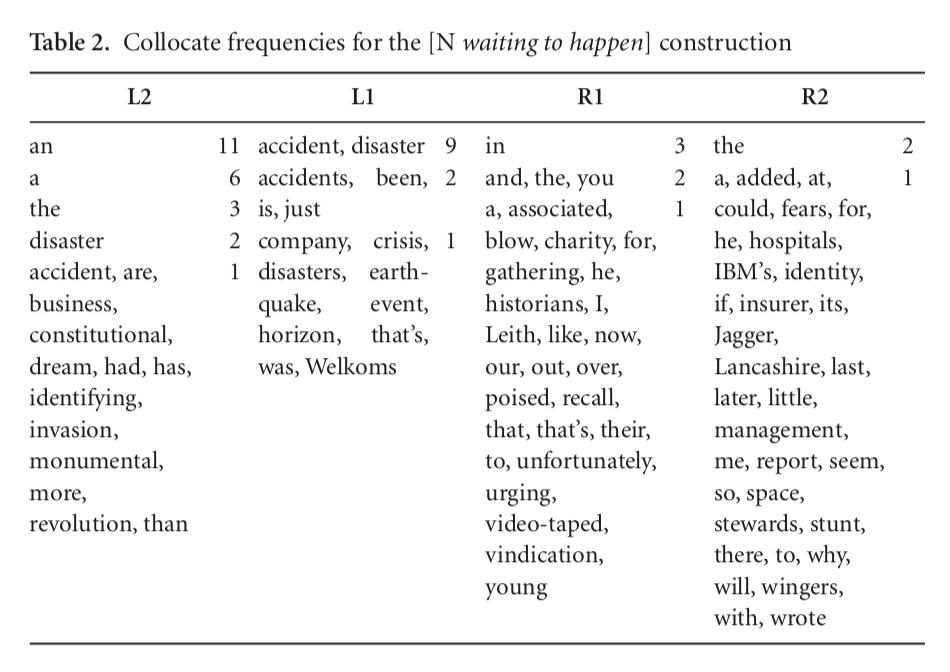
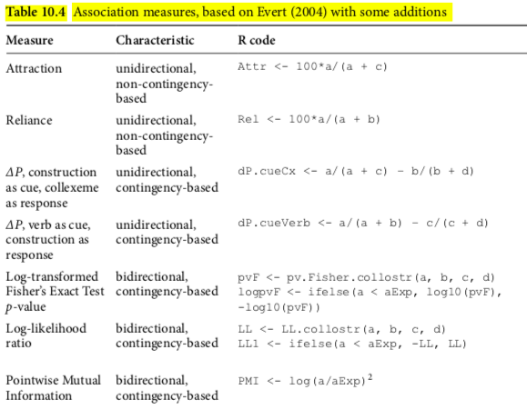
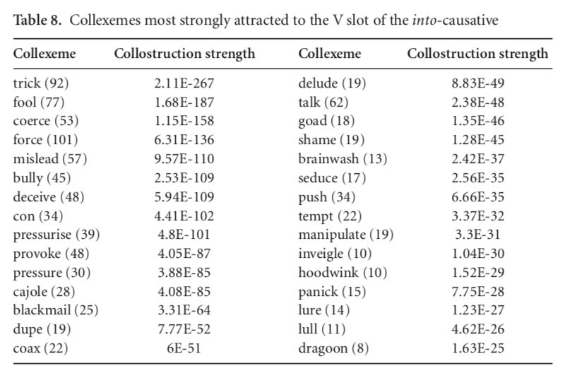

```{r setup, include=FALSE}
knitr::opts_chunk$set(echo = TRUE)
```

class: inverse, center, middle, clear

# Recap of last last week

---

# What we did last time

## Skills

* ✔️ scraping stuff from static websites with .orange[rvest]
* ✔️ .orange[quanteda] package .grey[(easier corpus but we needed .orange[tidytext] first)]
* ❌ looking at some .blue[.xml files]

## Datasets

* ✔️ a .blue[website] 
* ✔️.blue[PTT] .blue[(this is your homework)]
* ❌  (a  part of the) .blue[BNC corpus (in xml)]

## Case studies

Getting a bunch of data from the internet, and showing how you can start exploring it (before you analyze it yourself).

---


# This time

This will probably be the last session in the Rbootcamp for lexical semanticists.

## Skills

* xml-files
* segmentation of Chinese (.orange[jiebaR]) + how I do it
* stop words

## Data

* BNC

## Theory

* Association measures à la Gries

---

class: inverse, center, middle, clear

# Setup of today

---

# Setup

## Make a new markdown document in your project

Called "jieba.Rmd"

## Packages

```{r, eval=FALSE}
library(tidyverse)
library(here)
```

```{r, eval=FALSE}
library(quanteda)
library(jiebaR) # install.packages("jiebaR") # segmenting Chinese

library(tmcn) # stopwords and other functions for Chinese
```

---

# Segmenting Chinese

So in the past we have seen that .orange[tidytext] and .orange[quanteda] use the same library underneath to make some segmentation guesses for Chinese.

.orange[quanteda] is a bit more powerful, because you can glue words back together if they have been split.

However, what most people recommend for .blue[basic] segmentation is called .blue[jieba]. It comes with a [manual in Chinese](https://qinwenfeng.com/jiebaR/), so check that out later.

Jieba is originally a python package, but the R variant is available and called .orange[jiebaR]. 

---

# jiebaR

The basic thing you need to do is define a .red[worker()], and then you can .red[segment()] stuff.

```{r, eval=FALSE}
cutter <- worker()
segment("你好最近還可以嗎", cutter)
```

---

# jiebaR

Let's cut a table as well:

```{r, eval=FALSE}
cutter$bylines = TRUE
cutter

tribble(
  ~a,
  "你好最近還可以嗎", 
  "台灣大學現在很冷"
) %>%
  mutate(a = segment(a, cutter)) %>%
  unnest(a)
```

The resulting view should be familiar from .orange[tidytext].

---

# jiebaR

But you are probably most interested in how to segment a bunch of files, right?

As always we **first do 1 file**.

```{r, eval=FALSE}
file <- read_lines(here("inputfiles", "周杰倫_晴天.txt"))

cutter$bylines = TRUE

segment(file, cutter) -> segmented_tokens


segmented_tokens %>% 
  enframe() %>% 
  unnest(value) %>% # this is the unnest_tokens view
  ungroup() %>% # this is weird but first ungroup then group_by
  group_by(name) %>%
  summarise(sent = str_c(value, collapse = " ", sep = "")) %>%
  pull(sent) %>%
  str_squish() -> segmented_spaces

segmented_spaces %>%
  write_lines(here("output", "周杰倫_晴天.txt"))
```

---

# jiebaR

Now we wrap that into a function, just as we have done in the past few weeks:

```{r, eval=FALSE}
tokens_to_spaces <- function(segmented_tokens){
  segmented_spaces <- segmented_tokens %>% 
  enframe() %>% 
  unnest(value) %>% # this is the unnest_tokens view
  ungroup() %>% # this is weird but first ungroup then group_by
  group_by(name) %>%
  summarise(sent = str_c(value, collapse = " ", sep = "")) %>%
  pull(sent) %>%
  str_squish() 
  
  segmented_spaces
}

tokens_to_spaces(segmented_tokens = segmented_tokens)
```

---

# jiebaR

## more

It should be the same. 

This function you can call with the familiar steps:
1. listing all files that participate with .orange[ls::].red[dir_ls] with options .blue[recurse = TRUE, regexp = ".txt$"]
2. Iterate with the .orange[purrr::].red[map/walk] family of functions.

## dictionary

There should be an option for custom dictionaries, that can help you segment better (e.g. you upload a list of things you definitely want segmented in a certain way).

But I don't understand the manual. Maybe you do (in Chinese). If you manage to make it work, please tell me how.

http://qinwenfeng.com/jiebaR/

---

# How I segment

I wrote a whole [blogpost](https://www.thomasvanhoey.com/post/guanguan-goes-the-chinese-word-segmentation-2/) about my troubles and successes with segmentation.

Currently I use a combination of R and python, through the .orange[reticulate] package and the python .orange[ckiptagger] library. You can find a demonstration [here](https://github.com/ckiplab/ckiptagger). 

If you are interested in this, I can demonstrate it at some point.

## Conclusion

So for now the best way is either to use this way (.orange[jiebaR]) to segment your files, or directly trust .orange[tidytext] or .orange[quanteda].

There is no 100% guaranteed word segmentation tool, as far as I know.

But last week Hsieh laoshi said in his talk that we should not be looking for "the golden standard" anymore, but rather focus on levels of granularity. And I think that pragmatic mindset is good: computational stuff can help you a lot, but it can't do everything.

---

class: inverse, center, middle, clear

# Stop words


---

# Stop words

Let's make a resource that is useful for us later: a list of [stop words](https://en.wikipedia.org/wiki/Stop_words) in Chinese.

So words like {我, 與, 是... } are things we would like to list, so we can focus more on content words.
(Although I think that is a naive way of doing linguistics, but it has its place in things like wordclouds etc.)

---

# Lists of stopwords

## Quanteda

The first list comes from the .orange[quanteda] package, which we loaded above.

```{r, eval=FALSE}
ch_stop <- stopwords("zh", source = "misc") %>% enframe(name = NULL)
head(ch_stop)
nrow(ch_stop)
#ch_stop %>% distinct(value)
```

## tmcn

The second comes from the .orange[tmcn] package.

```{r, eval=FALSE}
data("STOPWORDS")
tmcn_stop <- stopwordsCN() %>% enframe(name = NULL)
head(tmcn_stop)
nrow(tmcn_stop)
```

---

# Lists of stopwords

## Combining them

```{r, eval=FALSE}
full_join(ch_stop, tmcn_stop, by = "value") %>% 
  distinct(value) -> stopwords

stopwords

stopwords %>%
  rename(simp = value) %>%
  mutate(trad = tmcn::toTrad(simp)) -> stopwords # traditional characters
```


So now we have a nice set of stopwords.
You can save it somewhere for future usage :).

```{r, eval=FALSE}
write_csv(stopwords, here("stopwords.csv"))
```

---

class: inverse, center, middle, clear

# Collexemes and collostructions

---

# Papers by Gries and friends 

.font70[
Stefanowitsch, Anatol & Stefan Th. Gries. 2003. Collostructions: Investigating the interaction of words and constructions. International Journal of Corpus Linguistics 8(2). 209–243. doi:10.1075/ijcl.8.2.03ste.

Gries, Stefan Th. & Anatol Stefanowitsch. 2004. Covarying collexemes in the into-causative. 

Stefanowitsch, Anatol. 2005. New York, Dayton (Ohio), and the raw frequency fallacy. Corpus Linguistics and Linguistic Theory 1(2). 295–301.

Colleman, Timothy. 2009. The semantic range of the Dutch double object construction: A collostructional perspective. Constructions and Frames 1(2). 190–220. doi:10.1075/cf.1.2.02col.

Schmid, Hans-Jörg. 2010. Does frequency in text instantiate entrenchment in the cognitive system? 

Gries, Stefan Th. 2012. Frequencies, probabilities, and association measures in usage-/exemplar-based linguistics. Studies in Language 11(3). 477–510.

Hilpert, Martin. 2012. Diachronic collostructional analysis: How to use it and how to deal with confounding factors. 

Schmid, Hans-Jörg & Helmut Küchenhoff. 2013. Collostructional analysis and other ways of measuring lexicogrammatical attraction: Theoretical premises, practical problems and cognitive underpinnings. Cognitive Linguistics 24(3). 531–577. doi:10.1515/cog-2013-0018.

Gries, Stefan Th. 2015. More (old and new) misunderstandings of collostructional analysis: On Schmid and Küchenhoff (2013). Cognitive Linguistics 26(3). 505–536. doi:10.1515/cog-2014-0092.

Levshina, Natalia. 2015. How to do linguistics with R: data exploration and statistical analysis. 

Gries, Stefan Th. 2019. 15 years of collostructions: Some long overdue additions/corrections (to/of actually all sorts of corpus-linguistics measures). International Journal of Corpus Linguistics 24(3). 385–412. doi:10.1075/ijcl.00011.gri.
]

---

# Collostructions and collexeme analysis

Here are the basic ideas:

Raw absolute token frequencies give you *an impression* of what collocations are important.

BUT to have a real analysis, you need to turn them into relative frequencies, because who is to say that very frequent elements (the verbs TO BE, TO HAVE, A/AN, THE...) just occur a lot in your sample because they just occur a lot, rather than being .blue[significant] for the construction you are looking at?

---

# Collostructions and collexeme analysis

Example: .red[N waiting to happen]



So you need to calculate somehow how significant the N in .red[N waiting to happen] is, right.

---

# The methodology

1. Get a corpus
2. Count all instances of the phemonenon you want to investigate 
3. Count all instances of categories that participate in your phenomenon 
4. Do letter math with your  contingency table (choose a small set at first)
5. Perform statistical tests

So you want to make a contingency table like this:

 | Element 2  | Not element 2 / other elements | Sum
-- |--|--
**Element 1**                     | a         |        b                       | a + b |
**Not element 1 / other elements** | c         |     d                          | c + d
**Sum**                            | a + c     | b + d                  | a + b + c + d


---

# The methodology

an example from Stefanowitsch & Gries (2003):

 | accident | not accident | Sum
----------------------------------|-----------|--------------------------------|---
N waiting to happen                     | 14         |        21                       | 35
not N waiting to happen | 8,606         |     10,197,659                          | 10,206,265
**Sum**                            | 8,620    | 10,197,680                  | 10,206,300


---

# Statistical tests



Levshina (2015) provides this nice list of calculations we can do (see also my [blog on tidy collostructions](https://www.thomasvanhoey.com/post/tidy-collostructions/) -- basically what we are doing today).

---

# Some more methods

Basically three big approaches within collostruction analysis:

1. .blue[collexeme analysis] (Stefanowitsch & Gries, 2003), whose purpose it is to quan- tify how much words that occur in a syntactically defined slot of a construction are attracted to or repelled by that construction; examples include the verbs that occur in the ditransitive, the imperative, or the nouns that occur in the .red[N waiting-to-happen construction]
2. .blue[distinctive collexeme analysis] (Gries & Stefanowitsch, 2004a), whose purpose it is to quantify how much words prefer to occur in slots of two functionally similar constructions; examples include the .red[ditransitive vs. the prepositional dative] or the .red[will vs. the going-to future] 
3. .blue[co-varying collexeme analysis] (Gries & Stefanowitsch, 2004b), whose purpose is to quantify how much words in one slot of a construction are attracted to or repelled by words in a second slot of the same construction; examples include the two verb slots in the .red[into-causative] .grey[(trickV1 someone into buyingV2 or forceV1 someone into acceptingV2)] or the verb and the preposition of the .red[way-construction] .grey[(weaveV your way throughPrep the crowd or makeV your way toPrep the top)].

The last one .red[into-causative] brings us to the case study of our R tutorial today.
It will be a bit more theoretical in the beginning, because it takes a while to run on the whole BNC.

---

# The into causative

We are going to recreate the casestudy of the *into* causative Stefanowitsch & Gries (2003:224-227). 

.red[

$$S_{agent} V O_{patient/agent} into A_{gerund}^{resulting action}$$
 ]
 
Examples:
 
a. He tricked me into employing him.

b. They were forced into formulating an opinion.

c. We conned a grown-up into buying the tickets.

---

# The issue

Hunston & Francis (2000) had provided some .blue[impressionistic] material about raw frequency data, making them conclude that there is 

> a strong tendency of the construction to occur with verbs denoting negative emotions (e.g. frighten, intimidate, panic, scare, terrify, embarrass, shock, shame etc.) or ways of speaking cleverly and deviously (e.g. talk, coax, cajole, charm, browbeat etc.). They propose that verbs entering into the into-causative usually (i) do not mean ‘talk reasonably’ and (ii) can also be used transitively; they go on to argue that both of the senses they have identified are associated with “some kind of forcefulness or even coercion” (Hunston & Francis 2000:106).

Furthermore:
1. they only discuss the V slot (and we will too today)
2. the verbs *force* and *coerce* are absent from their discussion, even though they talk about it.

---

# What we should find




---

# Plan of attack

0. Make a new Rmarkdown 'gries.Rmd'
1. I show how I found all instances of the V in the .red[V into V-ing construction]
2. I show how I found all Verbs in the British National Corpus
3. We load in the files I created, and perform the association tests.
4. Short discussion

---

# New Rmarkdown

It's called 'Gries.Rmd'

Restart the R session

```{r, eval=FALSE}
library(tidyverse)
library(here)
library(xml2) # install.packages("xml2")
```

---

# xml

A short demonstration of xml, which works in the same way as the html-documents from last time (there is a big tree and you need to find the right nodes).

Basically, XML is hell. But we will open a file, and eventually turn it into a flat string, so we can use our regular expression knowledge to get stuff. It is not beautiful and very painful, but you can get stuff from it.

```{r, eval=FALSE}
# This is the path to where I parked my BNC file
files <- "/Users/Thomas/Desktop/BNC/A/A0/A00.xml"

xmlread <- read_xml(files) # read in xml
xmlread

xmlsentence <- xml_find_all(xmlread, "//s") # find all sentences
xmlsentence

xml.sentencecharacter <- tolower(as.character(xmlsentence)) # turn to lower case after turning every xml to a character string
head(xml.sentencecharacter, 2) 
```

---

# Getting what we want

For a corpus like the BNC, the tagset is your best friend

http://www.natcorp.ox.ac.uk/docs/c5spec.html

Important is also the use of .blue[[^<]] as a character that acts as .blue[.] usually works, but with a little bit more restriction.

So this is what I came up with

```{r, eval=FALSE}
VERB <- "<w[^<]+pos=\"verb\"[^<]+</w>"
INTO <- "<w[^<]+pos=\"prep\">into </w>"
VERBGERUND <- "<w c5=\"v[bdhv]g\"[^<]+</w>" # all the different ing forms
INBETWEEN <- "<[^<]+<[^<]+" # this is one tag!
SPACE <- "[^<]"

search.expression <- glue::glue("{VERB}(\n  )?{INTO}")

search.expression

se <- glue::glue("{VERB}{SPACE}+({INBETWEEN})+{INTO}{SPACE}+{VERBGERUND}")
se
```

---

# Iterating over the whole BNC

```{r, eval=FALSE}
collexeme.preparer <- function(files) {
  number <- basename(files)
  
  # this we just did
  xmlread <- read_xml(files) # read in xml
  xmlsentence <- xml_find_all(xmlread, "//s") # find all sentences
  xml.sentencecharacter <- tolower(as.character(xmlsentence)) # turn to lower case after turning every xml to a character string
  
  # this is new 
  extracted.modal.verb  <- xml.sentencecharacter %>%
    str_extract(se) %>% # getting into   
    tibble(.name_repair = ~ "strings") %>%
    mutate(name = number) %>%
    drop_na(strings)
  
  write_csv(extracted.modal.verb, 
            here::here("into.csv"),
            append = TRUE)
  
}
```

---

# Iterating over the whole BNC

```{r, eval=FALSE}
filelist <- fs::dir_ls(here::here("BNC"),
                       recurse = TRUE,
                       regexp = ".xml$")
length(filelist)

# this is where you really iterate
future_walk(filelist, collexeme.preparer, .progress = TRUE)
```

I used a package .orange[furrr], which uses the power of .orange[future] to make more use of your computer. Just google it if you want to do this.
But we won't do it today, because it takes a while.

---

# So we got the V into V-ing

We got the V into V-ing constructions.

But you need more frequencies to fill up the contingency table.

 | Element 2 | Not element 2 / other elements | Sum
----------------------------------|-----------|--------------------------------|---
**Element 1**                     | .blue[a]         |        b                       | a + b
**Not element 1 / other elements** | c         |     d                          | c + d
**Sum**                            | a + c     | b + d                  | .blue[a + b + c + d]

---

# Getting all Verbs form the BNC

Basically, it is the same script:

```{r, eval=FALSE}
* VERB <- "<w[^<]+pos=\"verb\"[^<]+</w>"

collexeme.preparer <- function(files) {
  number <- basename(files)
  
  xmlread <- read_xml(files) # read in xml
  xmlsentence <- xml_find_all(xmlread, "//s") # find all sentences
  xml.sentencecharacter <- tolower(as.character(xmlsentence)) # turn to lower case after turning every xml to a character string
  
  extracted.modal.verb  <- xml.sentencecharacter %>%
    str_extract(VERB) %>% # getting modal verb followed by infinitive  
    tibble(.name_repair = ~ "strings") %>%
    mutate(name = number) %>%
*    mutate(verb = str_extract(strings, '(?<=hw=")\\w+')) %>%
    drop_na(strings)
  
  write_csv(extracted.modal.verb, 
            here::here("allverbsinBNC.csv"),
            append = TRUE)
  
}

future_walk(filelist, collexeme.preparer, .progress = TRUE)
```

---

# Some post processing 

If you want to do this at home (but you can just use the end file, see next slide)

```{r, eval=FALSE}
freqlist <- read_csv(filelist, col_names = FALSE)

freqlist %>%
  filter(str_detect(X1, 'pos="verb"')) -> firstfilter

firstfilter %>% 
  filter(str_detect(X1, "mislead"))
  mutate(verb = str_extract(X1, 'hw="\\w+'),
         verb = str_remove(verb, 'hw="')) %>%
  select(verb) %>%
  count(verb) %>%
  filter(n > 10) %>%
  rename(freqall = n) -> freqofverbs
  
freqofverbs
write_csv(freqofverbs, here("bncallverbs.csv"))
```


---

# Time for further analysis.

Let's download the csv file with all frequencies for verbs from my github, where I parked it, and check it.

```{r, eval=FALSE}
freqofverbs <- read_csv("https://raw.githubusercontent.com/simazhi/sinologica/master/static/Rbootcamp/inputfiles/bncallverbs.csv") %>%
  mutate(freqall = as.integer(freqall))

freqofverbs %>%
  filter(verb == "trick")
```

We can already get .blue[a + b + c + d]!

```{r, eval=FALSE}
abcd <- freqofverbs %>%
  summarise(sum = sum(freqall)) %>%
  pull()
abcd 
```


---

# The into frequencies

This one isn't so pretty:

```{r, eval=FALSE}
intos <- read_csv("https://raw.githubusercontent.com/simazhi/sinologica/master/static/Rbootcamp/inputfiles/into.csv", col_names = FALSE)

intos %>%
  mutate(X1 = str_replace_all(X1, "\n", "@")) %>% # hidden \n s
  mutate(last = str_extract(X1, '<.+verb.+verb.+$')) %>% # we want the end
  select(last) %>%
  mutate(
    # first make the gerund in a few steps
    gerund = str_extract(last, 'c5="v[bdhv]g.+$'), 
    gerund = str_extract(gerund, '(?<=hw=")\\w+'),
    # make the V into
    verb = str_remove_all(last, 'into.+$'),
    verb = str_extract(verb, '<[^<]+pos="verb"(?!.+pos="verb".+).+</w>'),
    verb = str_extract(verb, '(?<=hw=")\\w+')) %>%
  select(verb, gerund) -> occurrences

occurrences
```

---

# Join the two tables

First counting, then joining.

```{r, eval=FALSE}
occurrences %>%
  count(verb, sort = TRUE) %>%
  left_join(freqofverbs, by = c("verb" = "verb"))
```

I noticed that there is something weird going on, because mislead occurs 42 times in the subset and 33 times in the whole set; trick 69 vs. 65 times.

So probably the regular expression can be improved, and you should definitely find out what is wrong if this is a real study, but for today, I am going to cheat a little bit and say that if freqall is smaller than n, then I am going to say it is the same.

---

# Join the two tables

```{r, eval=FALSE}
occurrences %>%
  count(verb, sort = TRUE) %>%
  left_join(freqofverbs, by = c("verb" = "verb")) %>%
  mutate(freqall = case_when(
    n > freqall ~ n,
    TRUE ~ freqall
  )) -> finished.df

finished.df
```

So here you can see that *come*, *go* occur very often into this .red[V into V-ing] construction, e.g. *come into being*, *went into hiding*. But they might just occur a lot because they are frequent verbs.
So that's why we need the association measures.

---

# Contingency table

Let's look at .blue[trick].


 | trick | trick NOT into | Sum
---------------------------------|-----------|--------------------------------|---
**into**                     | a         |        b                       | a + b
**NOT trick into** | c         |     d                          | c + d
**Sum**                            | a + c     | b + d                  | a + b + c + d


---

# What do we know?

* a (trick into)
* a+b (freqall)

* a+b+c+d (the sum of freqall)

We can calculate the rest as follows, first shown for .blue[trick] and .blue[talk]

```{r, eval=FALSE}
finished.df %>% 
  filter(str_detect(verb, "trick|talk")) %>%
  rename(a = n,
         ab = freqall) %>%
  mutate(b = ab - a) %>%
  mutate(ac = sum(a)) %>%
  mutate(c = ac - a) %>%
  mutate(abcd = abcd) %>% # we know abcd from above
  mutate(cd = abcd - ab) %>% 
  mutate(d = cd - c) %>%
  select(verb, a, b, c, d, abcd)
```

---

# Big table for all verbs

Now the same but without the filter:

```{r, eval=FALSE}
finished.df %>% 
  #filter(str_detect(verb, "trick|talk")) %>%
  rename(a = n,
         ab = freqall) %>%
  mutate(b = ab - a) %>%
  mutate(ac = sum(a)) %>%
  mutate(c = ac - a) %>%
  mutate(abcd = abcd) %>% # we know abcd from above
  mutate(cd = abcd - ab) %>% 
  mutate(d = cd - c) %>%
  mutate(aexp = ab * ac / abcd) %>%
  select(verb, a, b, c, d, abcd, aexp) -> preassociation
preassociation
```

---

# Time for testing

As mentioned above, you can do many different tests -- it is up to the researcher to choose a good one.
You can also do multiple ones, just by using .red[mutate()] and the .blue[letter math] formula. 

I chose cue validity because it is closely related to the one Stefanowitsch & Gries showed:

$$\Delta P_{word \to construction} = cue_{construction} = \frac{a}{a + c} - \frac{b}{b + d}$$

---

# Cue validity

Given a word, how strongly does it attract the construction:

```{r, eval=FALSE}
preassociation %>%
  mutate(dP.cueCx = a/(a + c) - b/(b + d),
         dP.cueVerb = a/(a + b) - c/(c + d)) %>%
  arrange(desc(dP.cueVerb)) %>%
  top_n(20) 
```

Then this is what you analyze with the methods we are used to (relation to theoretical frameworks etc.)

Let's see what Stefanowitsch and Gries (2003) have to say:

* you can categorize the verbs in semantic groups 
* you can see which ones attract, which ones repulse
* you can also integrate the V-ing into the analysis
...

---

# Steps taken

1. Get a corpus
2. Count all instances of the phemonenon you want to investigate (into construction)
3. Count all instances of categories that participate in your phenomenon (all verbs) + calculate the sum (abcd)
4. Do letter math with your tidy contingency table (choose a small set at first)
5. Perform statistical tests

It's simple in abstraction, but a bit annoying to actually do.
Because XML is hell.
But letter math is rad.

---

class: inverse, center, middle, clear

# Last words

---

# General conclusion

We have focused on some techniques to get data, and clean it so we can begin with our analysis.

R won't do it for you, but I hope that this bootcamp has shown you how you can integrate a bit of R in your workflow.

The most important things are regular expressions and how to quickly clean your dataset.
The tagging, unfortunately, is still best done by hand, but it's also good so you can familiarize yourself with your data.

And remember three things

1. Cheat sheet
2. Google is your friend
3. People from the computational lab are also your friend

---

class: inverse, center, middle, clear

# Good luck with R

---

background-image: url(https://media.giphy.com/media/upg0i1m4DLe5q/source.gif)
background-position: 50% 50%
background-size: 100%
class: center, bottom, clear


