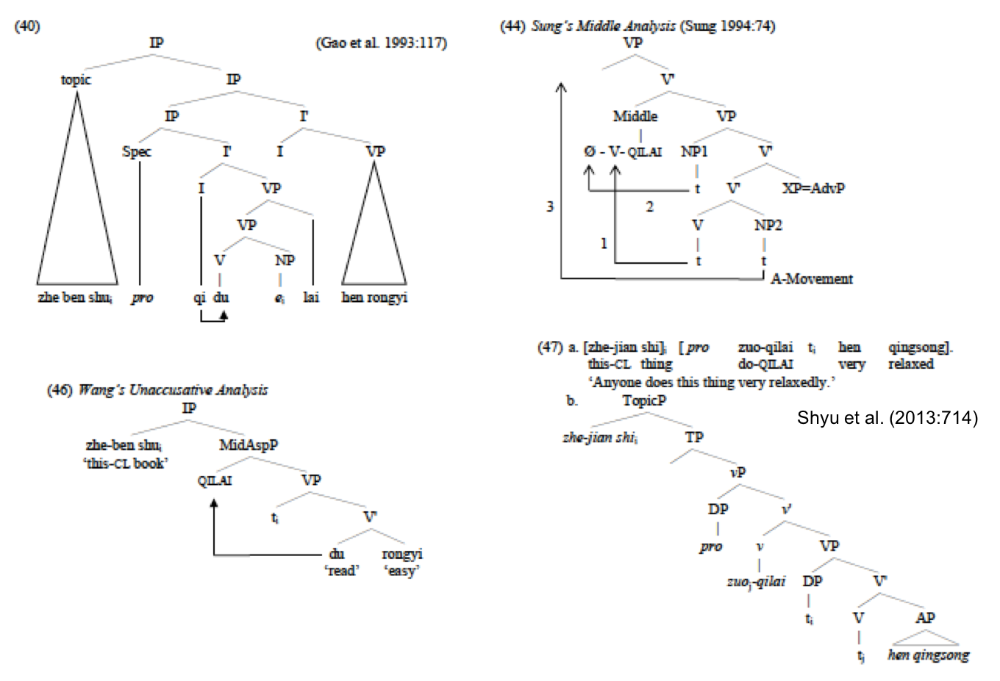
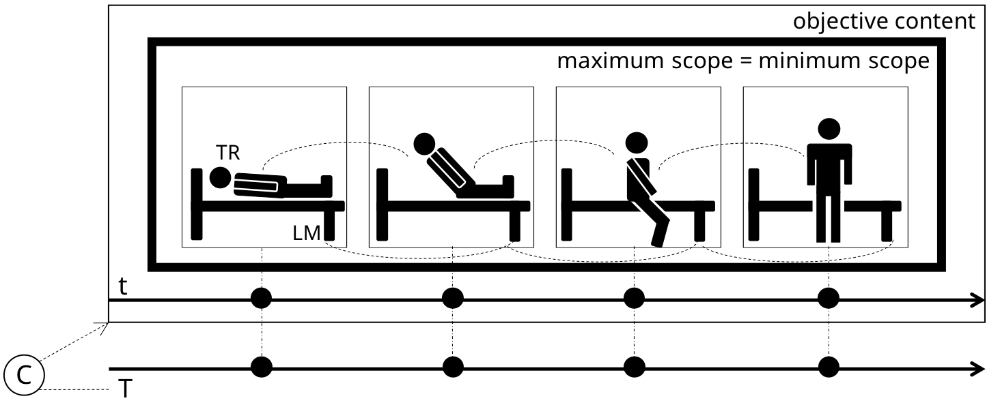
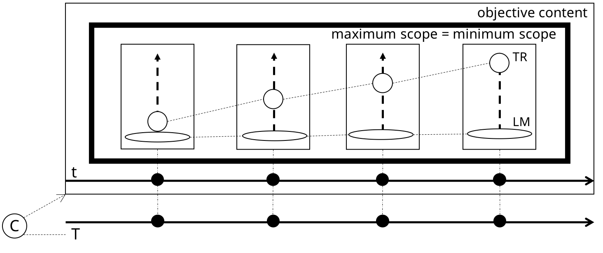
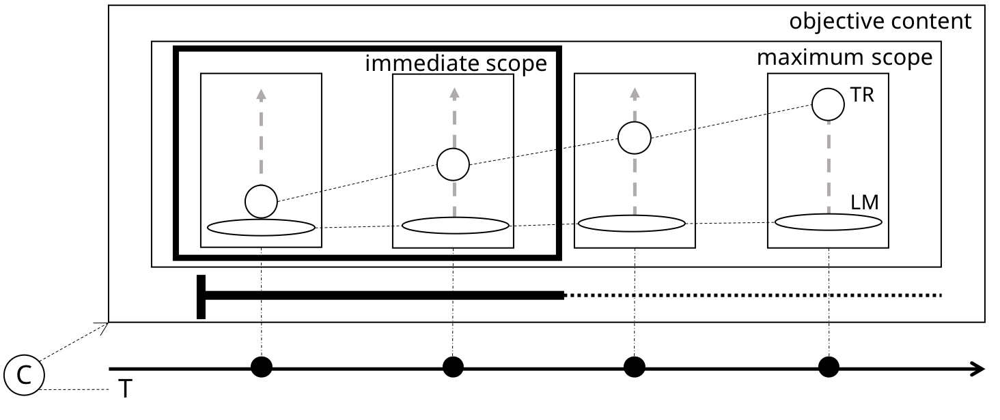
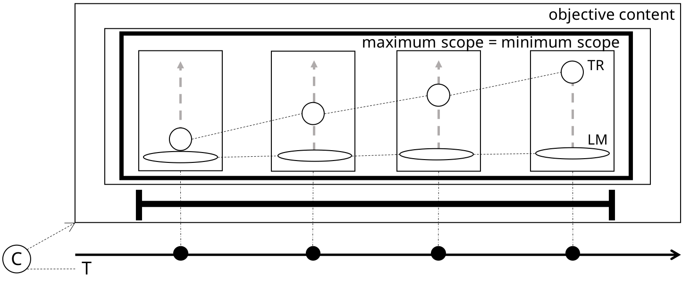
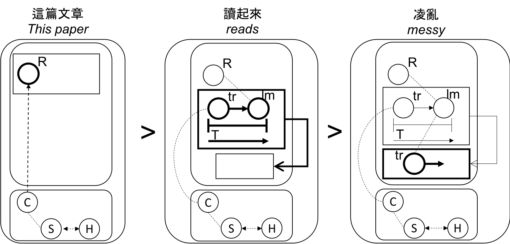
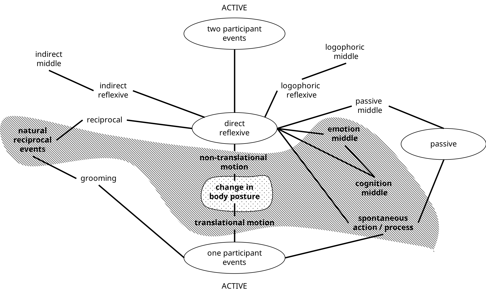

```{r setup, include=FALSE}
options(htmltools.dir.version = FALSE)
```

# Roadmap

* literature review
* methodology & material
* results
  * first look
  * .sc[qilai] as lexical verb
  * protosense of .sc[qilai]
    *-lai
    *qi-
  * inchoative .sc[qilai]
  * perfective .sc[qilai]
* perception verbs and .sc[qilai]
* discussion & conclusion
---

# Introduction

* .sc[qilai] constructions in Mandarin Chinese are polysemous.
* How can learners (especially SLA learners) learn these different usages and meanings better?
* Assuming a level from a low-intermediate upwards, I think the following theoretical yet usage-based approach can yield good results:
  * corpus-based study
  * construal and Cognitive Grammar


---

# Literature review

.font70[
```{r terminology, echo=FALSE, warning=FALSE, message=FALSE}
library(tidyverse)
terminology <- read_csv("terms.csv")
terminology[is.na(terminology)] <- " " #NAs as spaces for format
knitr::kable(terminology, format = "html")
```
]


```r
a. 張三剛剛起來了。
b. 張三從地板上爬了起來。
c. 女孩哭了起來。
d. 他躲了起來。
e. 這本書唸起來很難。
f. 他唸起書來很認真。`He, when reading books, is very earnest.'
g. 我買不起Chomsky的書。
```


---

# Literature: black and white

**formal approaches**
* treat the different usages with reference to objective situations (formal semantics).
* invoke .sc[merge] and .sc[move] with resulting *traces* *t* and non-expressed pronouns .sc[pro] in the tree-model.
* classifications based on clear-cut categories -- even though the categories may be assumed and not well-defined (cf. the critique by Croft 2001 or Langacker 2008).
* fixed rules, no variation, or alternative construal

---

# Literature: black and white



---

# Literature: shades of grey

So far, it seems only Chang (1994) and its continuation Huang & Chang (1996) are the only ones that are more functionally-oriented: **differences in construal**, especially going from .sc[getting up] to .sc[inchoative] they invoked a conceptual metaphor .sc[to start is to move up].

If what we know from our discussion on learning vs. acquisition is true, namely that **(sub)consciousness**, **im/explicitness** and **product/process** (Krashen 1981; Ellis 2008) all influence how languages are learned and keep on being acquired, then we need a **dynamic** model that does justice to our analysis of .sc[qilai], not only for second language acquisition but also for first language acquisition.


For me, the framework that seems to answer most of my questions, is that of Langacker's **Cognitive Grammar** (1987; 1991 etc.):
* dynamic
* usage-based
* role of the Conceptualizer C
* fictive motion (Langacker 2008:524-535)

---

# Methodology and material

## Goal
* identify the different meanings of .sc[qilai] 起來 constructions
* draw the polysemy network 
* discover motivations in this network

This means organizing (instead of only classifying) and connecting the different sentences that are discussed mostly in previous research + using frequency to posit some form of prototypicality and usefulness in SLA research.

```r
a. 張三剛剛起來了。
b. 張三從地板上爬了起來。
c. 女孩哭了起來。
d. 他躲了起來。
e. 這本書唸起來很難。
f. 他唸起書來很認真。`He, when reading books, is very earnest.'
g. 我買不起Chomsky的書。
```
---

# Methodology and material

## zhTenTen2011 corpus

* developed by [the SketchEngine](https://www.sketchengine.eu/zhtenten-chinese-corpus/)
* goal: +10 Billion words
* simplified Chinese: 1,729,867,455 (no traditional)
* for a construction like this one it is an advantage, because more material (Jakubíček et al. 2013)

## data gathering

```{r regex, echo=FALSE, warning=FALSE, message=FALSE}
regex <- c("/起来/", "/起·*·来/","/不|得·起/")
match <- c("站起來、看起來", "下起雨來", "買不起、買不起來")
abs.freq <- c(570022, 4703, 71426)
stand.freq <- c("270.60/M", "2.20/M", "33.90/M")

seeds <- tibble(regex, match, abs.freq, stand.freq)
knitr::kable(seeds, format = "html")
```

From the `/起来/` we take a sample of 100,000 (downloadable maximum).
This allowed me for some exploring of patterns.

---

# Results: a first look

**Question:** Which/what kind of verbs engage with .sc[qilai]?

This way we get a tentative idea of the kind of verbs and constructions we need to account for. Filtering `sum >= 200` gets 55414, out of 100,000 (55.41%) of the data.


.font70[
```{r vqilaifreqD, echo=FALSE, warning=FALSE, message=FALSE, tidy=FALSE}
vqilaifreqD <- read_csv("V-QILAI-freq.csv") %>%
  select(hit, sum)
#knitr::kable(vqilaifreqD, format = "html")
DT::datatable(
  head(vqilaifreqD, 45),
  fillContainer = FALSE, options = list(pageLength = 8)
)
```
]
---

# A first look

This list shows that .sc[qilai] seems to be used more as grammaticalized (bleached) suffix, rather than with its full verbal meaning. 

Especially, looking at `token frequency > 1000`, we find a few different classes of verbs, using English FrameNet:

.font70[
```{r vqilaiframe, echo=FALSE, warning=FALSE, message=FALSE, tidy=FALSE}
vqilaiframe <- read_csv("V-QILAI-freq-frame.csv")
framefreq <- vqilaiframe %>%
  select(hit, sum, frame) %>%
  group_by(frame) %>%
  count()%>%
  left_join(vqilaiframe, by = "frame") %>%
  rename(typefreq = n)

frametypetoken <- framefreq %>%
  select(frame, hit, typefreq, sum) %>%
  rename(tokenfreq = sum) %>%
  group_by(frame) %>%
  mutate(cum_tokenfreq = cumsum(tokenfreq))

frametypetoken <- frametypetoken[c("frame", "typefreq", "hit", "tokenfreq", "cum_tokenfreq")]

#knitr::kable(vqilaifreqD, format = "html")
DT::datatable(
  head(frametypetoken, 51),
  fillContainer = FALSE, options = list(pageLength = 8)
)
```
]

We will have to account for these verbal meanings in the different meanings of .sc[qilai] constructions.

But first, look at what .sc[qilai] as a full verb means.

---

# .sc[qilai] as a lexical verb



```
当天，我早上起来，做些准备工作 。
'That day, I woke up in the morning, and did some preparatory work.'
(早上 起来 has a frequency of 0.70/M)
```

So **qǐlái** here means `'to get up, typically after a period of rest'`.

Most concrete and specific meaning of .sc[qilai], at the lowest-level (Tuggy 2003). 

---

# .sc[qilai]'s compositionality: -lái 來

.pull-left[


.font80[
Why it is qǐ**lái** and not qǐ**qù**? 

Xu Dan (2008:181-184) explains this cognitively with .sc[field of vision] (of the conceptualizer C). Also, according to him and Wang Canlong (2004) there used to be a *qǐqù*, mostly collocating with 藏 and 收, but it has almost entirely disappeared, because of a cognitive 'mismatch' (Wang 2004). 

However, there are dialects where *qǐqù* also grammaticalized.
]
]

.pull-right[
.font80[
>"[T]hrough **processing time (T)**, we successively conceptualize the mover as occupying—through **conceived time (t)** -- a series of locations that collectively constitute the path. 

>An inherent aspect of this conception is that the conceptualizer scans mentally along the same path which the mover traverses physically; 

>to properly apprehend this event, C must access the successive locations in the same order that the mover reaches them. 

>The dynamic conception of a path is therefore immanent in the conception of actual motion." <br>(Langacker 2008:529)

]
]


---

# .sc[qilai]'s compositionality: qǐ(-) 起



The previous diagram can be abstracted to `getting up` or simply `up`.

It is this heuristic diagram that best captures the .sc[vertical vector] and the .sc[upwards direction] (Chu 2004;2009) of **qǐlái** (as its own verb) or as a Satellite **-qilai**<sup>1</sup>. 


.footnote[1 I don't know how advanced the phonetic reduction in TSM is, but it seems less.]

---

#  Frames that match with .sc[qilai]<sub>.sc[up]</sub>

It is not very controversial, but these verbs match with .sc[qilai]<sub>.sc[up]</sub>, mostly because of their vertical upwards movement.
Although Self_motion also fits in with our next category (it is a fuzzy boundary).

.font80[
```{r up, echo=FALSE, warning=FALSE, message=FALSE}
up <- frametypetoken %>%
  filter(frame == "Change_posture" | frame == "Self_motion") %>%
  select(frame, hit, tokenfreq)
knitr::kable(up, format = "html")
```
]

```
男孩	站 起来	， 小心 捧 着 蝴蝶 回家 了 。
"The man stood up and went home, carefully holding the butterfly in his hands."
```
---

# Inchoative .sc[qilai]<sub>.sc[inch]</sub>



.font80[
Now the benefit of using **fictive motion** will become apparent:

In this grammaticalized *-qilai* construction
* the vertical upwards movement has become less important
* however, what is **profiled** is the change in the state<sub>0</sub> and state<sub>1</sub>
* *crucially*, there is no **t** (conceived time of the motion) at play anymore, only **T** (processing time)


]


---

# Fictive motion and .sc[qilai]<sub>.sc[inch]</sub>

**Fictive motion** is a product of **subjectification** phenomena, similar to **reference point** constructions where the conceptualizer C first accesses a reference point R to focus on a target (`C --> R --> T`), e.g. `桌子-上  有   香蕉。`

In both of these the role of the conceptualizer C is extremely important, and there are experiments (e.g. Matlock 2004) that show there is some kind of simulation.

--
```
An ugly scar RUNS from his elbow to his wrist.
A BROKEN vase vs. A BROKEN line.
```
--

.ru-blockquote[So, the conceptualizer also simulates this movement -- (somewhat) bleached off its verticality.]

.footnote[*Fun fact: Langacker (2005) uses fictive motion / abstract motion to explain the grammaticalization of `to go` as a future marker.*]

---
# Perfective .sc[qilai]<sub>.sc[pfv]</sub>



.font80[
The Trajector TR is construed as having moved, i.e. having been discplaced trough different moments in time. However, this is only fictive motion T.

Huang & Chang (1996) called this the **completive** aspectual usage, and argue it was a special case of the **inchoative**, and that it was **imperfective**.

However, this seems more of a **perfective** usage: the action is **bounded**, what remains is its last 'state'.
]


---
# .sc[qilai]<sub>.sc[pfv]</sub> vs. .sc[qilai]<sub>.sc[inch]</sub>

It is somewhat hard to classify verb groups as *strictly* belonging to one of these two categories. However, inheritance links between constructions (see e.g. Goldberg 1995) may provide help.

* Amalgamation (结合、联系 etc.) often has a *bǎ* 把: `把 行业 党建 工作 与 这些 工作	结合 起来`. This profiles the perfective reading.
* Stative predicates ('adjectives', Change_position_on_a_scale frame) often have a verbal *le* 了: `最近 ， 在 雅溪 中心 卫生院 看病 的 群众	多 了 起来。`. This also profiles a perfective reading.
* Similar findings for what are usually considered inchoative usages, e.g. 笑起来 and 哭起来 occur mostly without *le*, then with a verbal *le*, and very few times with sentential *le*. 

.ru-blockquote[Conclusion (?): The boundary between perfectivity and inchoativity is somewhat fuzzy, and largely depends on verbal semantics and its concrete construal.
]


---

# V<sub>.sc[perception]</sub> and .sc[qilai]

Now the most interesting part -- which needed the build-up of fictive motion.

Example sentences:
```
這篇文章 讀起來 凌亂。 'This paper reads like a mess.'

這本書 買起來 很貴。 'This book is sold expensively.'
```

What is going on here is essentially a dynamic process of construal: previous formal analyses try to push this all in one big tree; however, it makes more sense to see these clauses as a nested collection of  events, *frames of attention* (Langacker 2001). 

The V-qilai construction acts as a perfective process the conceptualizer moves through before the 'final verdict' is made.

The boundedness of .sc[qilai]<sub>.sc[pfv]</sub> naturally elaborates into a new mental space.


---

# V<sub>.sc[perception]</sub> and .sc[qilai]



---

# V<sub>.sc[perception]</sub> and .sc[qilai]

.font70[
This 'final verdict' ("AP / small clause") can be built up analytically through the constructions we are showing here, and motivated by .sc[qilai]'s semantic and pragmatic usage. 

However, it is not uncommon for the elaborations of `V-qilai + small clause` to chunk together and attain 'unit status' through entrenchment: in the table below there are many `V-qilai + small clause` constructions of which the small clause sounds very natural, right?
]

```{r tingqilai, echo=FALSE, warning=FALSE, message=FALSE, tidy=FALSE}
tingqilai <- read_csv("tingqilai.csv") 
#knitr::kable(tingqilai, format = "html")
DT::datatable(
  head(tingqilai, 500),
  fillContainer = FALSE, options = list(pageLength = 4)
)
```


---

# V<sub>.sc[perception]</sub> and .sc[qilai]: .sc[ideophones]

.sc[Ideophones] can be cross-linguistically defined as `Marked Words that Depict Sensory imagery` (Dingemanse 2011;2012), and for Chinese usually conform to all or the majority of the following criteria:
* partial / full reduplication, e.g. `玲瓏、稀裡嘩啦，汪汪、濛濛`
* *canonically* non-.sc[referential] usage (although conceptual reification and metonymy can occur `一個帥帥`) in the Croftian (1991;2001) sense
* 'radical support' for literary ideophones (Van Hoey 2017; 2018), e.g. `雨 in 霏霏`
* multiple <graphemes> that encode the same word, e.g. `<凌亂> and <零亂>`
* a definition in traditional dictionaries that ends with `的樣子` or `然`

As you can see, this list is not complete yet and functions a lot like  Hopper & Thompson (1980) on transitivity. But we're getting there :).

---

# V<sub>.sc[perception]</sub> and .sc[qilai]: Performativity

.font80[
As e.g. Dingemanse (2011; 2012) and Nuckolls (2017) argue, the pragmatic function of ideophones is their **performativity**. As I am (still) trying to show (e.g. Van Hoey 2017), mental space theory can be used to describe and analyze this function, as it builds up through the (written/spoken) discourse. 

There might be an extra construction in between, as we often have the inheritance link between our `V-qilai + small clause`, the `ideophone`: `ideophone 的`.
]

.pull-left[
```{r moqilai, echo=FALSE, warning=FALSE, message=FALSE, tidy=FALSE}
moqilai <- read_csv("moqilai.csv") 
#knitr::kable(moqilai, format = "html")
DT::datatable(
  head(moqilai, 100),
  fillContainer = FALSE, options = list(pageLength = 4)
)
```
]

.pull-right[
```{r moqilai_ideos, echo=FALSE, warning=FALSE, message=FALSE, tidy=FALSE}
moqilai_ideos <- read_csv("moqilai_ideos.csv") 
#knitr::kable(moqilai_ideos, format = "html")
DT::datatable(
  head(moqilai_ideos, 10000),
  fillContainer = FALSE, options = list(pageLength = 5)
)
```
]

---

# Discussion & conclusion

## What have we learnt?

* Just like Kilgariff et al. (2015), it seems the corpus can help the learner incredibly (be it first or second language) acquire the most frequent collostructions (Stefanowitsch & Gries 2003).
* This helps the formation of different schemas (based on real language data) that will help apprehend next encounters of the same construction (and different levels of abstraction).
* Invoking fictive motion -- a general cognitive mechanism that has an increasing body of experimental evidence as well -- seems to be a good theory to explain the different *qilai*s. Even opaque collocations (Xiong 2017), like `想起來 'remember'` can be motivated as an elaboration of  .sc[qilai]<sub>.sc[pfv]</sub>.
* Particularly in connection with my own studies, this network of .sc[perception verb + qilai] constructions can help me discover new ideophones -- probably relatable to evidentiality (cf. Vygotsky 1983; San Roque et al. 2015; Van Hoey & Lu *in prep.*). However, this deserves further research.

---

# Discussion & conclusion

## Is .sc[qilai] a Middle Voice?



---

# Discussion & conclusion

## Is .sc[qilai] a Middle Voice?

If you follow e.g. Xiong's narrow definition of a middle (2017), some functions of .sc[qilai] can be called middle voice.

If you follow e.g. Kemmer's (1993) extensive typological discussion on middle voice, it most definitely is.

Only, the reflexive meaning present in so many Standard Average European languages is not covered by .sc[qilai]. However, this may not be a problem: for the Austronesian language Mori Atas, a similar observation was made (Sirima 2017:60).

---

# Future directions

The status of .sc[qilai] as an evidentiality + middle marker deserves further investigation. For instance, how/when do children learn these constructions? Childes corpus (*Lu*):

.pull-left[
```{r childesqilai, echo=FALSE, warning=FALSE, message=FALSE, tidy=FALSE}
qilai <- read_csv("qilaiCHILDES.csv")
qilaismooth <- qilai %>%
  group_by(age) %>%
  tally()

plot <- ggplot() +
  stat_count(data = qilai, mapping = aes(x = age, fill = role)) +
#  geom_smooth(data = qilaismooth, mapping = aes(x = age, y = n)) +
  ggtitle("Qilai uttered by children and adults") +
  theme_bw() +
  theme(panel.border = element_blank(),
        panel.grid.major = element_blank(),
        panel.grid.minor = element_blank(),
        axis.line = element_line((colour = "black"))
        ) +
  scale_x_continuous(name = "age",
                     limits = c(12, 100),
                     breaks = seq(12, 100, 6)) +
  scale_y_continuous(name = "number of onomatopoeia",
                     limits = c(0, 350),
                     breaks = seq(0, 400, 50)) 

library(plotly)
ggplotly(plot)
```

]

.pull-right[
```{r childesverbs, echo=FALSE, warning=FALSE, message=FALSE, tidy=FALSE}
Vqilai <- qilai %>%
  select(Vqilai, age, role) %>%
  filter(role == "child") %>%
  arrange(age)

Vqilaismooth <- Vqilai %>%
  group_by(Vqilai) %>%
  tally() %>%
  arrange(desc(n)) %>%
  top_n(10)

knitr::kable(Vqilaismooth, format = "html")
```

]


---
class: middle, center

.font200[
Thanks for listening!
<br> 謝謝聆聽！
]

---

# Appendix Down the rabbit hole...

**Talmy** (1975; 1985; 1991; 2000b) discerns two opposites for languages .sc[verb-framed] (Spanish) and .sc[satellite-framed] (English). He says that **(Mandarin) Chinese** is an **S-language**, with these Path-satellites:<br> `去、來、上、下、進、出、到、倒、過、起、掉、走、回、攏、開、散`.

--

**Tai** (2003) claims Chinese is a **V-language**, based on `飛過了——過了——*飛了 公園`. This is not really followed by anyone.

--

**Slobin** (2004) comes with the idea of .sc[equipollently-framed] languages, based on the *Frog story* discourse, especially the moment the 'owl is flying out'. Problem is the **serial-verbiness** of `飛出（來)`.
**Chen & Guo** (Chen 2005; Chen & Guo 2009) follow Slobin, based on novels.

--

Later, **Croft et al.** (2010) also classify Chinese as a **serial-verb** language. They expand Talmy's typology with other categories, yet do not really solve the conundrum of Chinese.

---

# ...in wonderland and...

**Chu** (2004) first (?) mentions the idea of a **parallel system** <br>
`下山 VF vs. 爬山上 SF`.

Later **Ji et al.** (2011) also use the term **parallel system**, saying that Chinese is mostly .sc[sf], but different from English.

--

**Lamarre** (2007; 2008) also agrees with a **split system**, as does **Xu** (2008): Chinese is mostly a .sc[sf] language.
<br> However, if the .sc[Motion] is .sc[self-agentive], both a .sc[Path Verb] and a .sc[Co-Event + Path Verb] are available: `進 vs. 走進`.
<br> If it is .sc[caused motion] (and the Figure is a .sc[patient]), only the second option is available: .sc[Co-Event + Path Verb].

Furthermore, in e.g. `走進去`, 進 is classified as a Path:
* phonetic reduction 
* morphology: closed class
* syntax: some tests
* semantic: redundancy (掉下來), dummy verbs etc.

---

# ... back out again.

In the meanwhile, **Peyraube** (2006) has been arguing that Chinese is more like an .sc[S-language], but that typologically it has *evolved* from a .sc[V-language] in Old Chinese.

--

**Shi & Wu** (2014) agree slightly: Chinese is **NOT** an .sc[E-language] but, an .sc[S-language] that has *been evolving* from a .sc[V-language]. 

```{r, evolution, echo=FALSE, warning=FALSE, message=FALSE}

verbconst <- c("M+P", "P", "M")
OC <- c(10.86, 74.53, 11.17)
MiC <- c(13.01, 67.83, 6.39)
PreMoC <- c(37.54, 47.11, 5.46)
MoC <- c(70.39, 22.21, 6.73)

evolution <- tibble(Construction = verbconst, OC, MiC, PreMoC, MoC)
knitr::kable(evolution, format = "html")
```

Furthermore, they show the number of .sc[Ground]s is not a good metric for deciding .sc[equipollency] like Slobin; Chen & Guo did.

Next, they also accept similar criteria as Lamarre (2007;2008) for deciding the `M+P` is actually .sc[satellite-framed].

---

# Interim summary of .sc[real motion]

**Talmy** (2009;2016) resurfaces and agrees on a **split system**, yet one of .sc[equipollency] for .sc[Path Verbs] that are included in the set `上、下、進、出、回、過、到、倒、開 'open'、走、去、來` <br> but not in the set `開 'away'、遠 'away'、跑 'away'、"fei1 ‘abruptly off/away from a point’"、近、朝、住、`**起**`、掉、翻、散、"cheng2 ‘radially inward’"、中、滿`.

## Interim summary

* I do not entirely agree with this list. There seem many 'mistakes'?
* I really like the way Shi & Wu defended their argument.
* Lamarre's and Xu's discussions also fit in with this split system.
* So, my interim conclusion is that Chinese has indeed more than just one pattern, but it does have dominant tendencies, and I would also classify it as a Sattellite-framed language (though not entirely).


