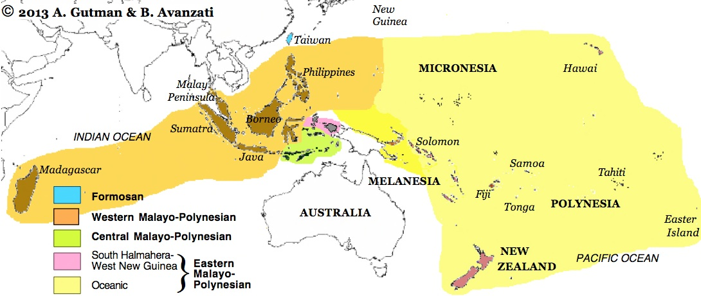
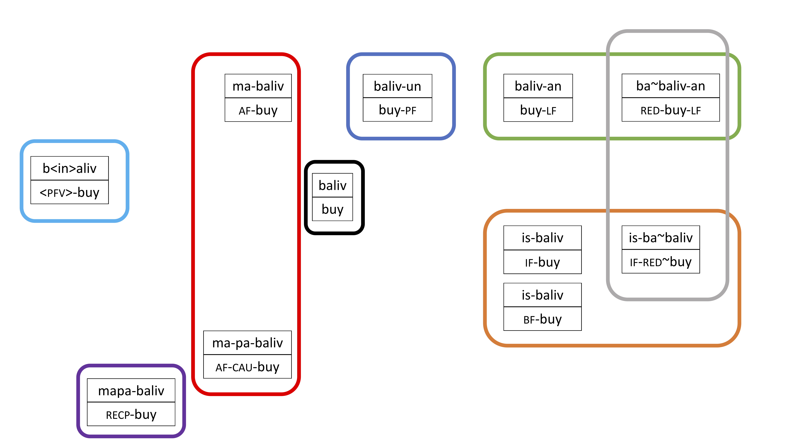
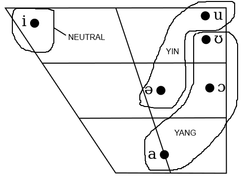
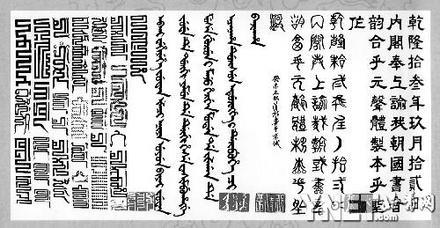
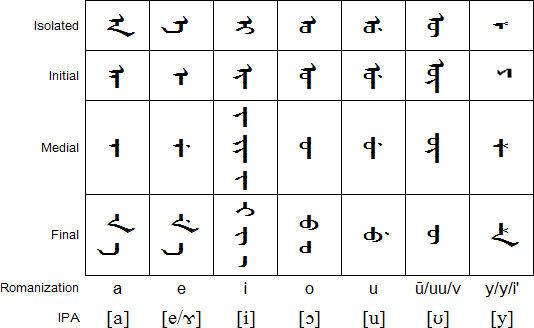
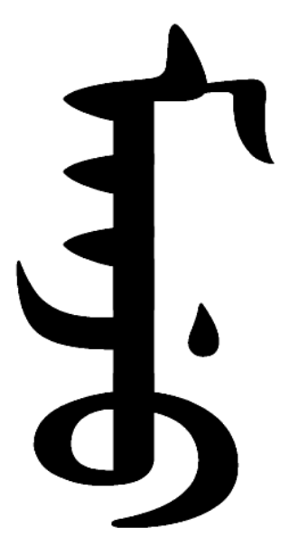

```{r setup, include=FALSE}
options(htmltools.dir.version = FALSE)
library(lingtypology)
library(tidyverse)
```

# The Austronesian Language Family

```{r auslanguages, cache=TRUE, message=FALSE, warning=FALSE, echo=FALSE, out.width='100%'}
austronesian <- lang.aff('Austronesian') %>%
  tibble::tibble() %>%
  rename(language = ".") %>%
  mutate(affiliation = aff.lang(language)) %>%
  mutate(subgroup = str_extract(affiliation, 
                                "Austronesian, \\w+(-?\\w+, \\w+-?\\w+)?"))
df <- austronesian %>%
  mutate(subgroup = str_replace_all(subgroup, "Austronesian,(.+)", "\\1")) %>%
  mutate(subgroup = str_replace_all(subgroup, 
                                    "Malayo-Polynesian, (.+)", "\\1")) %>%
  mutate(iso = iso.lang(language)) %>%
  mutate(country = country.lang(language))  

#austronesian

map.feature(languages = df$language,
            features = df$subgroup)
```

---

# Roadmap

What can we do with this knowledge?
What questions are to be explored?

* (historical) phonology
* lexical-semantics
  * conceptualization of space: land-sea axis
  * conceptualization of seasons / time
* focus system
  * neutral aligment
  * order V second or V first
  * different languages
  * nominalization
* some other languages
  * alignment and valence
  * Manchu 

---

# Three groups of Austronesian
## Three groups (Ross 2002)

1. Philippine-type languages 
1. Indonesian-type languages
1. post-Indonesian type languages



http://www.languagesgulper.com/eng/Austronesmap.html

So if you know where the language is located geographically (and it belongs to the Austronesian family), you can make some educated guesses about some features.

---

# post-Indonesian languages: aloha

<blockquote class="twitter-tweet" data-lang="en" width=400 theme="dark" align="center"><p lang="en" dir="ltr">Aloha! Here&#39;s a family tree showing the history behind one Polynesian word, starting from Proto-Polynesian at the top. Throughout its history this word has meant love, pity, concern, empathy, hello, farewell. <a href="https://t.co/22SyMEUgKb">pic.twitter.com/22SyMEUgKb</a></p>&mdash; NativLang (@NativLang) <a href="https://twitter.com/NativLang/status/1014969135925637120?ref_src=twsrc%5Etfw">5 juli 2018</a></blockquote>


???

I assume this is you guys know how to do this.
Basically historical method.

---

# post-Indonesian reconstructions

.font80[
| Tongan | Samoan | Tahitian | Maori | Hawaiian | gloss |
|---|---|---|---|---|---|
| manu | manu | manu | manu | manu | ‘bird’ |
| ika | iʔa | iʔa | __1__ | iʔa | ‘fish’ |
| kai | __2__ | ʔai | kai | ʔai | ‘to eat’ |
| tapu | tapu | tapu | tapu | __3__ | ‘forbidden’ |
| vaka | vaʔa | vaʔa | waka | waʔa | ‘canoe’ |
| fohe | foe | hoe | hoe | hoe | ‘oar’ |
| mata | mata | __4__ | mata | maka | ‘eye’ |
| ʔuta | uta | uta | uta | uka | ‘bush’ |
| __5__ | toto | toto | toto | koko | ‘blood’ |
]

Can you fill in the blanks?

--
.font80[
1. ika, 2. ʔai, 3. kapu, 4. mata, 5. toto
]

.font50[Based on 
http://udel.edu/~dlarsen/ling203/Slides/Linguistic%20Reconstruction.pdf
]
---

# More Hawaiian typology

*ʻaʻole ʻo-ia e puka ana* <br>
NEG he FUT graduate SINGLE.EVENT <br>
"He won't graduate"

* analytic language
* VSO order (negation is often treated as a verb)
* no-Philippine-type voice <br> (like we saw in 何老師's talk)


---

# Indonesian-type languages

.pull-left[
* phonological inventory is quite small (like all Austronesian languages)
* analytic language (agglutinative)
* SVO order (tendency)
* voices / focus system: actor, undergoer + extra
* affixes:
    * *di-* patient focus
    * *diper-* causative focus
    * *meng-* agent focus
    * *memper-* causative agent
    * *ter-* agentless action (involuntary, sudden, stative...)
    * *-kan* causative, benefactive
    * *-i* locative
    * *ber-...-an* plural subject
    * *ke-...-an* potential, unintentional
]

.pull-right[
Examples

* *duduk* 'to sit down'
* *men-duduk-kan* 'to sit someone down, give someone a seat, to appoint'
* *men-duduk-i* 'to sit on, to occupy'
* *di-duduk-kan* 'to be given a seat, to be appointed'
* *di-duduk-i* 'to be sat on, to be occupied'
* *ter-duduk* 'to sink down, to come to sit'
* *ke-duduk-an* 'to be situated'

]

---

# Philippine-type languages

* Taiwan, Philippines, Madagascar...
* analytical (agglutinative)
* VSO tendency
* typically a 4 focus system (or voice system)
    1. agent focus
    1. patient focus
    1. location focus
    1. instrumental / beneficiary focus

| language | agent | patient | location | instrumental
| --- | --- | --- | --- |
| Proto-Austronesian | *M- | *-en | *-an | *Si/Sa-
| Isbukun Bunun | ma- | -un | -an | is/sin-
| Yami | m-/ -om- | -en | -an | i-
| Paiwan | -em- | -en | -an | si-
| Tagalog | mag- / -um- | -in | -an | ipag- | 

So this is very robust, especially the first three.

---

# Tagalog

But what do these focus affixes mean?

.font90[
.red[Mag]-salis .orange[ang babae] .blue[ng bigas] sa sako para sa bata.<br>
.red[AF]-will:take:out .orange[TR woman] .blue[ART rice] LOC sack BEN child<br>
‘.orange[The woman] will take .blue[some rice] out of {a / the} sack for {a / the} child.’

Aalis-.red[in] .blue[ng babae] .orange[ang bigas] sa sako para sa bata.<br>
will:take:out-.red[TF] .blue[ART woman] .orange[TR rice] LOC sack BEN child<br>
‘.blue[{A / The} woman] will take .orange[the rice] out of {a / the} sack for {a / the} child.’

Aalis-.red[an] .blue[ng babae] .blue[ng bigas] .orange[ang sako] para sa bata.<br>
will:take:out-.red[LF] .blue[ART woman] .blue[ART rice] .orange[TR sack] BEN child<br>
‘.blue[{A / The} woman] will take .blue[some rice] .orange[out of the sack] for {a / the} child.’

.red[Ipag]-salis .blue[ng babae] .blue[ng bigas] sa sako .orange[ang bata].<br>
.red[BF]-will:take:out .blue[ART woman] .blue[ART rice] LOC sack .orange[TR child]<br>
‘.blue[{A / The} woman] will take .blue[some rice] out of {a / the} sack .orange[for the child].’
]

.font80[
Tagalog (Langacker 2008 adapted from Schachter 1976) <br>
TR = trajector (here: the thing in focus); TF = theme focus; LF = locative focus; beneficiary focus
]

---

# Isbukun Bunun

## Tense

| Root | Meaning | Present | Recent past | Remote past | Future |
| --- | --- | --- | --- | --- | ---
| hanup | ‘to hunt’ | hanup | h-in-anup | h-inin-anup | na=hanup 
| | 打獵 | 打獵 | 打過獵 | 很久以前打過獵 | 要打獵了


## Aspect

| Root | Meaning | Simple | Perfective | Repetitive | Durative |
| --- | --- | --- | --- | --- | ---
| hanup | ‘to hunt’ | hanup | hanup-in | ha~hanup | hanup-ang |
| | 打獵 | 打獵 | 打獵了 | 一直打獵 | 正在打獵

## Reduplication

Reduplication can have many meanings: repetition (*ha~hanup*), intensive (人海茫茫), diminution 'make smaller' (看看)...

---

# Bunun nominalization

Having this kind of focus system is also useful for nominalization.




---

# Bunun nominalization

.font80[
| root | meaning | focus | nominal | meaning |
| --- | --- | --- | --- | --- |
| ka-huzas | ‘to  sing’ | ka-hu~huzas | kahuhuzas | ‘singer’ |
| un-huma | ‘to  farm’ | m-unhu~huma | munhuhuma | ‘farmer’ |
| hanup | ‘to  hunt’ | ha~hanup | hahanup | ‘hunter’ |
| masnav | ‘to  teach’ | mas-na~nav | masnanav | ‘teacher’ |
| | | | | |
| kaun | ‘to eat’ | ka~kaun-un | kakaunun | ‘food’ |
| baliv | ‘to  buy’ | baliv-un | balivun | ‘things to be bought’ |
| pit’ia | ‘to  cook’ | pit’i-un | pit’iun | ‘food’ |
| | | | | |
| kaun | ‘to eat’ | is-ka~kaun | iskakaun | ‘cutlery’ |
| patas | ‘to  write’ | is-pa~patas | ispapatas | ‘pen’ |
| | | | | |
| kaun | ‘to  eat’ | ka~kaun-an | kakaunan | ‘dining place’ |
| baliv | ‘to  buy’ | ba~baliv-an | babalivan | ‘shop’ |
| sumsum | ‘to  worship’ | su~sumsum-an | susumsuman | ‘church/temple’ |
| (pas-)nava | ‘to  study | pas-na~nava-an | pasnanavaan | ‘school’ |
]

---

# Bunun seasons: *talabal* 好熱

If you know that *na=* is a future/irrealis marker and *min-* means 'change', then what are these seasons in Bunun?

.pull-left[
1. *naminhamisan*
2. *talabal*
3. *namintalabal*
4. *hamisan*
]

.pull-right[
1. ___
2. ___
3. ___
4. ___
]

--

1. IRR=change=winter 'autumn'
2. summer
3. IRR=change=summer 'spring'
4. winter

---

# Location across languages

## body as center
left-right
front-back

--

## fixed coordinates
cardinal directions
North, East, South, West

--

## geographical terrain
land-sea axis
upstream-downstream

---

# The land-sea axis

Many Austronesian languages use a radically different way of expressing direction, mostly due to their being located on islands: the so-called **land-sea axis**.

.font80[
|  | Inland | Seaward |
| --- | --- | --- |
| PAN | *daya | *lahud
| Pazeh | daya ‘upstream; east’ | rahut ‘downstream; west’
| Thao | saya ‘uphill, upstream’ | raus ‘downhill, downstream’
| Paiwan | zaya ‘upland, upriver’ | lauz ‘seaward, downriver’
| Yami | rala 'next to the mountain | ralud 'towards the sea'
| Ilokano | dáya ‘east’ | láud ‘west’
| Cebuano | iláya ‘away from coast/town’ | iláwud ‘near coast/town’
| Kelabit | dayəh ‘upstream’ | laʔud ‘downstream’
| Manam | auta ‘landward’ | ilau ‘seaward’
| Lakalai | -ilo ‘landward’ | -lau ‘seaward’
| Pohnpeian | peiloŋ- ‘landward’ | peiei- ‘seaward’
| Hawaiian | mauka ‘landward’ | makai ‘seaward’
]

---

# The land-sea axis

.font140[BEST TIP EVER!]

When confronted with a problem, look at the clues they give you. Especially if it's a map.
.font60[-- but you probably already knew this...]

14th ILO (2016) Aralle-Tabulahan

http://www.ioling.org/booklets/iol-2016-indiv-prob.en.pdf
http://www.ioling.org/booklets/iol-2016-indiv-sol.en.pdf

However, also use your common sense: many Austronesian people live in warm climates near the equator, so it doesn't make sense to think of 4 seasons, but just in terms of .sc[warm] and .sc[less warm] or .sc[rain] and .sc[no rain]. 
They will probably have many words for .sc[boat], but not many for .sc[train], since many islands are small. 

On the other hand, don't overthink the clues they give you, but just try to stay alert.

---

# Alignment and valence / valency

## valence 
.font80[
The valence of a lexical item is its inherent relationality that allows it to govern a particular number of arguments

* `看` = usually 2 participants
* `跑` = usually 1 participants
* `給` = usually 3 participants
]

## alignment

.font80[
Typologically we can see some major roles in clauses

* Participant in a clause with 1 participant = S
* Participant as 'do-er' in clause with 2 participants = A
* Participant as 'done-to' in clause with 2 particpants = O
* Participant as 'the given' in clause with 3 participants = T
* Particpant as 'the receiver' in clause with 3 participants = R

Alignment = the system that organizes these basic roles
]


---

# Alignment patterns

## Frequent patterns

NOMINATIVE (S/A) vs. ACCUSATIVE (O)

* S = A ≠ O
  * `I run; I see him.`

ABSOLUTIVE (S/O) vs. ERGATIVE (A)

* S = O ≠ A
  * `gizona ettor-i da.` 'the man has arrived.'
  * `mutila-k gizona ikusi du.` 'the boy has seen the man.' 
  <br>(gizona = man, mutila=boy)

NEUTRAL

* S = A = O
  * `男生到了，我看到他`
  
---

# Alignment patterns

## Rare patterns

These patterns are definitely possible, but just very very very rare.

TRIPARTITE

* S ≠ O ≠ A 

DOUBLE OBLIQUE 

* S ≠ O = A 


---

# Complications of alignment

Please reconstruct the alignment system of Warrgamay (Dixon 1981).
Make a table of nominals and the marking they receive.

.font90[
.pull-left[
1. ngulmburu gagama
‘The woman will go.’
2. ngana gagama
‘We will go.’
3. ngananya nyurra ngundalma
‘You (pl.) will see us.’
4. gagama maal
‘The man will go.’
5. maal ngulmburunggu ngundalma
‘The woman will see the man.’
6. gagama nyurra
‘You (pl.) will go.’
7. maalndu ngulmburu ngundalma
‘The man will see the woman.’
8. nyunga gagama
'It will go.'

]

.pull-right[
9. ngulmburu ngana ngundalma
‘We will see the woman.’
10. nyurranya ngana ngundalma
‘We will see you.’
11. maalndu nyunga ngunday
'The man sees it.'
12. ngananya ngulmuburunggu ngundalma
‘The woman will see us.’
13. nyubula nganya ngundalgani
‘The two of you are looking at me.’
14. ngadha maal ngundalgani
‘I look at the man.’
15. maalndu nyubulanga ngundalgani
‘The man is looking at the two of you.’
16. nyulangga maal ngunday
'It is seeing the man.'
]
]

---

# Complications of alignment

| word | A | S | O
| --- | --- | --- | ---
| 1sg | ngadha | __1__ | ngan**ya**
| 1pl | ngana | ngana | ngana**nya**
| 2du | nyubula | __2__ | nyubula**nga**
| 2pl | nyurra | nyurra | nyurra**nya**
| 3sg | nyu**langga** | nyunga | nyunga
| woman | ngulmburu**nggu** | ngulmburu | ngulmburu
| man  | maal**ndu** | maal | maal

What do you think 1 and 2 are?

--

1. ngadha, 2. nyubula

---

# Split ergativity

Some languages have more than one system, e.g. NOMINATIVE and ERGATIVE. Should you encounter such a problem, you should try to find the 'split' in the system.

This split is often determined by the semantics of the NP

1 pron > 2 pron > 3 pron > pers. names > human N > animate N > inanimate N

NOM/ACC --------------------------->  <------------------------------------ ERG/ABS


= Silverstein Hierarchy (Silverstein 1976, Tsunoda 1981)

* If an NP in the hierarchy is marked by NOM/ACC alignment, everything higher (more left) will also be NOM/ACC
* If an NP in the hierarchy is marked by ERG/ABS alignment, everything lower (more right) will also be ERG/ABS 


---

# Valence decreasing

.font80[

.pull-left[
PASSIVE: defocusing the A

English:
* `The police caught the thief.`
* `The thief was caught (by the police).`


ANTIPASSIVE: defocusing the O

Anyua (Sudan, Reh 1996):
* `rìŋɔ́	ā-cám	ɲɪ̀làal-lɪ`<br> meat PAST-eat child-DET <br> "The child ate the meat."
* `ɲɪ̀làál	ā-cʌ́mó	(kɪ̄-ríŋō` <br> child PAST-eat.ANTIPASSIVE OBL-meat <br> "The child ate (*from* the meat)."

]

.pull-right[

DEOBJECTIVE: completely removing the O

Ainu:
* `sake a-ku` <br> sake 1SG.TR-drink <br> 'I drink sake.'
* `i-ku-an` <br> DEOBJ-drink-1SG.INTR <br> 'I drink.'

ANTICAUSATIVE: completely removing the A

Turkish:
* `Anne-m kapı-yı aç-tı.` <br> mother-1SG door-ACC open-PAST(3SG) <br> ‘My mother opened the door.’
* `Kapı aç-ıl-dı.` <br> door open-ANTIC-PAST(3SG) <br> ‘The door opened.’
]
]


---

# Valence increasing

.font80[

.pull-left[

APPLICATIVE: adding an O

Indonesian:
* `Orang itu me-masak ikan.` <br> 
man ART TR-cook fish <br>
‘The man cooked fish.’
* `Orang itu me-masak-kan perempuan itu ikan.` <br>
man ART TR-cook-APPL woman ART fish <br>
‘The man cooked fish for the woman.’

CAUSATIVE: adding an A
* Chinese
`我 吃 麵` 'I eat noodles.'
`媽媽 讓/使/叫/給 我 吃 麵` 'Mum makes me eat noodles.'
]

.pull-right[

Tip: pay attention to what happens in a ditransitive sentence

Bunun:
* `m-aun sidi mas ismuut(-cia)` <br> AF-eat goat OBL grass(-DIST.OBL) <br> 'The goat eats grass.'
* `ma-pa-kaun saia mas sidi ismuut` <br> AF-CAU-eat 3SG.NOM OBL goat grass <br> 'He makes the goat eat grass. / He feeds grass to the goat.'

A O -> A O ∅

]
]

---

# Complication

.font80[
Some languages use the same markers for different purposes.

You are probably familiar with English -s
* *dog-s*
* *eat-s*
* etc.

But let us look at Manchu (Altaic, Gorelova 2002):

* `gele-bu-he` <br> fear-PASS-PART <br> was frightened (by)
* `gele-bu-he` <br> fear-CAU-PART <br> caused to be frightened

Luckily it is not that much of a problem, as particles or other markers will help disambiguate.

* `bi in-de gele-bu-he` <br> I he-**DAT** fear-PASS-PART <br> “I was frightened by him.” 
* `i mim-be gele-bu-he` <br> he I-**ACC** fear-CAUS-PART <br> “He caused me to be frightened.”
]

---

# Bunun vs. Manchu phonology

.pull-left[

Here is nice Isbukun phonology

|	 | Front | Central | Back
| --- | --- | --- | ---
| High |	i	| | u
| Mid	|	
| Low	| | 	a	

.font90[
Some uncommon sounds as well, though: allophonic variation in /l/:

* *ma-la~la'la* <br> AF-RED~call <br> keep on calling

pronounced as
[ malalaʔla ] or [maɬaɬaʔɬa]

ɬ is not uncommon in Formosan languages
]
]

.pull-right[

Here is strange Manchu phonology



.font90[
* *amila* 'rooster'
* *emile* 'chick'

* *ama* 'father'
* *eme* 'mother'
]
]

---

# Manchu *saha* 知道了

.pull-left[
<blockquote class="twitter-tweet" data-conversation="none" data-lang="nl"><p lang="en" dir="ltr">That is SAHA in Manchu (the H is with friction). From SAMBI &#39;to know&#39;  <a href="https://twitter.com/isaac?ref_src=twsrc%5Etfw">@isaac</a> <a href="https://t.co/aKbhlORypH">pic.twitter.com/aKbhlORypH</a></p>&mdash; Fresco SAM-SIN (@manjurabumbi) <a href="https://twitter.com/manjurabumbi/status/758346013421760513?ref_src=twsrc%5Etfw">27 juli 2016</a></blockquote>
]

.pull-right[

]


---
class: center

# Manchu alphabet

<iframe width="560" height="315" src="https://www.youtube.com/embed/bjYpHJLIfBI?rel=0" frameborder="0" allow="autoplay; encrypted-media" allowfullscreen></iframe>

---

# Manchu alphabet

.font70[
| type | direction | form | combinations 
| --- | --- | --- | ---
| alphabet <br> syllabary | up->down, left->right | different forms beginning, middle, end | sometimes ligatures (combinations)
]


.pull-left[

]

.pull-right[

]

???

a is written like n
---
class: center


# The end.


.font170[
And with this I wish you good luck in the competition!

Think in the box and out of the box.

And win!
]

