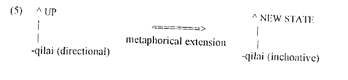
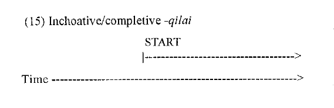
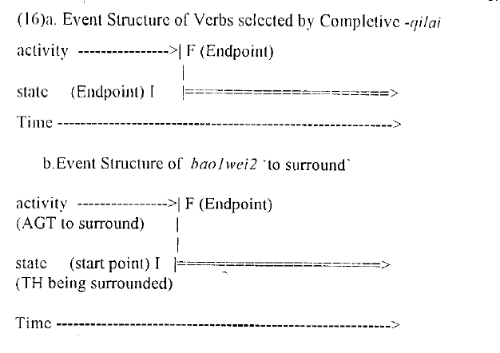

```{r setup, include=FALSE}
options(htmltools.dir.version = FALSE)
```

# Roadmap

* Overview of the paper
* Some other literature
* My own take (so far)


---
.pull-left[

##  Huang Chu-ren 黄居仁

**Research interests:**
* Computational Linguistics
* Lexical Semantics
* Ontology,

* Corpus Linguistics
* Chinese Linguistics
* Language Archives

Based in Hong Kong Polytechnic University

[Huang Chu-Ren's bio](http://www.cbs.polyu.edu.hk/staff-en/churen-huang.php?&output=p)

]

.pull-right[

## Chang Shen(g)-Min(g)

Was a student at NTHU before, focus on the *qilai* constructions

* Chang (1993)
* **Huang & Chang (1996)**

]

---


# Introduction: goals of this paper

This paper wants to study the **interaction of metaphor and grammar**:

* grammaticalization can be motivated by metaphorical extension
* contradicting objectivistic view that linguistic relations are necessarily arbitrary once grammaticalized
* conceptual structure is not an autonomous (and thus isolated) module

Of course, this study is from 1996: there are now many more studies on this interaction, e.g. Barcelona (2003), Steen (2007), Panther et al. (2009).

---

# Introductory game

Question: what kinds of *-qilai* can you think of?

Please also give an example.


---

# Different kinds of *-qilai*

Huang & Chang discern/treat three kinds of **monoclausal** *-qilai* in this paper (based on Lu et al. 1984; Yeh et al. 1993)

## 1. Directional *-qilai*

<table border="0">
<tr> 
 <td  align="left">他</td>
 <td  align="left">跳-了-起來</td>
</tr>

<tr> 
 <td  align="left">tā</td>
 <td  align="left">tiào-le-qǐlái<sup>1</sup></td>
</tr>

<tr> 
 <td  align="left"><sc>3SG</sc></td>
 <td  align="left">jump-<sc>perf</sc>-<sc>qilai</sc></td>
</tr>

<tr>
 <td colspan="9">'S/he jumped upwards.'</td>
</tr>

</table>

.footnote[
[1] I don't know if Taiwanese Mandarin speakers tend to say this *-qilai* with or without tones. But I think I should mark them.
]

---

## 2. Inchoative *-qilai*

<table border="0">
<tr> 
 <td  align="left">李初</td>
 <td  align="left">哭-了-起來</td>
</tr>

<tr> 
 <td  align="left">Lǐ.Chū</td>
 <td  align="left">kū-le-qǐlái</td>
</tr>

<tr> 
 <td  align="left"><sc>PN</sc></td>
 <td  align="left">cry-<sc>perf</sc>-<sc>qilai</sc></td>
</tr>

<tr>
 <td colspan="9">'Li Chu began crying.'</td>
</tr>

</table>


## 3. Completive *-qilai*

<table border="0">
<tr> 
 <td  align="left">老-爸</td>
 <td  align="left">即時</td>
 <td  align="left">躲-起來</td>
</tr>

<tr> 
 <td  align="left">lǎo-bà</td>
 <td  align="left">jí.shí</td>
 <td  align="left">duǒ-qǐlái</td>
</tr>

<tr> 
 <td  align="left">old-pa</td>
 <td  align="left">in.time</td>
 <td  align="left">hide-<sc>qilai</sc></td>
</tr>

<tr>
 <td colspan="9">'Old Pa hid (successively) [?successfully?] just in time.'</td>
</tr>

</table>


---

# Classification of the three *-qilai*s based on constructions and verbal semantics

## 1. Directional *-qilai*

「他跳了起來。」

* **upward movement**
* <sc>movement</sc> and <sc>posture</sc> verbs
* compatible with +Stage marker *(zhèng)zài* 正在
* not compatible with +State marker *-zhe* 著

<table border="0">
<tr> 
 <td  align="left">張三</td>
 <td  align="left">正在</td>
 <td  align="left">站-起來</td>
 <td  align="left">的-時候</td> 
</tr>

<tr> 
 <td  align="left">Zhāng.Sān</td>
 <td  align="left">zhèngzài</td>
 <td  align="left">zhàn-qǐlái</td>
 <td  align="left"de-shíhou</td>
</tr>

<tr> 
 <td  align="left"><sc>PN</sc></td>
 <td  align="left"><sc>prog</sc></td>
 <td  align="left">stand.up-<sc>qilai</sc></td>
 <td  align="left"><sc>de</sc>-time</td>
</tr>

<tr>
 <td colspan="9">'While Zhangsan was standing up, ...'</td>
</tr>

</table>
---
## 1. Directional *-qilai*

But not

```
*張三站起來著。
Zhangsan was standing up.
```

"The affixation of *-qilai* focuses on the upward directionality of the movement. Thus it denotes the manner of a continuing activity, not a state."

---

## 2. Inchoative *-qilai*

This type denotes a situation where a **new event begins** and **continues**.

Huang & Chang claim there is a metaphorical extension of the spatial movement to the temporal <sc>path</sc> (Lakoff 1987; Goldberg 1992; Goldberg 1995).



<sc>to start (a new state) is to move up</sc> 

This metaphor is an elaboration of <sc>activation is motion</sc> (Lakoff 1987)

The authors quote some examples about *shàng* <sc>up</sc> here to prove this metaphor exists., e.g. 「上吧」、「上癮」、「愛上」etc.
However, a "slightly different meaning is assigned when the exension [of the verbs] is marked by *-qilai*" (p.205).

---

## 2. Inchoative *-qilai*

Let's look at example (9) and (10)

```r
他（從地上)調-了-起來
"S/he jumped upwards from the ground."
```

```r
他一聽音樂，就跳-了-起來
"S/he starts jumping/dancing as soon as s/he hears the music."
```

**<sc>movement</sc> verbs are ambiguous: they can be both <sc>directional</sc> or <sc>inchoative</sc>.**

**<sc>non-movement</sc> verbs (like 哭、認真) can only be <sc>inchoative</sc>.**

---

## 2. Inchoative *-qilai*: Stage and State markers

<table border="0">
<tr> 
 <td  align="left"></td>
 <td  align="left">Stage 正在</td>
 <td  align="left">State 著</td>
</tr>

<tr> 
 <td  align="left"><sc>directional</sc></td>
 <td  align="middle"><sc>+</sc></td>
 <td  align="middle"><sc>-</sc></td>
</tr>

<tr> 
 <td  align="left"><sc>inchoative</sc></td>
 <td  align="middle"><sc>-</sc></td>
 <td  align="middle"><sc>-</sc></td>
</tr>

</table>

Because the **viewpoint focus** of the inchoative aspect *-qilai* is on the **continuation of the situation**, the lexical semantics of 正在 conflicts with that of *-qilai*: 
正在 = a **progress event** composed of **stages**
*-qilai* = a **progress event** with a **continuing state**

For Huang & Chang, "*-qilai* marks an imperfective aspect (see Chang 1994), contrary to Smith's (1991) claim that it is telic by virtue of its start point!"
---

## 2. Inchoative *-qilai*: durational and change-of-state adjuncts

Constructional tests:

```r
Durational adjunct 三天 not compatible with imperfective events
* *他聰明起來了   三天。

Durational adjunct 一直 not compatible with bounded events
* *他    一直    聰明起來了。

Change-of-state adjunct 突然 not compatible with un-bounded events.
* (OK)  他    突然    聰明起來了。
```

---
## 2. Inchoative *-qilai*: durational and change-of-state adjuncts

However, *-qilai* is a *marked* imperfective, because the change-of-state is a salient part in its event structure.



---

## 3. Completive *-qilai*

Previous literature (before 1996) justs lists these as idiosyncracies. Huang & Chang try to find a unified account.

* small class of verbs (complementary distribution with verbs occurring with inchoative *-qilai*)
* *locatum argument*
* activity affecting the locatium or the state/location of the locatum
* initiation of the state coincides with the complementation of the activity
* 'accomplishment verbs' (Vendler 1967)

---

## 3. Completive *-qilai*: two-tiered diagram (Smith 1991)


---
## 3. Completive *-qilai*: two-tiered diagram (Smith 1991)
FOCUS ON THE ACTIVITY TIER
```r
美軍正在包圍海地。
'The U.S. armed forces are encircling Haiti.'
```

FOCUS ON STATE TIER
```r
美軍包圍海地。
'The U.S. armed forces has [sic] surrounded Haiti.'
```

(extra data)
FOCUS ON STATE TIER?
```r
美軍把海地包圍起來。

?美軍包圍起來海地。
```

So, Huang & Chang argue that inchoative *-qilai* is a special imperfective. Then, because the focus of completive *-qilai* is also on the resulting state, they consider this a **special case of inchoative *-qilai* .**

---

# Grammaticalizaiton and metaphoric extension

This part is not that important, but basically Huang & Chang claim that:
* *-qilai* is seemingly free form the semantic restrictions of other Orientational Metaphors (Lakoff & Johnson 1980)
* there are some paradoxes, though, but they can be resolved

---

# Concluding remarks: Conceptual structure and grammar

Huang & Chang offer a **unified account** of the various [only 3] V-*qilai* constructions based on metaphoric extensions.

The metaphor behind the extenstion from <sc>directional -qilai</sc> to <sc>inchoative -qilai</sc> is **<sc>to start is to move up</sc>**. Furthermore, <sc>completive -qilai</sc> is a special case of <sc>inchoative -qilai</sc>.

---

# But, the story is not over: other research on *-qilai*

## Sentence types

```r
a.張三剛剛起來了。
b.張三從地板上爬了起來。
c.女孩哭了起來。
d.他多了起來。
e. 這本書唸起來很難。
f. 他唸起書來很認真。`He, when reading books, is very earnest.'
g. 我買不起Chomsky的書。
```

---
# Other research on *-qilai*


```{r terminology, echo=FALSE, warning=FALSE, message=FALSE}
library(tidyverse)
terminology <- read_csv("terms.csv")
terminology[is.na(terminology)] <- " " #NAs as spaces for format
knitr::kable(terminology, format = "html")
```

---
# A keyword-driven proposal
## Perspective
* non-native speaker
* PBL course on SLA
* debate on <sc>learning</sc> vs. <sc>acquisition</sc>

---
# A keyword-driven proposal
## Keywords
* item-based (Tuggy 2003; Newman 2008)
* frequency effects (Bybee 2001)
* historical (Peyraube 2006)
* mental spaces (Fauconnier)
* fictive motion (Talmy 2000; Langacker 2008)
* middle constructions (Kemmer 2003; Xiong 2017)
* corpus-based 


(see also the chapters by Langacker, Taylor, Achard, Lieven & Tomasello, Goldberg & Casenhiser, Bybee, Whiney, Ellis, Gries in Robinson & Ellis 2008)

(About *qilai*: there is a corpus study Yeh et al. (1993), and an MA thesis by Chang Shen(g?)-Min(g?) (1994) which are inaccessible to me...)

---
# Research questions

* In "the Chinese language system", what *qilai* constructions are there?
* As a learner of L2 Chinese, which ones should I acquire first in order to entrench the *items* and their *schematizations* (which will help me apprehend future encounters)?

---
# Corpus data

## zhTenTen: corpus of the Chinese web
* developed by [the SketchEngine](https://www.sketchengine.eu/zhtenten-chinese-corpus/)
* goal: +10 Billion words
* simplified Chinese: 1,729,867,455 (no traditional)
* still: bigger than Huang & Chang's reference of 10 million corpus

## three super schematic searches

```{r regex, echo=FALSE, warning=FALSE, message=FALSE}
regex <- c("/起來/", "/起 * 來/","/不|得 起/")
match <- c("站起來、看起來", "下起雨來", "買不起、買不起來")
abs.freq <- c(4703, 570022, 71426)
stand.freq <- c("2.20/M", "270.60/M", "33.90/M")

seeds <- tibble(regex, match, abs.freq, stand.freq)
knitr::kable(seeds, format = "html")
```


---
# Findings: 了
With these three data sets, it is possible to ask and resolve many questions, e.g. 

Is there a preference between e.g. V了起來 and V起來了 (for intransitives)?
(The situation without any 了 is much more common in most cases)

.pull-left[
```{r le-qilai, echo=FALSE, warning=FALSE, message=FALSE}
read_csv("le_qilai.csv") %>%
  knitr::kable(format="html")
```

]

.pull-right[
```{r qilai-le, echo=FALSE, warning=FALSE, message=FALSE}
read_csv("qilai_le.csv") %>%
  knitr::kable(format="html")
```
]
---
# Findings: ideophones after <sc>qilai</sc>

It has been a hypothesis of mine that the sensory domains of ideophones are similar to those of evidentials (Aikhenvald 2003; 2004), so my interest in the *qilai* constructions (Van Hoey & Lu, in prep) stems from this. Let's look at 聞 and 摸:

.pull-left[
```{r wenqilai, echo=FALSE, warning=FALSE, message=FALSE}
read_csv("wenqilai.csv") %>%
  knitr::kable(format="html")
```

]

.pull-right[
```{r moqilai, echo=FALSE, warning=FALSE, message=FALSE}
read_csv("moqilai.csv") %>%
  knitr::kable(format="html")
```
]

---

# Continuation of the study

* discussing the different types (see overview)
* network, backed up by usage-based frequency data
* explanations: I think Huang & Chang (1996) are on the right track with looking beyond variations in form, BUT I don't think metaphor is the best way: I think <sc>fictive motion</sc> and <sc>mental scanning</sc> will prove better and more comprehensive accounts for this network of constructions.


---

# Selected references

Chang, Shen-Min. 1993. V+qi(-lai) compounds in Mandarin Chinese. Computational Linguistics Society of R.O.C. 62–80.

Huang, Chu-Ren & Shen-Ming Chang. 1996. Metaphor, metaphorical extension, and grammaticalization: A study of Mandarin Chinese -qilai. In Adele Goldberg (ed.), Conceptual structure, discourse and language, 201–216. Cambridge: Cambridge Univ. Pr.


Robinson, Peter Jake & Nick C. Ellis (eds.). 2008. Handbook of cognitive linguistics and second language acquisition. New York: Routledge.

Wang, Chyan-an Arthur & Hsiao-hung Iris Wu. 2018. The syntax and semantics of Chinese impersonal V-qilai construction. Taiwan Journal of Linguistics 16(1). 1–34.
