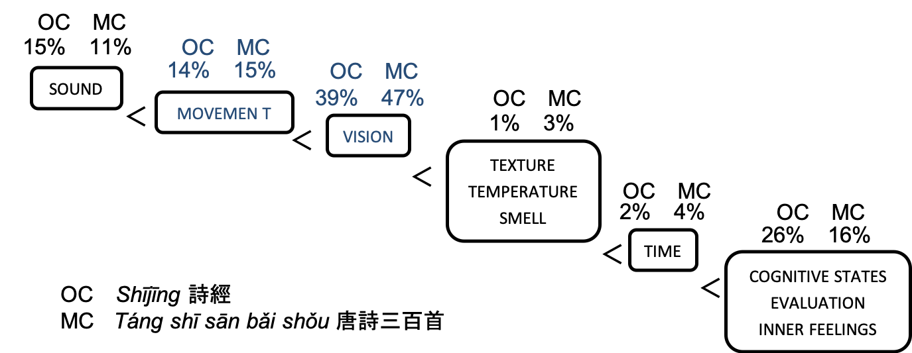

```{r setup, include=FALSE}
options(htmltools.dir.version = FALSE)
library(tidyverse)
library(kableExtra)
library(plotly)
```


layout: false

background-image: url(finished.jpg)
background-size: cover


# Roadmap

.font170[
* Introduction
<!-- * Aims and scope -->
* Background (literature review)
* Research questions
* Methodology
* Case study: .sc[visual] ideophones: .sc[light] ideophones
* Expected findings for the full dissertation
* Selected references
]
    
---


# Introduction: .sc[iconicity]

Iconicity has been studied in different perspectives since the 1980s:

* iconic ordering of clausal constituents in relation to their temporal order in syntax and pragmatics .ref[(e.g. Haiman 1985; Simone 1995; Radden & Panther 2004)];
* iconic relations between sounds and meaning, viz. phonaesthemes and sound symbolism in phonetics, phonology and morphology .ref[(Hinton, Nichols & Ohala 1994; Perniss & Vigliocco 2014; Lockwood 2017)]; 
* iconicity across different modalities such as in sign language .ref[(Taub 2001)] or metaphor .ref[(Hiraga 2005)]; 
* and in the .sc[lexicon] (.markeer[onomatopoeia] and .markeer[ideophones] or .markeer[mimetics], .ref[cf. Voeltz & Kilian-Hatz 2001; Dingemanse 2012; 2018; Haiman 2018)].
 
.ru-blockquote[This dissertation is about onomatopoeia and ideophones / mimetics.]

---

# Ideophones: examples

Language | Examples
--- | ---
Korean <br> .ref[(Lee 1992)] | *potïl* ‘soft and tender (surface)’, *palt’ak* ‘palpitating, jerking’, *c’onc’on* ‘woven tightly’, *ulakpulak* ‘unbalanced scary appearance’, *colcol* ‘flowing liquid’, *kalphancilphaN* ‘unable to decide’
Pastaza Quechua <br> .ref[(Nuckolls 1996)] | *dzing* ‘a sudden awareness or intuition, especially one that causes fright’, *sa* ‘expanded or random movement from or within a locus’, *tsung* ‘to absorb, cover, or drench with a liquid substance’, *palay* ‘to fall rapidly and/or peltingly, as a collectivity of entities’
Siwu <br> .ref[(Dingemanse 2011)] | *gùdùù* ‘pitch dark’, *gblogblogblo* ‘bubbling’, *fũɛ̃fũɛ̃* ‘malleable' *kpɔtɔtɔrɔ-kpɔtɔtɔrɔ* ‘walking like a  tortoise’, *ɣììì*  ‘sensation of vertigo’, *wɔ̃rã~wɔ̃rã* ‘spotted, patchy pattern’, *nyɛ̃kɛ̃nyɛ̃kɛ̃* ‘intensely sweet’, *kpiɛkpiɛ* ‘lukewarm’

Examples presented in Dingemanse's .ref[(2012:661)] overview article

---

# Ideophones: semantic domains

Domain | Example
--- | ---
.sc[sound] | *miāo* 喵 ‘mew, miaow’
.sc[movement] | *yōuyōu* 攸攸 ‘move swiftly, quickly; smoothly slipping by, rapidly rushing’
.sc[visual patterns] | *zhēngróng* 崢嶸 ‘craggy, precipitous masses of rock; loftily lifted; sheer steepness; high-piled’
.sc[other sensory perceptions] | *bìbì* 苾苾 ‘deeply fragrant’
.sc[inner feelings and cognitive states] | *xǔxǔ* 栩栩 ‘glad and gay, happy and light-heared, smug and satisfied’

Hierarchy presented in .ref[Dingemanse (2012:663)].

As it can be seen, .markeer[Chinese has examples for all these different domains].
Yet, it is usually left out from the cross-linguistic debate.

---

# Ideophones: terminology

Japanese-inspired | Cross-linguistic | Reduplication | Examples
--- | --- | ---
擬聲詞 <br> *giongo* 擬音語 <br> .markeer[phonomimes] | .markeer2[ideophones] <br>  onomatopoeia | non-red. or A| 哔 'peep', <br> 咻 'shew' (.sc[sound + visual])
擬態詞 <br> *gitaigo* 擬態語 <br> .markeer[phenomimes] | .markeer2[ideophones] <br> non-phonomimes  | full red. or XAA (ABB) <br> partial red. or AB |  雾-濛濛 'fog-misty' <br> 崢嶸 'precipitous'
擬情詞 <br> *gijōgo* 擬情語 <br> .markeer[psychomimes] | .markeer2[ideophones] <br> non-phonomimes   | full red. or AA | 欣欣 'joyful'

These terms each highlight a different aspect of the data (cf. section 2 of the proposal).

It is my goal to unify these aspects into a single, though multi-faceted theory.

---

# Defining ideophones

Such a theory is already in the making: Dingemanse's .ref[(2011; 2012)] definition:

.ru-blockquote[Ideophones are marked words that depict sensory imagery.]

form | meaning
--- | ---
marked | depiction 
words | sensory imagery

Most studies up to this point have focused on the .sc[form].
When .sc[meaning] is taken into account, the scope usually only contains .sc[sound].

I want to focus mostly on the .sc[meaning] but not without losing .sc[form] out of sight.

Moreover: variation is what interests me.

---

# Research questions

## .markeer[Main RQ: What does the semantic structure of Chinese ideophones look like?]


### .markeer2[RQ1. Is there any variation at play, and if so, in what ways?]

### .markeer2[RQ2. How have these structures evolved over time?]

### .markeer2[RQ3. What constructions do ideophones appear in and what are their functions?]


---

# Main research question

## .markeer[What does the semantic structure of Chinese ideophones look like?]

I will address this main question by:

1. answering the .markeer[subquestions] .ref[(see below)]

1. take as a starting point Dingemanse's .ref[(2011; 2012)] definition of the cross-linguistic concept of ideophones:
> "Ideophones are .markeer[marked words] that .markeer[depict sensory imagery]."

1. .markeer[database] of Chinese ideophones, available at [https://simazhi.shinyapps.io/Chineseideophone/](https://simazhi.shinyapps.io/Chineseideophone/)   
.ref[(consultable, but still not fully functional)]

<!-- [I hope to maybe show this briefly during my proposal 口試.] -->

---

# RQ 1: Variation

## .markeer2[Is there any variation at play, and if so, in what ways?]

Usually, .markeer[constructions] are defined as .markeer[mappings between .sc[form] and .sc[meaning]] .ref[(Langacker 1987; 1991; 2008)] .markeer[or .sc[form] and .sc[function]] .ref[(Fillmore 1988; Goldberg 1995; 2006; Croft 2001)]

$$form \mid meaning$$

Chinese has a .markeer[folk model of *xíng yīn yì* 形音義],  
culminating in 'the character' *zì* 字, .ref[(Packard 1998; 2000)]:  
.markeer[
* .sc[written form], 
* .sc[phonological form],
* .sc[meaning] ] 


$$\frac{sound}{writing} \mid meaning$$


<!-- Clearly, there can be variation at any of these poles: -->

---

# RQ 1: Variation

## .markeer2[Is there any variation at play, and if so, in what ways?]


$$\frac{sound}{writing} \mid meaning$$

There can be variation at any of these poles:

Pole | Example
--- | ---
.sc[sound] vs. .sc[meaning] <br> .font80[.ref[(polysemy & homonymy)]] | /jījīzhāzhā/ referring to the sounds of 'mice' or 'people chattering'
.sc[writing] vs. .sc[meaning] | <嘰嘰喳喳\> referring to the sounds of 'mice' or 'people chattering'
.sc[sound] vs. .sc[writing] | /wēiyí/ being written as <逶迤\> or <委蛇\> <br> .font80[.ref[(there are more variations, cf. Hsu 2013)]]


---

# RQ 1: Variation

## .markeer2[Is there any variation at play, and if so, in what ways?]


Ideophones of different modalities, e.g. .sc[sound], .sc[visual], .sc[other perceptions], .sc[inner feelings] and .sc[cognitive states].

Case study of .sc[visual] ideophones, more precisely ideophones in the domain of .sc[light].

In the future, another major case study with .sc[auditory] ideophones.

Cursory findings:

* prototypical structure of meanings
* token frequency effects
* type frequency effects

---

# RQ 2: Diachronic evolution

## .markeer2[How have these structures evolved over time?]

Using the same case study of .sc[light] ideophones:

* the semantic structure is dynamic and evolves over time
* new meanings are formed from certain meanings or clusters of meanings in similar ways for the data under inspection
* these meaning extensions are motivated (yet not predictable)

---

# RQ 3: Qualitative approaches

## .markeer2[What constructions do ideophones appear in and what are their functions?]

Some possible future lines of development:

* investigating particular constructions, <br> e.g. .sc[v-qilai + ideophone]) with particular theories (e.g. Cognitive Grammar .ref[(Langacker 1987; 1991; 2008)], collostructions .ref[(Stefanowitsch & Gries 2003)]
* multimodality: ideophone and image, <br> cf. comic book studies .ref[(Forceville & Urios-Aparisi 2009)] or clothing terms .ref[(Geeraerts, Grondelaers & Bakema 1994)]
* acquisition: the role of intersubjectivity .ref[(Verhagen 2005)] in this process

---

# Structure of the dissertation

.center[]

A .markeer[holistic] study with attention to balances between:

* **synchronic** and **diachronic**
* **qualitative** and **quantitative**
* **paradigmatic** and **syntagmatic**
* **form**, **meaning**, and **usage**

---

# Methodology

The .markeer2[methodological frameworks] in this dissertation draw heavily on approaches from .markeer[Cognitive semantics], e.g.:

* Diachronic prototype semantics .ref[(Geeraerts 1997)]
* Conceptual Metaphor Theory .ref[(Lakoff & Johnson 1980; Kövecses 2017)]
* Mental Spaces .ref[(Fauconnier & Sweetser 1996; Fauconnier & Turner 2003)]
* Frequency effects .ref[(Bybee & Hopper 2001)]

Combined with .markeer2[computational approaches], such as .markeer[distributional semantics]:

* Cognitive Linguistics .ref[(Heylen, Speelman & Geeraerts 2012; Wielfaert, Heylen & Speelman 2013; Heylen et al. 2015; Peirsman, Geeraerts & Speelman 2015)]
* `word2vec`-like approaches .ref[(Mikolov, Yih & Zweig 2013; Mikolov et al. 2013; Goldberg & Levy 2014)]
* `R` .ref[(Silge 2017a; 2017b)] and `python`

Using .markeer[historical corpus material]: 

* Scripta Sinica corpus 漢籍全文資料庫計畫 

---

# Case study: .sc[light] ideophones

.center[]

From these ideophones that are expressed by the sensory modality of .sc[vision] <br> be it dynamic (.sc[movement]) or static (.sc[vision]),
<br> I have chosen those that express .sc[light].

Similar to the English *gl-* phonaestheme:

* *glare, gleam, glim, glimmer, glint, glisten, glister, glitter, gloaming, glow*
* *glance, glaze, glimpse, glint*
* *glacé, glacier, glair, glare, glass, glaze, gloss*

---

# .sc[light] ideos: types

.font80[
```{r data, echo=FALSE, warning=FALSE, error=FALSE, cache=TRUE}
character <- c("熠熠",
"煜煜",
"燿燿",
"耀耀",
"爚爚",
"灼灼",
"爍爍",
"鑠鑠",
"犖犖",
"燁燁",
"爗爗",
"曄曄",
"煒煒",
"韡韡",
"煇煇",
"輝輝",
"暉暉")

pinyin <- c(" yìyì ",
" yùyù ",
" yàoyào ",
" yàoyào ",
" yuèyuè ",
" zhuózhuó ",
" shuòshuò ",
" shuòshuò ",
" luòluò ",
" yèyè ",
" yèyè ",
" yèyè ",
" wěiwěi ",
" wěiwěi ",
" huīhuī ",
" huīhuī ",
" huīhuī ")

MOE <- c(" 閃亮光耀的樣子。 ",
" 光明照耀的樣子。 ",
" 光明的樣子。 ",
" 光明的樣子。 ",
" 光明的樣子。 ",
" 花茂盛鮮明。明亮。 ",
" 光閃動的樣子。 ",
" 光明閃耀的樣子。 ",
" 事理分明的樣子。光明磊落的樣子。  ",
" 光鮮明亮的樣子。  顯赫的樣子。  ",
" NA ",
" 盛大的樣子。 ",
" 光彩極盛的樣子。 ",
" 光明盛大的樣子。 ",
" NA ",
" NA ",
" 晴朗的樣子。 ")

Kroll <- c(" vividly bright",
" burning brightly, flamboyant",
" flashing, sparkling, glittering",
" flashing, sparkling, glittering",
" flashing and flickering, blazingly bright",
" evident, brilliant, aglow, vivid and vibrant,   brightly blazing, plain and patent",
" flashing, flaring, effulgent, alight, rutilant; splendrous",
" polished, gleaming; shining; glittering, flashing",
" manifestly evident; conspicuous, outstanding",
" brightly shining; flashing, flaring, gleaming",
" NA",
" brightly shining; flashing, flaring, gleaming",
" swirling or globed flames; bright shimmer",
" vividly dazzling, gorgeously glistering",
" fire-red, blazing brightly; splendid; brilliant",
" radiant illumination, glow; splendor, brilliance",
" radiant, gleaming; vividly white, candent;  gloze, spread light; dazzle")

df <- tibble(character, pinyin, MOE, Kroll)

DT::datatable(
  df,
  fillContainer = FALSE, options = list(pageLength = 9)
)
```
]

---

background-image: url(vergrijpen.png)
background-size:contain
background-position: right

# Methodology case study: *vergrijpen*

.font70[
<br>
.markeer[A: to use physical violence against (someone)]  
.markeer[B: to oppose someone to whom one owes respect and obedience]  
.markeer2[C: to harm (someone) in a non-physical way]  
D: to oppose an abstract principle  
E: to mis-take  
F: to do something forbidden  
G: to make a mistake  
H: to adulterate  
I: to do something inadvisable, unwise, improper  
.markeer2[J: to harm (something) in a non-physicial way]  
K: to steal  
L: to violate a woman’s honour  
M: to eat or drink excessively  
N: to hurt while catching or seizing  
O: to rebel violently  
P: to catch the wrong person  
Q: to commit suicide  
R: to damage (something)
]

---

# *Huīhuī* 煇煇, *huīhuī* 輝輝,  *huīhuī* 暉暉

Let us take these three as a case study for this presentation:

Mandarin |Middle Chinese|Old Chinese|MOE|Shuowen jiezi
--- |--- |--- |--- 
暉 huī |<MC xjwɨj |<OC *qʷʰər|「 晴朗的樣子。」|「 光也。」
輝 huī |<MC xjwɨj |<OC *qʷʰər||「 光也。」
煇 huī |<MC xjwɨj |<OC *qʷʰər||「 光也。」

Based on the definitions, one could presume that their meanings are entirely the same, i.e. synonymous.

But below I will show that this is not the case.

---

# *Huīhuī* 煇煇, *huīhuī* 輝輝,  *huīhuī* 暉暉

Step 0. .markeer[Getting the data from corpus (manual copying) + 'wrangling' into concordance]

Step 1. .markeer[Identifying the collocate]

*huīhuī* 輝輝 with .markeer2[LIGHT] radical

* "Spring clouds gently drifting, .under[the sun] *blazing*" 春雲澹澹日輝輝, in collection of 御定佩文齋廣群芳譜
* "On a clear morning, .under[the lantern] *burning brightly*" 清晨輝輝燭, in collection of 御定佩文齋廣群芳譜
* "*Bright* .under[cinnabar]" 輝輝丹, in collection of 御定佩文齋廣群芳譜
* "*Bright* is the light, shining in the 5 .under[colours]" 輝輝有光曜五色, in 全後漢文

---

# *Huīhuī* 煇煇, *huīhuī* 輝輝,  *huīhuī* 暉暉

Step 1. .markeer[Identifying the collocate]

*huīhuī* 煇煇 with .markeer2[FIRE] radical

* "[...] make ill .under[the ear], and the sound *blazing*" 病耳聾煇煇, in 耳病門
* ".under[candles] *burning brightly*"燭煇煇, in 咸淳臨安志
* "The colour .under[red] is *flaming brightly*" 赤之色煇煇也, in 易緯稽覽圖

*huīhuī* 暉暉 with .markeer2[SUN] radical

* ".under[vermillion red] and *bright* the drunken face" 暉暉朱顏酡, in 全宋詩
* "*Brightly red*, watching the .under[setting sun]" 暉暉視落日, in 梁詩
* ".under[The sun] *brightly red*, under the mountain" 日暉暉兮山之下, in 全宋詩

Step 2. .markeer[Count these collocates per period]

---

background-image: url(huihui.png)
background-size:contain

# *Huīhuī* 煇煇, *huīhuī* 輝輝,  *huīhuī* 暉暉

<!-- I have to test this -->

---

# *Huīhuī* 煇煇, *huīhuī* 輝輝,  *huīhuī* 暉暉

There is a big .markeer[type frequency] difference: *huīhuī* 輝輝 with .sc[LIGHT] radical has a much higher .markeer[type frequency] in terms of different referential collocates.

Still, they each are similar in meanings, e.g. different shades of .sc[red] per ideophone.

This difference in .markeer[type frequency] inspired an inquiry into .markeer[token frequency].

The ideophone with the highest token frequency in my data was *zhuózhuó* 灼灼. 

.center[]

---

background-image: url(zhuozhuo.png)
background-size:contain

# *Zhuózhuó* 灼灼

<!-- Prototypical bundle of very frequent meanings: .sc[blossoming] frame, with less salient in the margins. -->

<!-- So now we already have gained alread a lot of insight into the dynamic semantic structure of these ideophones. -->

---

# Computational complement

Until now, these manual methods have yielded a great amount of insight into the dynamic semantic structure of these ideophones.

However, I want to subject even more ideophones to such an analysis.

Therefore, I wanted to use computational methods to help automate the process.

.markeer[Operationalized question:] .markeer2[how can computational methods help us better understand the semantic structure of ideophones?]

As mentioned, answers were found in .markeer[distributional semantics] methodology.  
.ref[
* Cognitive linguistics: Heylen, Speelman & Geeraerts 2012; Wielfaert, Heylen & Speelman 2013; Heylen et al. 2015; Peirsman, Geeraerts & Speelman 2015
* word2vec-like approaches: Mikolov, Yih & Zweig 2013; Mikolov et al. 2013; Goldberg & Levy 2014
]

---

# Computational complement

Step 0. .markeer[Gathering data]

The material stayed the same — Scripta Sinica corpus 漢籍全文資料庫計畫 — but I wrote a `python` script (with the `selenium` library) to gather the data, instead of having to manually copy it.


Step 1. .markeer[Segmenting text]

Using the `python` library `jieba`, I segmented the text, which was relatively successful. 

In order to aid in the segmentation process, two 'dictionaries' were added to `jieba`:

1. a list of ideophones (database)
1. a list of particles used in Premodern Chinese .ref[(based onJonker, Esch & Mansvelt Beck 2011)]

Step 2. .markeer[Choice of model and units]

* word-based (as opposed to syntax-based or text-based)
* skip-grams (cf. [this blog post](https://juliasilge.com/blog/tidy-word-vectors/) and [this one](https://juliasilge.com/blog/word-vectors-take-two/))]
* functions written with `R` (a function called `sliding_windows()`)

---

# Computational complement

Step 3. .markeer[Frequencies and co-occurrence strength]

* calculating the pointwise mutual information PMI for every pair of words, using a function `tidy_pmi()`

Step 4. .markeer[Similarity]

* reducing the dimensionality with singular value decomposition SVD, with a function `widely_svd()` from the `widyr` package

Step 5. .markeer[Interpreting the results]

Now there is a long data frame ('table-like object in `R`'), with a score for each 'neighbour' ('calculated collocate')

---

# The computational *zhuózhuó* 灼灼


---

# The computational *zhuózhuó* 灼灼

.markeer[Discussion:]

.markeer2[Computational methods are able to calculate similar results as with the manual analysis.]

But: they mostly show the higher-frequency items  
— if there are 'hapaxes' or many similar scores, it can become messy.

However, they can aid in the analysis of higher levels of abstraction:

* mental spaces .ref[(Fauconnier1994; Fauconnier & Turner 2003; etc.)]
* frames .ref[(Fillmore 1975; 1988; 2003; etc.)]
* domains .ref[(Langacker 1987; 1991)] / ICMs .ref[(Lakoff 1987)]
* image schemas .ref[(Johnson 1987; Lakoff 1987)]

I categorized the most frequent collocates of the mental spaces into frames and domains, following the method proposed by Kövecses .ref[(2017)].

---

background-image: url(framesdomains.png)
background-size:contain

# Manual frames 


---

background-image: url(computationalframesdomains.png)
background-size:contain


# Computationally aided frames

---

# The frames and domains of *huīhuī* 

The preceding diagram leads to two further questions, in relation to the case study of *huīhuī*:
<!-- Taht I haven't talked about in my proposal -->

1. .markeer[If we collapse the variable .sc[time], which frames co-occur with the three *huīhuī*s?]
1. .markeer[Given that there are three different radicals (部首/偏旁/functional components), how much do certain radicals *attract* certain frames?]

--

.center[]

---

background-image: url(huihui-mca-adapted.png)
background-size:contain

# Frames, domains, and *huīhuī*

---

# Interim discussion

## RQ1: Is there any variation at play, and if so, in what ways?

## RQ2: How have these structures evolved over time?

Through the case studies presented today, and those in my proposal, I have shown that:

1. .markeer[variation] is present in .sc[light] ideophones (as it is probably inherent in language throughout time) 
1. the meanings of these ideophones are .markeer[dynamic]
1. the .markeer[written form] has variation which can .markeer[influence the meaning]

## .ref[RQ3: What constructions do ideophones appear in and what are their functions?]

.ref[not yet explored]


---


# Plan for the dissertation

## 1. More case studies
* .sc[auditory] (computational and then manual)
* other modalities .ref[(?)]

## 2. Revisiting Chinese ideophones

After these case studies, what is typical for 'the Chinese ideophone'?

## 3. Qualitative studies
* particular constructions
* multimodality
* acquisition

---

# Contributions and expected findings

## .markeer[Bridging] the literature:

* Western languages: ideophone studies 
* Japanese: mimetics studies
* Chinese:
    * onomatopoeia
    * binomes
    * reduplication studies

--

## Methodologically:
* approaches grounded in Cognitive Linguistics that focus on .markeer[lexical semantics] (.markeer[categorization] and .markeer[variation])
    * mental spaces
    * frames
    * domains and ICMs
    * image schemas
* computationally aided (.markeer[empirical usage-based data])

<!-- My innovation lies in bringing together a number of theories and techniques, applied to Chinese ideophones -->

---

# Contributions and expected findings

## Expected findings

I expect to:

1.  find out ***that*** .markeer[variation] is important for Chinese ideophones, in the three poles (.markeer2[meaning], .markeer2[phonological form], and .markeer2[written form]) of the Chinees folk model.
1. find out ***how*** the interplay between variation of these three poles is structured.
1. find out ***how*** this variation evolved over time.
1. find out ***that*** the functions of Chinese ideophones becomes more clear, more specifically from the perspective of mental spaces theory.
1. find out ***how*** this reflects back on what is cross-linguistically known about ideophones. More precisely, how .markeer[cross-modality] — in this case the .markeer2[written form] — influences the meaning and usage of (Chinese) ideophones.


<!-- This study is innovative because of it brings together these fields and methods in order to apply them to Chinese ideophones. -->

---

# Selected references

.font200[
** under construction**
]


